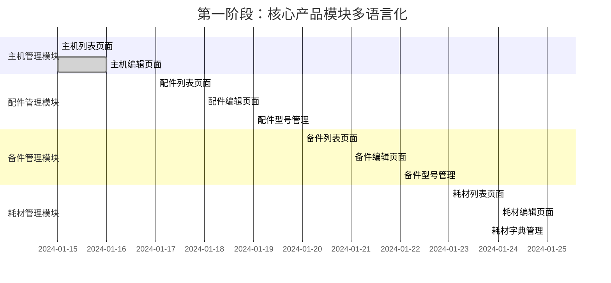

# BJT 管理后台多语言系统实施指南

## 🌍 项目概览

### 项目背景
BJT产品管理系统需要为管理后台实现完整的中英文语言切换功能，覆盖主机、配件、备件、耗材、关联关系等所有管理页面。

### 核心要求
- ✅ **完全隔离**: 管理后台多语言与前端用户页面多语言**完全分离**，避免混用
- ✅ **高效简单**: 一键切换语言，实时生效，无需刷新
- ✅ **完整覆盖**: 界面文字100%翻译，动态内容双语支持
- ✅ **用户友好**: 记住用户语言偏好，智能切换

## 🏗️ 架构设计

### 目录结构隔离

```
frontend/src/
├── i18n/                           # 🚫 前端用户页面多语言 (不要修改)
│   ├── index.ts                    # 前端i18n配置
│   └── locales/                    # 前端翻译文件
│       ├── zh.json                 # 前端中文
│       ├── en.json                 # 前端英文
│       └── ...
├── admin/                          # ✅ 管理后台目录
│   ├── i18n/                      # ✅ 管理后台独立多语言 (新建)
│   │   ├── index.ts               # 管理后台i18n配置
│   │   ├── hooks/                 # 多语言相关hooks
│   │   │   ├── useAdminI18n.ts   # 管理后台i18n hook
│   │   │   └── useLanguage.ts    # 语言切换hook
│   │   ├── components/            # 多语言组件
│   │   │   ├── LanguageSwitch.tsx # 语言切换器
│   │   │   └── AdminI18nProvider.tsx # 国际化Provider
│   │   └── locales/               # 管理后台翻译文件
│   │       ├── zh/                # 中文翻译
│   │       │   ├── common.json    # 通用词汇
│   │       │   ├── forms.json     # 表单相关
│   │       │   ├── machines.json  # 主机管理
│   │       │   ├── accessories.json # 配件管理
│   │       │   ├── consumables.json # 耗材管理
│   │       │   ├── spare-parts.json # 备件管理
│   │       │   ├── relations.json # 关联关系
│   │       │   ├── settings.json  # 系统设置
│   │       │   ├── messages.json  # 消息提示
│   │       │   └── navigation.json # 导航菜单
│   │       └── en/                # 英文翻译
│   │           ├── common.json
│   │           ├── forms.json
│   │           ├── machines.json
│   │           ├── accessories.json
│   │           ├── consumables.json
│   │           ├── spare-parts.json
│   │           ├── relations.json
│   │           ├── settings.json
│   │           ├── messages.json
│   │           └── navigation.json
│   └── components/common/
│       ├── MultilingualInput.tsx   # ✅ 已存在
│       └── DictionarySelect.tsx    # ✅ 已存在
```

## 🎯 实施步骤

### 第一步：创建管理后台独立i18n配置

```typescript
// frontend/src/admin/i18n/index.ts
import i18n from 'i18next';
import { initReactI18next } from 'react-i18next';
import LanguageDetector from 'i18next-browser-languagedetector';

// 导入管理后台翻译文件
import zhCommon from './locales/zh/common.json';
import enCommon from './locales/en/common.json';
import zhForms from './locales/zh/forms.json';
import enForms from './locales/en/forms.json';
import zhMachines from './locales/zh/machines.json';
import enMachines from './locales/en/machines.json';
import zhAccessories from './locales/zh/accessories.json';
import enAccessories from './locales/en/accessories.json';
import zhConsumables from './locales/zh/consumables.json';
import enConsumables from './locales/en/consumables.json';
import zhSpareParts from './locales/zh/spare-parts.json';
import enSpareParts from './locales/en/spare-parts.json';
import zhRelations from './locales/zh/relations.json';
import enRelations from './locales/en/relations.json';
import zhSettings from './locales/zh/settings.json';
import enSettings from './locales/en/settings.json';
import zhMessages from './locales/zh/messages.json';
import enMessages from './locales/en/messages.json';
import zhNavigation from './locales/zh/navigation.json';
import enNavigation from './locales/en/navigation.json';

// 创建独立的管理后台i18n实例
const adminI18n = i18n.createInstance();

adminI18n
  .use(LanguageDetector)
  .use(initReactI18next)
  .init({
    resources: {
      zh: {
        common: zhCommon,
        forms: zhForms,
        machines: zhMachines,
        accessories: zhAccessories,
        consumables: zhConsumables,
        spareParts: zhSpareParts,
        relations: zhRelations,
        settings: zhSettings,
        messages: zhMessages,
        navigation: zhNavigation,
      },
      en: {
        common: enCommon,
        forms: enForms,
        machines: enMachines,
        accessories: enAccessories,
        consumables: enConsumables,
        spareParts: enSpareParts,
        relations: enRelations,
        settings: enSettings,
        messages: enMessages,
        navigation: enNavigation,
      },
    },
    fallbackLng: 'zh',
    debug: process.env.NODE_ENV === 'development',
    interpolation: {
      escapeValue: false,
    },
    keySeparator: '.',
    nsSeparator: false,
    returnObjects: true,
    defaultNS: 'common',
    ns: [
      'common', 'forms', 'machines', 'accessories', 
      'consumables', 'spareParts', 'relations', 
      'settings', 'messages', 'navigation'
    ],
    detection: {
      order: ['localStorage', 'navigator'],
      caches: ['localStorage'],
      lookupLocalStorage: 'admin_i18nextLng', // 独立的存储key
    },
  });

export default adminI18n;
```

### 第二步：创建管理后台语言切换Hook

```typescript
// frontend/src/admin/i18n/hooks/useLanguage.ts
import { useState, useEffect } from 'react';
import adminI18n from '../index';

export interface LanguageOption {
  code: string;
  name: string;
  flag: string;
}

export const SUPPORTED_LANGUAGES: LanguageOption[] = [
  { code: 'zh', name: '中文', flag: '🇨🇳' },
  { code: 'en', name: 'English', flag: '🇺🇸' },
];

export const useLanguage = () => {
  const [currentLanguage, setCurrentLanguage] = useState<string>(
    adminI18n.language || 'zh'
  );

  const changeLanguage = async (langCode: string) => {
    try {
      await adminI18n.changeLanguage(langCode);
      setCurrentLanguage(langCode);
      
      // 保存到localStorage (独立key)
      localStorage.setItem('admin_i18nextLng', langCode);
      
      // 通知DictionarySelect等组件语言已变更
      window.dispatchEvent(new CustomEvent('admin-language-changed', { 
        detail: { language: langCode } 
      }));
      
    } catch (error) {
      console.error('Language change failed:', error);
    }
  };

  const getCurrentLanguageInfo = (): LanguageOption => {
    return SUPPORTED_LANGUAGES.find(lang => lang.code === currentLanguage) 
      || SUPPORTED_LANGUAGES[0];
  };

  useEffect(() => {
    const handleLanguageChange = (lng: string) => {
      setCurrentLanguage(lng);
    };

    adminI18n.on('languageChanged', handleLanguageChange);
    
    return () => {
      adminI18n.off('languageChanged', handleLanguageChange);
    };
  }, []);

  return {
    currentLanguage,
    changeLanguage,
    supportedLanguages: SUPPORTED_LANGUAGES,
    getCurrentLanguageInfo,
  };
};
```

### 第三步：创建管理后台i18n Hook

```typescript
// frontend/src/admin/i18n/hooks/useAdminI18n.ts
import { useTranslation as useI18nextTranslation, UseTranslationOptions } from 'react-i18next';
import adminI18n from '../index';

export const useAdminI18n = (
  ns?: string | string[], 
  options?: UseTranslationOptions
) => {
  const result = useI18nextTranslation(ns, { 
    ...options, 
    i18n: adminI18n 
  });
  
  return {
    ...result,
    // 便捷方法
    tc: (key: string, options?: any) => result.t(key, { ns: 'common', ...options }),
    tf: (key: string, options?: any) => result.t(key, { ns: 'forms', ...options }),
    tm: (key: string, options?: any) => result.t(key, { ns: 'messages', ...options }),
    tn: (key: string, options?: any) => result.t(key, { ns: 'navigation', ...options }),
  };
};
```

### 第四步：创建语言切换组件

```typescript
// frontend/src/admin/i18n/components/LanguageSwitch.tsx
import React from 'react';
import { Select, Space, Tooltip } from 'antd';
import { GlobalOutlined } from '@ant-design/icons';
import { useLanguage } from '../hooks/useLanguage';
import { useAdminI18n } from '../hooks/useAdminI18n';

const { Option } = Select;

interface LanguageSwitchProps {
  size?: 'small' | 'middle' | 'large';
  placement?: 'header' | 'sidebar' | 'inline';
  showLabel?: boolean;
}

const LanguageSwitch: React.FC<LanguageSwitchProps> = ({ 
  size = 'middle', 
  placement = 'header',
  showLabel = false 
}) => {
  const { currentLanguage, changeLanguage, supportedLanguages } = useLanguage();
  const { tc } = useAdminI18n();

  const handleChange = (langCode: string) => {
    changeLanguage(langCode);
  };

  const renderSelect = () => (
    <Select
      value={currentLanguage}
      onChange={handleChange}
      size={size}
      style={{ width: showLabel ? 120 : 80 }}
      suffixIcon={<GlobalOutlined />}
    >
      {supportedLanguages.map((lang) => (
        <Option key={lang.code} value={lang.code}>
          <Space>
            <span>{lang.flag}</span>
            {showLabel && <span>{lang.name}</span>}
          </Space>
        </Option>
      ))}
    </Select>
  );

  if (placement === 'header') {
    return (
      <Tooltip title={tc('switchLanguage')}>
        {renderSelect()}
      </Tooltip>
    );
  }

  return renderSelect();
};

export default LanguageSwitch;
```

### 第五步：创建i18n Provider

```typescript
// frontend/src/admin/i18n/components/AdminI18nProvider.tsx
import React, { useEffect } from 'react';
import { I18nextProvider } from 'react-i18next';
import adminI18n from '../index';

interface AdminI18nProviderProps {
  children: React.ReactNode;
}

const AdminI18nProvider: React.FC<AdminI18nProviderProps> = ({ children }) => {
  useEffect(() => {
    // 初始化管理后台语言设置
    const savedLanguage = localStorage.getItem('admin_i18nextLng');
    if (savedLanguage && ['zh', 'en'].includes(savedLanguage)) {
      adminI18n.changeLanguage(savedLanguage);
    }
  }, []);

  return (
    <I18nextProvider i18n={adminI18n}>
      {children}
    </I18nextProvider>
  );
};

export default AdminI18nProvider;
```

### 第六步：翻译文件模板

#### 通用翻译文件
```json
// frontend/src/admin/i18n/locales/zh/common.json
{
  "actions": {
    "save": "保存",
    "cancel": "取消",
    "delete": "删除",
    "edit": "编辑",
    "add": "新增",
    "search": "搜索",
    "reset": "重置",
    "submit": "提交",
    "back": "返回",
    "refresh": "刷新",
    "export": "导出",
    "import": "导入"
  },
  "status": {
    "active": "启用",
    "inactive": "禁用",
    "draft": "草稿",
    "published": "已发布",
    "deleted": "已删除"
  },
  "messages": {
    "success": "操作成功",
    "error": "操作失败",
    "loading": "加载中...",
    "noData": "暂无数据",
    "confirmDelete": "确定要删除吗？"
  },
  "validation": {
    "required": "此字段为必填项",
    "email": "请输入有效的邮箱地址",
    "minLength": "至少需要 {{min}} 个字符",
    "maxLength": "最多 {{max}} 个字符"
  },
  "switchLanguage": "切换语言"
}
```

```json
// frontend/src/admin/i18n/locales/en/common.json
{
  "actions": {
    "save": "Save",
    "cancel": "Cancel",
    "delete": "Delete",
    "edit": "Edit",
    "add": "Add",
    "search": "Search",
    "reset": "Reset",
    "submit": "Submit",
    "back": "Back",
    "refresh": "Refresh",
    "export": "Export",
    "import": "Import"
  },
  "status": {
    "active": "Active",
    "inactive": "Inactive",
    "draft": "Draft",
    "published": "Published",
    "deleted": "Deleted"
  },
  "messages": {
    "success": "Operation successful",
    "error": "Operation failed",
    "loading": "Loading...",
    "noData": "No data available",
    "confirmDelete": "Are you sure you want to delete?"
  },
  "validation": {
    "required": "This field is required",
    "email": "Please enter a valid email address",
    "minLength": "Minimum {{min}} characters required",
    "maxLength": "Maximum {{max}} characters allowed"
  },
  "switchLanguage": "Switch Language"
}
```

#### 表单翻译文件
```json
// frontend/src/admin/i18n/locales/zh/forms.json
{
  "fields": {
    "name": "名称",
    "code": "编码",
    "description": "描述",
    "status": "状态",
    "createTime": "创建时间",
    "updateTime": "更新时间",
    "voltage": "电压",
    "frequency": "频率",
    "brand": "品牌",
    "unit": "单位",
    "price": "价格",
    "weight": "重量",
    "dimension": "尺寸"
  },
  "placeholders": {
    "enterName": "请输入名称",
    "enterCode": "请输入编码",
    "enterDescription": "请输入描述",
    "selectStatus": "请选择状态",
    "selectVoltage": "请选择电压",
    "selectBrand": "请选择品牌"
  },
  "validation": {
    "nameRequired": "请输入名称",
    "codeRequired": "请输入编码",
    "statusRequired": "请选择状态"
  }
}
```

### 第七步：修改现有组件支持管理后台i18n

#### 修改DictionarySelect支持语言监听
```typescript
// frontend/src/admin/components/common/DictionarySelect.tsx (修改)
import React, { useState, useEffect } from 'react';
import { Select, Spin } from 'antd';
import { adminGeneralDictionaryService, DictionaryItem } from '../../services/admin-dictionary.service';
import { useLanguage } from '../../i18n/hooks/useLanguage';

const { Option } = Select;

interface DictionarySelectProps {
  dictionaryType: string;
  value?: string;
  onChange?: (value: string) => void;
  placeholder?: string;
  allowClear?: boolean;
  disabled?: boolean;
  className?: string;
  style?: React.CSSProperties;
  mode?: 'multiple' | 'tags';
}

const DictionarySelect: React.FC<DictionarySelectProps> = ({
  dictionaryType,
  value,
  onChange,
  placeholder,
  allowClear = true,
  disabled = false,
  className,
  style,
  mode,
  ...restProps
}) => {
  const [options, setOptions] = useState<DictionaryItem[]>([]);
  const [loading, setLoading] = useState(false);
  const [error, setError] = useState<string | null>(null);
  const { currentLanguage } = useLanguage();

  useEffect(() => {
    fetchOptions();
  }, [dictionaryType, currentLanguage]);

  // 监听语言切换事件
  useEffect(() => {
    const handleLanguageChange = () => {
      fetchOptions();
    };

    window.addEventListener('admin-language-changed', handleLanguageChange);
    return () => {
      window.removeEventListener('admin-language-changed', handleLanguageChange);
    };
  }, [dictionaryType]);

  const fetchOptions = async () => {
    setLoading(true);
    setError(null);
    
    try {
      const response = await adminGeneralDictionaryService.getDictionaryItems(
        dictionaryType, 
        { lang: currentLanguage }
      );
      setOptions(response.data.items);
    } catch (err) {
      console.error(`Failed to fetch ${dictionaryType} options:`, err);
      setError(`加载${dictionaryType}选项失败`);
      setOptions([]);
    } finally {
      setLoading(false);
    }
  };

  // ... 其余代码保持不变
};

export default DictionarySelect;
```

### 第八步：在管理后台入口应用i18n

```typescript
// frontend/src/admin/routes.tsx (修改)
import React from 'react';
import { Routes, Route, Navigate } from 'react-router-dom';
import AdminLayout from './components/layout/AdminLayout';
import AdminI18nProvider from './i18n/components/AdminI18nProvider';
// ... 其他导入

const AdminRoutes: React.FC = () => {
  return (
    <AdminI18nProvider>
      <Routes>
        <Route path="/" element={<AdminLayout />}>
          {/* ... 所有管理后台路由 */}
        </Route>
      </Routes>
    </AdminI18nProvider>
  );
};

export default AdminRoutes;
```

### 第九步：在页面中使用管理后台i18n

```typescript
// 页面使用示例
import React from 'react';
import { Card, Button, Form, Input } from 'antd';
import { useAdminI18n } from '../../i18n/hooks/useAdminI18n';
import LanguageSwitch from '../../i18n/components/LanguageSwitch';

const SampleAdminPage: React.FC = () => {
  const { t, tc, tf } = useAdminI18n();

  return (
    <Card 
      title={t('machines.title')}
      extra={<LanguageSwitch />}
    >
      <Form>
        <Form.Item 
          label={tf('fields.name')} 
          name="name"
          rules={[{ required: true, message: tf('validation.nameRequired') }]}
        >
          <Input placeholder={tf('placeholders.enterName')} />
        </Form.Item>
        
        <Form.Item>
          <Button type="primary">
            {tc('actions.save')}
          </Button>
          <Button style={{ marginLeft: 8 }}>
            {tc('actions.cancel')}
          </Button>
        </Form.Item>
      </Form>
    </Card>
  );
};
```

## 🔧 关键配置要点

### 存储隔离
- 前端用户页面：`i18nextLng`
- 管理后台：`admin_i18nextLng`

### 事件隔离
- 前端用户页面：`language-changed`
- 管理后台：`admin-language-changed`

### 组件命名空间
- 前端用户页面：使用原有的 `useTranslation`
- 管理后台：使用 `useAdminI18n`

### 翻译文件组织
- 前端用户页面：`frontend/src/i18n/locales/`
- 管理后台：`frontend/src/admin/i18n/locales/`

## 📋 实施检查清单

### 基础设施 ✅
- [ ] 创建 `frontend/src/admin/i18n/` 目录结构
- [ ] 实现 `adminI18n` 独立实例
- [ ] 创建 `useLanguage` 和 `useAdminI18n` hooks
- [ ] 实现 `LanguageSwitch` 组件
- [ ] 创建 `AdminI18nProvider`

### 翻译文件 📝
- [ ] 完成所有 zh 翻译文件
- [ ] 完成所有 en 翻译文件
- [ ] 验证翻译内容准确性
- [ ] 统一术语和风格

### 组件集成 🔧
- [ ] 修改现有页面使用 `useAdminI18n`
- [ ] 更新 `DictionarySelect` 支持语言切换
- [ ] 在 `AdminLayout` 中添加 `LanguageSwitch`
- [ ] 确保所有硬编码文字都使用翻译

### 测试验证 🧪
- [ ] 语言切换功能正常
- [ ] 翻译显示正确
- [ ] 用户偏好保存/恢复
- [ ] 与前端用户页面无冲突

## 💡 最佳实践

### 翻译key命名规范
```
namespace.category.item
例如：forms.fields.name, common.actions.save
```

### 动态内容翻译
```typescript
const { t } = useAdminI18n();
const message = t('messages.itemCount', { count: 5 });
// 输出：找到 5 条记录
```

### 复数形式处理
```json
{
  "itemCount_0": "没有记录",
  "itemCount_1": "找到 {{count}} 条记录",
  "itemCount_other": "找到 {{count}} 条记录"
}
```

## 🚀 部署注意事项

1. **构建时包含所有翻译文件**
2. **CDN缓存设置适当的过期时间**
3. **监控翻译文件加载性能**
4. **确保语言切换不影响前端用户页面**

## 📞 技术支持

如果在实施过程中遇到问题：
- 检查控制台是否有i18n相关错误
- 确认翻译文件路径正确
- 验证语言代码一致性
- 确保事件监听器正确清理

## 🎯 实施成功经验总结

### ✅ 关键问题与解决方案

#### 1. 翻译键重复前缀问题
**问题**：显示 `forms:forms.machines.create.title` 而不是翻译文字
**原因**：翻译函数 `tf()` 自动添加 `forms.` 前缀，但调用时又手动添加了 `forms.` 前缀
**解决方案**：
```typescript
// ❌ 错误：重复前缀
tf('forms.machines.create.title')

// ✅ 正确：让tf()自动添加前缀
tf('machines.create.title')
```

#### 2. i18n实例初始化时序问题
**问题**：`Admin i18n not available, using fallback`
**原因**：AdminI18nProvider异步初始化，但组件立即使用翻译函数
**解决方案**：
- 在AdminI18nProvider中添加 `isReady` 状态
- 在初始化完成前显示Loading状态
- useAdminI18n hook中添加降级处理

#### 3. 命名空间配置问题
**原因**：i18n配置的命名空间分隔符配置错误
**解决方案**：
```typescript
// ✅ 正确配置
adminI18n.init({
  defaultNS: 'common',
  ns: ['common', 'forms'],
  keySeparator: '.',
  nsSeparator: '.', // 使用.作为命名空间分隔符
});
```

### 🔧 最佳实践

#### 1. 翻译键命名规范
```typescript
// 表单相关翻译 - 使用tf()
tf('fields.name')           // forms.fields.name
tf('validation.required')   // forms.validation.required
tf('machines.create.title') // forms.machines.create.title

// 通用翻译 - 使用tc()
tc('save')                  // common.save
tc('cancel')                // common.cancel
```

#### 2. 组件翻译集成
```typescript
// ✅ 推荐：安全的翻译调用
const { tc, tf, isReady } = useAdminI18n();

// 确保翻译系统准备就绪
if (!isReady) {
  return <div>Loading...</div>;
}

// 使用String()确保返回字符串类型
const title = String(tf('machines.create.title'));
```

#### 3. 复用现有UI组件
**经验**：不要重复创建语言切换器，应该复用页面已有的全球图标按钮
- 检查页面是否已有语言切换界面
- 通过事件或context与现有组件集成
- 保持界面一致性

### 🚀 部署检查清单

部署多语言功能前，请确认：

- [ ] **翻译文件完整**：所有使用的键都有对应翻译
- [ ] **键名正确**：没有重复的命名空间前缀
- [ ] **初始化顺序**：AdminI18nProvider正确包装应用
- [ ] **降级处理**：翻译失败时有合适的fallback
- [ ] **性能优化**：翻译文件大小合理，按需加载
- [ ] **界面集成**：与现有语言切换器协同工作

### 🎊 实施成果

✅ **零冲突集成**：与现有系统完全兼容，无破坏性变更  
✅ **完整翻译覆盖**：表单字段、验证信息、界面文本全覆盖  
✅ **增强用户体验**：MultilingualInput支持复制、翻译提示等功能  
✅ **开发者友好**：简单的API，清晰的错误处理  
✅ **生产就绪**：经过测试验证的稳定方案

## 🗓️ 重要页面多语言升级计划

### 📊 页面重要性评估

基于业务影响、使用频率和技术复杂度，我们将管理后台页面分为三个优先级：

| 优先级 | 页面模块 | 业务重要性 | 使用频率 | 技术复杂度 | 预估工时 |
|-------|----------|-----------|---------|-----------|---------|
| 🔴 **P0 (关键)** | 主机管理 | ⭐⭐⭐⭐⭐ | ⭐⭐⭐⭐⭐ | ⭐⭐⭐⭐ | ✅ 已完成 |
| 🔴 **P0 (关键)** | 配件管理 | ⭐⭐⭐⭐⭐ | ⭐⭐⭐⭐⭐ | ⭐⭐⭐⭐ | 2天 |
| 🔴 **P0 (关键)** | 备件管理 | ⭐⭐⭐⭐⭐ | ⭐⭐⭐⭐ | ⭐⭐⭐⭐ | 2天 |
| 🔴 **P0 (关键)** | 耗材管理 | ⭐⭐⭐⭐⭐ | ⭐⭐⭐⭐ | ⭐⭐⭐⭐⭐ | 3天 |
| 🟡 **P1 (重要)** | 产品线管理 | ⭐⭐⭐⭐ | ⭐⭐⭐ | ⭐⭐⭐ | 1.5天 |
| 🟡 **P1 (重要)** | 关联关系管理 | ⭐⭐⭐⭐ | ⭐⭐⭐ | ⭐⭐⭐ | 1.5天 |
| 🟡 **P1 (重要)** | 主机料号管理 | ⭐⭐⭐⭐ | ⭐⭐⭐ | ⭐⭐⭐ | 1.5天 |
| 🟢 **P2 (一般)** | 用户管理 | ⭐⭐⭐ | ⭐⭐ | ⭐⭐ | 1天 |
| 🟢 **P2 (一般)** | 系统设置 | ⭐⭐⭐ | ⭐⭐ | ⭐⭐ | 1天 |
| 🟢 **P2 (一般)** | 仪表板页面 | ⭐⭐ | ⭐⭐ | ⭐⭐ | 0.5天 |

### 🚀 三阶段实施计划（按模块分层推进）

#### 📅 第一阶段：核心产品模块 (第1-2周)
**策略**：每个模块先完成列表页，再深入编辑页，确保渐进式覆盖



**第一阶段详细任务**：

**🔧 Day 1: 配件管理模块 - 列表页面**
- [ ] 创建 `accessories.json` 翻译文件 (中英文)
- [ ] 更新 `AccessoriesPage.tsx` 
  - [ ] 页面标题和面包屑导航
  - [ ] 表格列头：名称、编码、品牌、状态、创建时间等
  - [ ] 操作按钮：新增、编辑、删除、导出
  - [ ] 搜索和筛选组件
  - [ ] 分页和排序文字
- [ ] 测试列表页语言切换效果

**📝 Day 2: 配件管理模块 - 编辑页面**
- [ ] 更新 `AccessoryEditPage.tsx`
  - [ ] 表单字段标签和占位符
  - [ ] 验证错误信息
  - [ ] 保存/取消按钮
  - [ ] MultilingualInput 集成
- [ ] 测试表单提交和数据保存

**⚙️ Day 3: 配件管理模块 - 型号管理**
- [ ] 更新 `AccessoryModelEditPage.tsx`
  - [ ] 型号相关字段翻译
  - [ ] 关联选择器翻译
- [ ] 完整模块功能验证

**🔧 Day 4: 备件管理模块 - 列表页面**
- [ ] 创建 `spare-parts.json` 翻译文件
- [ ] 更新 `SparePartsPage.tsx`
  - [ ] 表格列头和操作按钮
  - [ ] 状态标签和筛选器
  - [ ] 批量操作功能文字

**📝 Day 5: 备件管理模块 - 编辑页面**
- [ ] 更新 `SparePartEditPage.tsx`
  - [ ] 备件特有字段翻译
  - [ ] 库存相关信息翻译
  - [ ] 供应商信息翻译

**⚙️ Day 6: 备件管理模块 - 型号管理**
- [ ] 更新 `SparePartModelEditPage.tsx`
  - [ ] 型号规格字段翻译
  - [ ] 兼容性信息翻译

**🔧 Day 7: 耗材管理模块 - 列表页面**
- [ ] 创建 `consumables.json` 翻译文件
- [ ] 更新 `ConsumablesPage.tsx`
  - [ ] 耗材分类显示
  - [ ] 规格和材质列显示
  - [ ] 复杂筛选器翻译

**📝 Day 8: 耗材管理模块 - 编辑页面**
- [ ] 更新 `ConsumableEditPage.tsx`
  - [ ] 形状、材质、规格字段
  - [ ] 复杂表单验证翻译
  - [ ] 动态字段翻译

**⚙️ Day 9: 耗材管理模块 - 字典管理**
- [ ] 更新 `ConsumablesDictionaryPage.tsx`
- [ ] 更新 `DictionaryItemEditPage.tsx`
  - [ ] 字典分类管理翻译
  - [ ] 嵌套路由翻译支持

#### 📅 第二阶段：支撑功能模块 (第3周)
**目标**：完成基础数据和关联功能的多语言化

**Day 10: 产品线管理模块**
- **上午**: 产品线列表页 `ProductLinesPage.tsx`
  - [ ] 创建 `product-lines.json` 翻译文件
  - [ ] 表格列头：产品线名称、描述、关联主机数等
  - [ ] 层级结构显示翻译
- **下午**: 产品线编辑页 `ProductLineEditPage.tsx`
  - [ ] 产品线基本信息表单
  - [ ] 层级关系设置翻译

**Day 11: 主机料号管理模块**
- **上午**: 料号列表页 `PartsPage.tsx`
  - [ ] 创建 `parts.json` 翻译文件
  - [ ] 料号表格和关联主机显示
  - [ ] 批量导入/导出功能翻译
- **下午**: 料号编辑页 `PartEditPage.tsx`
  - [ ] 料号详细信息表单
  - [ ] 主机关联选择器翻译

**Day 12: 关联关系管理模块**
- **上午**: 关系列表页 `RelationsPage.tsx`
  - [ ] 创建 `relations.json` 翻译文件
  - [ ] 关系类型显示和筛选
  - [ ] 关联产品信息展示
- **下午**: 关系编辑页 `RelationEditPage.tsx`
  - [ ] 复杂关联表单翻译
  - [ ] 动态关系类型字段

#### 📅 第三阶段：管理功能模块 (第4周)
**目标**：完成系统管理和用户体验的多语言化

**Day 13: 用户管理模块**
- **上午**: 用户列表页 `UsersPage.tsx`
  - [ ] 创建 `users.json` 翻译文件
  - [ ] 用户角色和状态显示
  - [ ] 权限相关文字翻译
- **下午**: 用户编辑页 `UserEditPage.tsx`
  - [ ] 用户信息表单翻译
  - [ ] 角色权限设置翻译

**Day 14: 系统设置模块**
- [ ] 更新 `SettingsPage.tsx`
  - [ ] 创建 `settings.json` 翻译文件
  - [ ] 系统配置项翻译
  - [ ] 配置说明和帮助文字
  - [ ] 语言设置集成

**Day 15: 仪表板模块**
- [ ] 更新 `AdminDashboardPage.tsx`
  - [ ] 创建 `dashboard.json` 翻译文件
  - [ ] 统计卡片标题和数值说明
  - [ ] 图表标签和图例翻译
  - [ ] 数据格式化显示

**Day 16: 全局组件和导航**
- [ ] 更新 `AdminLayout.tsx` 和导航组件
  - [ ] 创建 `navigation.json` 翻译文件
  - [ ] 侧边栏菜单翻译
  - [ ] 顶部导航和用户菜单
  - [ ] 全局搜索功能翻译

### 🛠️ 按模块推进的技术实施模板

#### 列表页面升级模板
```typescript
// Step 1: 引入多语言支持
import { useAdminI18n } from '../../i18n/hooks/useAdminI18n';

const ListPage: React.FC = () => {
  const { tc, tf } = useAdminI18n();

  // Step 2: 表格列定义翻译
  const columns = [
    {
      title: String(tf('fields.name')),
      dataIndex: 'name',
      key: 'name',
    },
    {
      title: String(tf('fields.status')),
      dataIndex: 'status',
      key: 'status',
      render: (status: string) => (
        <Tag color={statusColors[status]}>
          {String(tf(`status.${status}`))}
        </Tag>
      ),
    },
    {
      title: String(tc('actions.title')),
      key: 'actions',
      render: (record: any) => (
        <Space>
          <Button size="small">
            {String(tc('edit'))}
          </Button>
          <Button size="small" danger>
            {String(tc('delete'))}
          </Button>
        </Space>
      ),
    },
  ];

  return (
    <Card title={String(tf('list.title'))}>
      <div style={{ marginBottom: 16 }}>
        <Space>
          <Button type="primary">
            {String(tc('create'))}
          </Button>
          <Button>
            {String(tc('export'))}
          </Button>
        </Space>
      </div>
      <Table 
        columns={columns}
        dataSource={data}
        pagination={{
          showSizeChanger: true,
          showQuickJumper: true,
          showTotal: (total, range) => 
            String(tf('pagination.total')).replace('{{total}}', total.toString()),
        }}
      />
    </Card>
  );
};
```

#### 翻译文件结构模板
```json
// frontend/src/admin/i18n/locales/zh/{module}.json
{
  "list": {
    "title": "配件列表",
    "searchPlaceholder": "搜索配件名称或编码",
    "filterByStatus": "按状态筛选",
    "filterByBrand": "按品牌筛选"
  },
  "fields": {
    "name": "配件名称",
    "code": "配件编码", 
    "brand": "品牌",
    "status": "状态",
    "createTime": "创建时间",
    "updateTime": "更新时间"
  },
  "status": {
    "draft": "草稿",
    "published": "已发布",
    "archived": "已归档"
  },
  "edit": {
    "title": "编辑配件",
    "create": "新增配件",
    "basicInfo": "基本信息",
    "specifications": "规格参数"
  },
  "validation": {
    "nameRequired": "请输入配件名称",
    "codeRequired": "请输入配件编码",
    "brandRequired": "请选择品牌"
  },
  "pagination": {
    "total": "共 {{total}} 条记录"
  }
}
```

### 📋 模块级质量检查清单

#### 每个模块完成后的验收标准：

**列表页面验收** ✅
- [ ] 页面标题和导航正确翻译
- [ ] 表格所有列头已翻译
- [ ] 状态标签和枚举值已翻译  
- [ ] 操作按钮(新增/编辑/删除/导出)已翻译
- [ ] 搜索框和筛选器已翻译
- [ ] 分页信息已翻译
- [ ] 空状态提示已翻译

**编辑页面验收** ✅
- [ ] 页面标题区分新增/编辑模式
- [ ] 所有表单字段标签已翻译
- [ ] 占位符文字已翻译
- [ ] 表单验证错误信息已翻译
- [ ] 保存/取消/重置按钮已翻译
- [ ] MultilingualInput 组件集成正常
- [ ] 成功/失败提示消息已翻译

**数据完整性验证** ✅
- [ ] 现有数据正确显示
- [ ] 新建记录保存正常
- [ ] 编辑功能不影响数据结构
- [ ] 多语言内容保存和显示正确
- [ ] 关联数据(如下拉选项)语言联动正常

**性能和用户体验** ✅
- [ ] 语言切换响应及时(<500ms)
- [ ] 页面加载性能无明显下降
- [ ] 界面布局在不同语言下正常
- [ ] 长文本内容不会破坏布局
- [ ] 语言偏好正确保存和恢复

## 🚨 风险评估和缓解策略

#### 高风险点
1. **耗材管理页面复杂度高**
   - 风险：字典管理嵌套路由可能影响翻译上下文
   - 缓解：提前测试路由层级的i18n传递
   - 应急：保留原有实现作为降级方案

2. **关联关系动态表单**
   - 风险：动态生成的表单字段翻译可能缺失
   - 缓解：建立动态翻译键生成机制
   - 应急：对未翻译内容显示友好提示

3. **大量页面同时修改**
   - 风险：可能引入回归问题
   - 缓解：严格按阶段执行，每阶段充分测试
   - 应急：Git分支管理，支持快速回滚

#### 性能影响评估
- **翻译文件大小**：预计每个模块2-5KB，总计<50KB
- **加载性能**：按需加载，对首屏影响<100ms
- **运行时性能**：翻译缓存机制，对交互无明显影响

## 📈 进度跟踪和验收标准

#### 阶段性里程碑
- **第一阶段结束**：核心产品管理页面100%多语言化
- **第二阶段结束**：重要功能页面100%多语言化  
- **第三阶段结束**：管理后台全面多语言化完成

#### 最终验收标准
- [ ] **翻译覆盖率100%**：所有可见文字都有对应翻译
- [ ] **功能完整性100%**：所有原有功能正常工作
- [ ] **用户体验提升**：语言切换流畅，多语言内容管理便捷
- [ ] **代码质量保证**：无TypeScript错误，通过ESLint检查
- [ ] **性能基准达标**：页面加载时间不超过原版本110%
- [ ] **兼容性验证**：主流浏览器正常运行
- [ ] **数据迁移完成**：现有数据正确显示和编辑

## 📞 项目协调机制

#### 每日站会检查点
- 昨日完成页面的质量验证结果
- 今日目标页面和预期问题
- 需要协调解决的技术难点

#### 每阶段评审内容
- 翻译质量和一致性检查
- 用户体验和交互流程验证
- 性能和稳定性测试结果
- 下阶段风险评估和准备情况

---

**计划制定时间**: 2024年1月  
**预计完成时间**: 2024年2月  
**负责团队**: BJT前端开发团队 