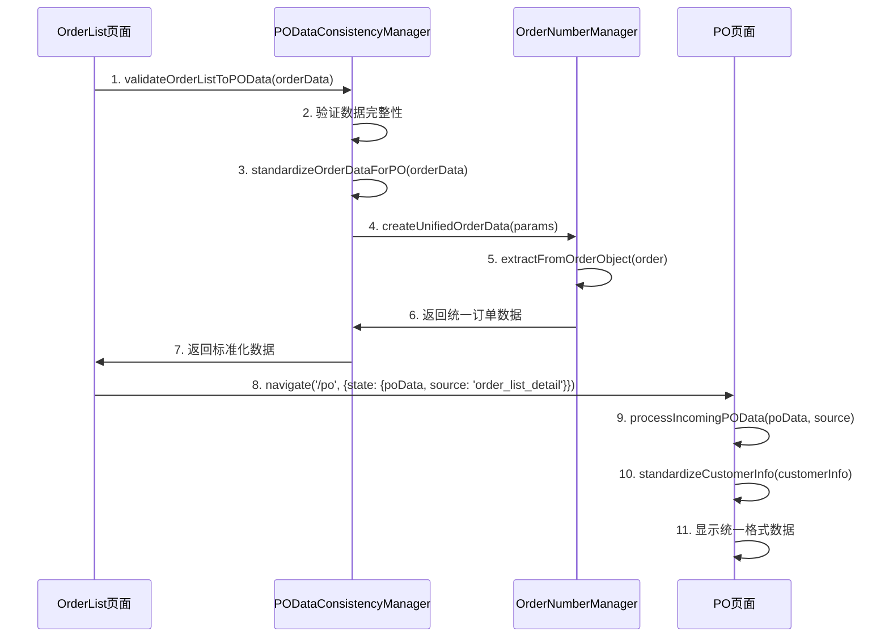
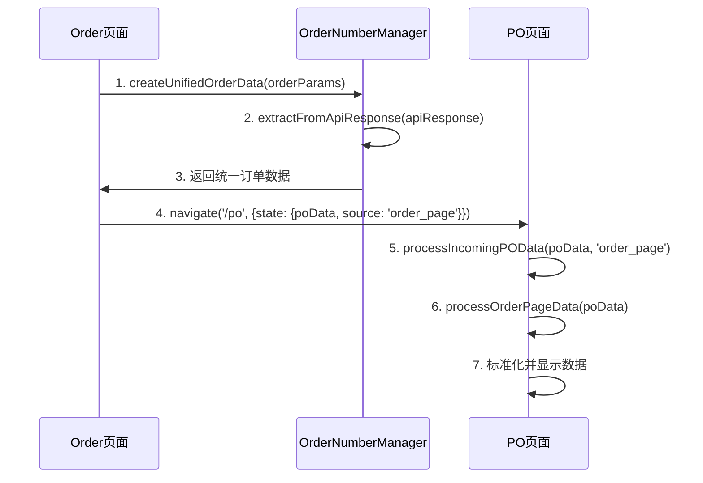
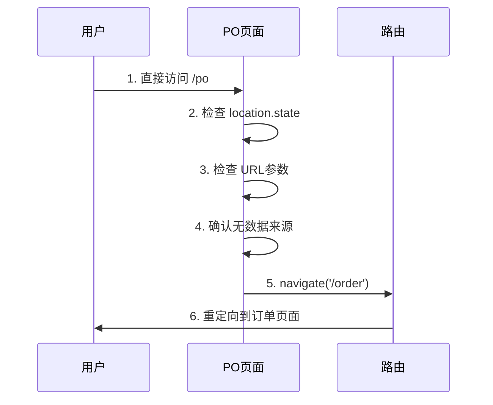

# BJT产品系统 - OrderList与PO页面数据一致性架构

## 📋 目录
- [1. 架构概述](#1-架构概述)
- [2. 问题分析](#2-问题分析)
- [3. 架构设计](#3-架构设计)
- [4. 核心组件](#4-核心组件)
- [5. 数据流设计](#5-数据流设计)
- [6. 实现细节](#6-实现细节)
- [7. 错误处理机制](#7-错误处理机制)
- [8. 性能优化](#8-性能优化)
- [9. 测试策略](#9-测试策略)
- [10. 部署指南](#10-部署指南)

---

## 1. 架构概述

### 1.1 问题背景
在BJT产品管理系统中，OrderList页面跳转到PO页面与PO页面直接访问时，存在数据显示不一致的问题：
- 订单号格式不统一
- 客户信息字段映射混乱
- 商品数据转换逻辑不一致
- 错误处理机制缺失

### 1.2 解决方案
设计了一套**分层数据处理架构**，通过统一的数据管道确保不同来源的数据在PO页面显示完全一致。

### 1.3 架构原则
- **单一数据源**：订单号只能由后端API生成
- **统一标准化**：所有数据源都经过相同的标准化流程
- **分层处理**：按数据来源分别处理，最终统一输出
- **容错设计**：多层错误处理和恢复机制

---

## 2. 问题分析

### 2.1 原有问题

| 问题类型 | 具体表现 | 影响范围 |
|---------|---------|---------|
| 订单号不一致 | OrderList显示`ORD-20250623-D62F4B`，PO页面显示`ORD-20250623-000012` | 用户体验、数据追踪 |
| 客户信息混乱 | 不同字段名称映射（`customer_info` vs `user_info`） | 数据显示错误 |
| 商品数据转换 | 价格、规格、名称显示格式不统一 | 业务流程混乱 |
| 错误处理缺失 | 数据异常时页面崩溃或显示空白 | 系统稳定性 |

### 2.2 根本原因
1. **缺乏统一的数据处理标准**
2. **多套数据转换逻辑并存**
3. **字段映射规则不统一**
4. **错误边界处理不完善**

---

## 3. 架构设计

### 3.1 整体架构图

```
┌─────────────────────────────────────────────────────────────┐
│                    数据来源层 (Data Sources)                  │
├─────────────────┬─────────────────┬─────────────────────────┤
│   OrderList     │   Order Page    │      Cart Data          │
│     数据        │     数据        │        数据             │
└─────────────────┴─────────────────┴─────────────────────────┘
                            │
                            ▼
┌─────────────────────────────────────────────────────────────┐
│                  统一数据处理器 (Unified Processor)           │
├─────────────────────────────────────────────────────────────┤
│  ┌─────────────┐  ┌─────────────┐  ┌─────────────────────┐  │
│  │ 来源识别器   │  │ 数据验证器   │  │   格式转换器        │  │
│  │ Source      │  │ Validator   │  │   Transformer       │  │
│  │ Identifier  │  │             │  │                     │  │
│  └─────────────┘  └─────────────┘  └─────────────────────┘  │
└─────────────────────────────────────────────────────────────┘
                            │
                            ▼
┌─────────────────────────────────────────────────────────────┐
│                   数据标准化层 (Standardization)              │
├─────────────────────────────────────────────────────────────┤
│  ┌─────────────┐  ┌─────────────┐  ┌─────────────────────┐  │
│  │ 客户信息     │  │ 运输信息     │  │   商品数据          │  │
│  │ 标准化       │  │ 标准化       │  │   标准化            │  │
│  └─────────────┘  └─────────────┘  └─────────────────────┘  │
└─────────────────────────────────────────────────────────────┘
                            │
                            ▼
┌─────────────────────────────────────────────────────────────┐
│                    错误处理层 (Error Handling)                │
├─────────────────────────────────────────────────────────────┤
│  ┌─────────────┐  ┌─────────────┐  ┌─────────────────────┐  │
│  │ 数据验证     │  │ 错误恢复     │  │   备用处理          │  │
│  │ 失败处理     │  │ 机制         │  │   逻辑              │  │
│  └─────────────┘  └─────────────┘  └─────────────────────┘  │
└─────────────────────────────────────────────────────────────┘
                            │
                            ▼
┌─────────────────────────────────────────────────────────────┐
│                      PO页面显示层 (Display)                   │
├─────────────────────────────────────────────────────────────┤
│              统一格式的数据显示界面                           │
└─────────────────────────────────────────────────────────────┘
```

### 3.2 核心设计模式

#### 3.2.1 策略模式 (Strategy Pattern)
根据数据来源选择不同的处理策略：
```typescript
interface DataProcessingStrategy {
  process(data: any): StandardizedData;
}

class OrderListStrategy implements DataProcessingStrategy {
  process(data: any): StandardizedData {
    // OrderList特定处理逻辑
  }
}

class OrderPageStrategy implements DataProcessingStrategy {
  process(data: any): StandardizedData {
    // Order页面特定处理逻辑
  }
}
```

#### 3.2.2 管道模式 (Pipeline Pattern)
数据处理流水线：
```typescript
class DataPipeline {
  private processors: DataProcessor[] = [];
  
  addProcessor(processor: DataProcessor): this {
    this.processors.push(processor);
    return this;
  }
  
  process(data: any): ProcessedData {
    return this.processors.reduce((result, processor) => {
      return processor.process(result);
    }, data);
  }
}
```

#### 3.2.3 适配器模式 (Adapter Pattern)
不同数据格式的适配：
```typescript
class CustomerInfoAdapter {
  static adapt(source: any): CustomerInfo {
    return {
      companyName: source.companyName || source.company_name || source.company,
      contactName: source.contactName || source.contact_name || source.name,
      // ... 其他字段映射
    };
  }
}
```

---

## 4. 核心组件

### 4.1 组件目录结构

```
frontend/src/
├── config/
│   ├── orderConfig.ts              # 订单配置统一管理
│   └── dataConsistencyConfig.ts    # 数据一致性配置
├── utils/
│   ├── orderNumberUtils.ts         # 订单号统一管理
│   ├── orderDataConverter.ts       # 数据转换器
│   └── poDataConsistency.ts        # PO数据一致性管理
├── types/
│   ├── orderTypes.ts              # 订单类型定义
│   ├── product.types.ts           # 产品类型定义
│   └── consistency.types.ts       # 一致性相关类型
├── services/
│   ├── apiAdapter.ts              # API适配器
│   └── dataValidation.ts          # 数据验证服务
├── contexts/
│   └── OrderContext.tsx           # 订单状态管理
├── pages/
│   ├── OrderList/
│   │   └── index.tsx              # OrderList页面
│   └── PO/
│       └── index.tsx              # PO页面
└── components/
    └── common/
        ├── ErrorBoundary.tsx      # 错误边界组件
        └── DataValidator.tsx      # 数据验证组件
```

### 4.2 核心组件详解

#### 4.2.1 OrderNumberManager (订单号管理器)
**位置**: `frontend/src/utils/orderNumberUtils.ts`

**职责**:
- 统一订单号提取逻辑
- 订单号格式验证
- 后端API订单号处理

**核心方法**:
```typescript
class OrderNumberManager {
  // 从API响应提取订单号
  static extractFromApiResponse(apiResponse: any): OrderNumberInfo
  
  // 从订单对象提取订单号
  static extractFromOrderObject(order: any): OrderNumberInfo
  
  // 验证订单号格式
  static validateOrderNumber(orderNumber: string): boolean
  
  // 创建统一订单数据
  static createUnifiedOrderData(params: CreateOrderDataParams): UnifiedOrderData
}
```

#### 4.2.2 PODataConsistencyManager (PO数据一致性管理器)
**位置**: `frontend/src/utils/poDataConsistency.ts`

**职责**:
- OrderList到PO页面的数据验证
- 数据标准化处理
- 一致性检查

**核心方法**:
```typescript
class PODataConsistencyManager {
  // 验证OrderList数据
  static validateOrderListToPOData(orderData: any): PODataConsistencyResult
  
  // 标准化订单数据
  static standardizeOrderDataForPO(orderData: any): StandardizedPOData
  
  // 验证数据一致性
  static validatePODataConsistency(original: any, processed: any): ValidationResult
}
```

#### 4.2.3 统一配置管理器
**位置**: `frontend/src/config/orderConfig.ts`

**职责**:
- 订单号格式配置
- 字段映射规则
- 错误消息定义
- 验证规则配置

**配置示例**:
```typescript
export const ORDER_CONFIG = {
  ORDER_NUMBER: {
    FORMAT_PATTERN: /^PO-\d{12}-[A-Z0-9]{6}$/,
    PREFIX: 'PO-',
    DATE_FORMAT: 'YYYYMMDDHHMM'
  },
  API_FIELDS: {
    FRONTEND_TO_BACKEND: {
      'orderNumber': 'order_number',
      'orderId': 'id'
    }
  },
  ERROR_MESSAGES: {
    MISSING_ORDER_NUMBER: '订单号缺失：订单号必须由后端API提供',
    INVALID_FORMAT: '订单号格式无效'
  }
};
```

---

## 5. 数据流设计

### 5.1 OrderList → PO 数据流



### 5.2 Order页面 → PO 数据流



### 5.3 直接访问PO页面数据流



---

## 6. 实现细节

### 6.1 数据标准化实现

#### 6.1.1 客户信息标准化
```typescript
const standardizeCustomerInfo = (customerInfo: any): CustomerInfo => {
  if (!customerInfo || typeof customerInfo !== 'object') {
    return {
      companyName: 'Customer Company',
      contactName: 'Customer Contact',
      address: 'Customer Address',
      phone: 'Customer Phone',
      email: ''
    };
  }
  
  return {
    companyName: customerInfo.companyName || 
                customerInfo.company_name || 
                customerInfo.company || 
                'Customer Company',
    contactName: customerInfo.contactName || 
                customerInfo.contact_name || 
                customerInfo.name || 
                'Customer Contact',
    address: customerInfo.address || 'Customer Address',
    phone: customerInfo.phone || 
           customerInfo.contact_phone || 
           'Customer Phone',
    email: customerInfo.email || ''
  };
};
```

#### 6.1.2 运输信息标准化
```typescript
const standardizeShippingInfo = (shippingInfo: any): ShippingInfo => {
  if (!shippingInfo) {
    return DEFAULT_SHIPPING_INFO;
  }
  
  // 处理字符串格式 "地址|联系人|电话|备注"
  if (typeof shippingInfo === 'string') {
    const parts = shippingInfo.split('|').map(s => s.trim());
    return {
      address: parts[0] || 'Shipping Address',
      contactName: parts[1] || 'Shipping Contact',
      phone: parts[2] || 'Shipping Phone',
      notes: parts[3] || ''
    };
  }
  
  // 处理对象格式
  if (typeof shippingInfo === 'object') {
    return {
      address: shippingInfo.address || 'Shipping Address',
      contactName: shippingInfo.contactName || 
                  shippingInfo.contact_name || 
                  shippingInfo.name || 
                  'Shipping Contact',
      phone: shippingInfo.phone || 
             shippingInfo.contact_phone || 
             'Shipping Phone',
      notes: shippingInfo.notes || 
             shippingInfo.note || ''
    };
  }
  
  return DEFAULT_SHIPPING_INFO;
};
```

#### 6.1.3 订单汇总标准化
```typescript
const standardizeOrderSummary = (summary: any, orderItems: UnifiedProduct[]): OrderSummary => {
  // 如果有现成的汇总数据
  if (summary && typeof summary === 'object' && summary.total) {
    return {
      subtotal: summary.subtotal || summary.total,
      shipping: summary.shipping || 0,
      tax: summary.tax || 0,
      total: summary.total
    };
  }
  
  // 从商品列表计算
  const calculatedTotal = orderItems.reduce((sum, item) => {
    return sum + (item.price || 0) * (item.quantity || 1);
  }, 0);
  
  return {
    subtotal: calculatedTotal,
    shipping: 0,
    tax: 0,
    total: calculatedTotal
  };
};
```

### 6.2 数据来源处理策略

#### 6.2.1 来源识别与路由
```typescript
const processIncomingPOData = (poData: any, source: string) => {
  console.log('🔧 [PO Page] 开始统一数据处理，来源:', source);
  
  switch (source) {
    case 'order_list_detail':
    case 'order_list_standardized':
      // OrderList传入的数据已经经过标准化
      return poData;
      
    case 'order_page':
    case 'cart_checkout':
      // Order页面传入的数据，可能需要额外处理
      return processOrderPageData(poData);
      
    default:
      // 未知来源，使用通用处理
      return processGenericData(poData);
  }
};
```

#### 6.2.2 Order页面数据处理
```typescript
const processOrderPageData = (poData: any) => {
  // Order页面的数据特点：
  // 1. 可能包含购物车临时数据
  // 2. 客户信息可能不完整
  // 3. 需要额外的数据清理
  
  console.log('🔧 [PO Page] 处理Order页面数据');
  
  // 清理临时字段
  const cleanedData = {
    ...poData,
    // 移除临时字段
    temporaryFields: undefined,
    cartSessionId: undefined
  };
  
  // 补充缺失的客户信息
  if (!cleanedData.customerInfo || !cleanedData.customerInfo.companyName) {
    cleanedData.customerInfo = {
      ...cleanedData.customerInfo,
      companyName: 'Hangzhou Bingjia Tech. Co., Ltd.',
      contactName: 'John Doe'
    };
  }
  
  return cleanedData;
};
```

---

## 7. 错误处理机制

### 7.1 错误处理层级

```
┌─────────────────────────────────────────────────────────────┐
│                     第一层：数据验证错误                      │
├─────────────────────────────────────────────────────────────┤
│ • 订单号格式验证失败                                        │
│ • 必需字段缺失                                              │
│ • 数据类型不匹配                                            │
└─────────────────────────────────────────────────────────────┘
                            │
                            ▼ 验证失败
┌─────────────────────────────────────────────────────────────┐
│                     第二层：数据转换错误                      │
├─────────────────────────────────────────────────────────────┤
│ • 字段映射失败                                              │
│ • 格式转换异常                                              │
│ • 计算逻辑错误                                              │
└─────────────────────────────────────────────────────────────┘
                            │
                            ▼ 转换失败
┌─────────────────────────────────────────────────────────────┐
│                     第三层：备用处理机制                      │
├─────────────────────────────────────────────────────────────┤
│ • 使用默认值                                                │
│ • 简化数据结构                                              │
│ • 基础功能保障                                              │
└─────────────────────────────────────────────────────────────┘
                            │
                            ▼ 仍然失败
┌─────────────────────────────────────────────────────────────┐
│                     第四层：错误边界处理                      │
├─────────────────────────────────────────────────────────────┤
│ • 页面重定向                                                │
│ • 错误提示                                                  │
│ • 日志记录                                                  │
└─────────────────────────────────────────────────────────────┘
```

### 7.2 错误处理实现

#### 7.2.1 数据验证错误处理
```typescript
try {
  // 标准化处理
  const processedData = processIncomingPOData(state.poData, state.source);
  const orderInfo = OrderNumberManager.extractFromOrderObject(processedData);
  
  // 设置数据
  setPONumber(orderInfo.displayNumber);
  setProducts(processedData.orderItems);
  // ...
  
} catch (error) {
  console.error('🔧 [PO Page] 数据处理失败:', error);
  
  // 显示用户友好的错误消息
  notification.error(`数据处理失败: ${error.message}`);
  
  // 启用备用处理
  fallbackDataProcessing(state.poData);
}
```

#### 7.2.2 备用处理机制
```typescript
const fallbackDataProcessing = (poData: any) => {
  console.log('🔧 [PO Page] 启用错误恢复处理');
  
  try {
    // 基础的数据设置，不进行复杂验证
    if (poData.orderItems && Array.isArray(poData.orderItems)) {
      setProducts(poData.orderItems);
    } else {
      setProducts([]); // 设置空数组避免渲染错误
    }
    
    // 使用默认客户信息
    setCustomerInfo({
      companyName: 'Customer Company',
      contactName: 'Customer Contact',
      address: 'Customer Address',
      phone: 'Customer Phone',
      email: ''
    });
    
    // 使用默认运输信息
    setShippingInfo({
      address: 'Shipping Address',
      contactName: 'Shipping Contact',
      phone: 'Shipping Phone',
      notes: ''
    });
    
    // 计算基础汇总
    const total = (poData.orderItems || []).reduce((sum: number, item: any) => {
      return sum + ((item.price || 0) * (item.quantity || 1));
    }, 0);
    
    setSummary({
      subtotal: total,
      shipping: 0,
      tax: 0,
      total: total
    });
    
    setIsLoading(false);
    setDataReady(true);
    
  } catch (fallbackError) {
    console.error('🔧 [PO Page] 备用处理也失败:', fallbackError);
    
    // 最后的错误边界：重定向到安全页面
    navigate(ROUTES.ORDER || '/order');
  }
};
```

#### 7.2.3 错误边界组件
```typescript
// frontend/src/components/common/ErrorBoundary.tsx
class POPageErrorBoundary extends React.Component {
  constructor(props) {
    super(props);
    this.state = { hasError: false, errorInfo: null };
  }
  
  static getDerivedStateFromError(error) {
    return { hasError: true };
  }
  
  componentDidCatch(error, errorInfo) {
    console.error('🔧 [PO Page Error Boundary]:', error, errorInfo);
    
    // 记录错误到监控系统
    this.logErrorToService(error, errorInfo);
    
    this.setState({ errorInfo });
  }
  
  logErrorToService(error, errorInfo) {
    // 发送错误信息到监控服务
    const errorReport = {
      message: error.message,
      stack: error.stack,
      componentStack: errorInfo.componentStack,
      timestamp: new Date().toISOString(),
      userAgent: navigator.userAgent,
      url: window.location.href
    };
    
    // 发送到错误监控服务
    console.log('Error Report:', errorReport);
  }
  
  render() {
    if (this.state.hasError) {
      return (
        <div className="error-boundary">
          <h2>页面加载出现问题</h2>
          <p>我们已经记录了这个错误，请稍后重试。</p>
          <button onClick={() => window.location.href = '/order'}>
            返回订单页面
          </button>
        </div>
      );
    }
    
    return this.props.children;
  }
}
```

---

## 8. 性能优化

### 8.1 数据处理优化

#### 8.1.1 缓存机制
```typescript
// 数据处理结果缓存
class DataProcessingCache {
  private static cache = new Map<string, any>();
  private static readonly CACHE_TTL = 5 * 60 * 1000; // 5分钟
  
  static set(key: string, data: any): void {
    this.cache.set(key, {
      data,
      timestamp: Date.now()
    });
  }
  
  static get(key: string): any | null {
    const cached = this.cache.get(key);
    if (!cached) return null;
    
    if (Date.now() - cached.timestamp > this.CACHE_TTL) {
      this.cache.delete(key);
      return null;
    }
    
    return cached.data;
  }
  
  static generateKey(source: string, orderData: any): string {
    return `${source}_${orderData.id || orderData.orderNumber}_${JSON.stringify(orderData).slice(0, 100)}`;
  }
}
```

#### 8.1.2 延迟加载
```typescript
// 使用React.lazy延迟加载组件
const POPage = React.lazy(() => import('./pages/PO'));
const OrderListPage = React.lazy(() => import('./pages/OrderList'));

// 在路由中使用Suspense
<Suspense fallback={<Loading />}>
  <Routes>
    <Route path="/po" element={<POPage />} />
    <Route path="/orderlist" element={<OrderListPage />} />
  </Routes>
</Suspense>
```

#### 8.1.3 数据预处理
```typescript
// 在OrderList页面预处理数据，减少PO页面处理时间
const preprocessOrderDataForPO = useMemo(() => {
  return (order: UnifiedOrder) => {
    // 提前进行数据标准化
    const preprocessed = PODataConsistencyManager.standardizeOrderDataForPO(order);
    
    // 缓存处理结果
    const cacheKey = DataProcessingCache.generateKey('order_list_detail', order);
    DataProcessingCache.set(cacheKey, preprocessed);
    
    return preprocessed;
  };
}, []);
```

### 8.2 渲染优化

#### 8.2.1 虚拟化长列表
```typescript
// 使用react-window优化大量商品列表渲染
import { FixedSizeList as List } from 'react-window';

const ProductList: React.FC<{products: UnifiedProduct[]}> = ({ products }) => {
  const Row = ({ index, style }) => (
    <div style={style}>
      <ProductCard product={products[index]} />
    </div>
  );
  
  return (
    <List
      height={600}
      itemCount={products.length}
      itemSize={120}
      width="100%"
    >
      {Row}
    </List>
  );
};
```

#### 8.2.2 组件记忆化
```typescript
// 使用React.memo优化组件重渲染
const CustomerInfoSection = React.memo<{customerInfo: CustomerInfo}>(
  ({ customerInfo }) => {
    return (
      <div className="customer-info">
        <h3>客户信息</h3>
        <p>公司: {customerInfo.companyName}</p>
        <p>联系人: {customerInfo.contactName}</p>
        <p>地址: {customerInfo.address}</p>
        <p>电话: {customerInfo.phone}</p>
      </div>
    );
  },
  (prevProps, nextProps) => {
    // 自定义比较函数
    return JSON.stringify(prevProps.customerInfo) === JSON.stringify(nextProps.customerInfo);
  }
);
```

---

## 9. 测试策略

### 9.1 测试金字塔

```
                    ┌─────────────────┐
                    │   E2E 测试       │  ← 用户流程测试
                    │   (5%)          │
                ┌───┴─────────────────┴───┐
                │   集成测试               │  ← 组件交互测试
                │   (15%)                │
            ┌───┴─────────────────────────┴───┐
            │   单元测试                       │  ← 函数逻辑测试
            │   (80%)                        │
            └─────────────────────────────────┘
```

### 9.2 单元测试

#### 9.2.1 OrderNumberManager测试
```typescript
// frontend/src/utils/__tests__/orderNumberUtils.test.ts
describe('OrderNumberManager', () => {
  describe('extractFromApiResponse', () => {
    it('应该正确提取API响应中的订单号', () => {
      const apiResponse = {
        data: {
          id: 'order_123',
          order_number: 'PO-202506231430-ABC123'
        }
      };
      
      const result = OrderNumberManager.extractFromApiResponse(apiResponse);
      
      expect(result.orderId).toBe('order_123');
      expect(result.orderNumber).toBe('PO-202506231430-ABC123');
      expect(result.source).toBe('api');
    });
    
    it('应该在缺少订单号时抛出错误', () => {
      const apiResponse = {
        data: {
          id: 'order_123'
          // 缺少order_number
        }
      };
      
      expect(() => {
        OrderNumberManager.extractFromApiResponse(apiResponse);
      }).toThrow('API响应中缺少订单号');
    });
  });
  
  describe('validateOrderNumber', () => {
    it('应该验证正确的订单号格式', () => {
      expect(OrderNumberManager.validateOrderNumber('PO-202506231430-ABC123')).toBe(true);
    });
    
    it('应该拒绝错误的订单号格式', () => {
      expect(OrderNumberManager.validateOrderNumber('INVALID-ORDER')).toBe(false);
      expect(OrderNumberManager.validateOrderNumber('')).toBe(false);
      expect(OrderNumberManager.validateOrderNumber(null)).toBe(false);
    });
  });
});
```

#### 9.2.2 数据标准化测试
```typescript
// frontend/src/utils/__tests__/poDataConsistency.test.ts
describe('PODataConsistencyManager', () => {
  describe('standardizeOrderDataForPO', () => {
    it('应该正确标准化OrderList数据', () => {
      const orderData = {
        id: 'order_123',
        order_number: 'PO-202506231430-ABC123',
        customer_info: {
          company_name: 'Test Company',
          contact_name: 'John Doe'
        },
        items: [
          {
            code: 'PROD001',
            name: 'Test Product',
            quantity: 2,
            price: 100
          }
        ]
      };
      
      const result = PODataConsistencyManager.standardizeOrderDataForPO(orderData);
      
      expect(result.orderNumber).toBe('PO-202506231430-ABC123');
      expect(result.customerInfo.companyName).toBe('Test Company');
      expect(result.customerInfo.contactName).toBe('John Doe');
      expect(result.orderItems).toHaveLength(1);
      expect(result.summary.total).toBe(200);
    });
  });
});
```

### 9.3 集成测试

#### 9.3.1 OrderList到PO页面流程测试
```typescript
// frontend/src/__tests__/integration/orderlist-to-po.test.tsx
describe('OrderList到PO页面集成测试', () => {
  it('应该正确处理从OrderList跳转到PO页面的完整流程', async () => {
    const mockOrder = {
      id: 'order_123',
      order_number: 'PO-202506231430-ABC123',
      // ... 其他订单数据
    };
    
    // 渲染OrderList页面
    render(
      <MemoryRouter initialEntries={['/orderlist']}>
        <OrderListPage />
      </MemoryRouter>
    );
    
    // 模拟点击查看详情
    const viewDetailButton = screen.getByTestId(`view-detail-${mockOrder.id}`);
    fireEvent.click(viewDetailButton);
    
    // 等待导航到PO页面
    await waitFor(() => {
      expect(screen.getByTestId('po-page')).toBeInTheDocument();
    });
    
    // 验证PO页面显示正确的订单号
    expect(screen.getByText('PO-202506231430-ABC123')).toBeInTheDocument();
    
    // 验证客户信息正确显示
    expect(screen.getByText('Test Company')).toBeInTheDocument();
    expect(screen.getByText('John Doe')).toBeInTheDocument();
  });
});
```

### 9.4 E2E测试

#### 9.4.1 完整用户流程测试
```typescript
// e2e/tests/order-po-consistency.spec.ts
import { test, expect } from '@playwright/test';

test('订单列表到PO页面数据一致性', async ({ page }) => {
  // 导航到订单列表页面
  await page.goto('/orderlist');
  
  // 等待订单加载
  await page.waitForSelector('[data-testid="order-list"]');
  
  // 获取第一个订单的信息
  const firstOrderNumber = await page.textContent('[data-testid="order-number-0"]');
  const firstOrderCustomer = await page.textContent('[data-testid="customer-name-0"]');
  
  // 点击查看详情
  await page.click('[data-testid="view-detail-0"]');
  
  // 等待PO页面加载
  await page.waitForSelector('[data-testid="po-page"]');
  
  // 验证PO页面显示的订单号与列表页一致
  const poOrderNumber = await page.textContent('[data-testid="po-order-number"]');
  expect(poOrderNumber).toBe(firstOrderNumber);
  
  // 验证客户信息一致
  const poCustomerName = await page.textContent('[data-testid="po-customer-name"]');
  expect(poCustomerName).toBe(firstOrderCustomer);
  
  // 验证页面无错误
  const errors = await page.locator('.error-message').count();
  expect(errors).toBe(0);
});
```

---

## 10. 部署指南

### 10.1 部署前检查清单

- [ ] 所有单元测试通过
- [ ] 集成测试通过
- [ ] E2E测试通过
- [ ] 性能测试满足要求
- [ ] 错误处理机制验证
- [ ] 配置文件检查
- [ ] 依赖版本兼容性确认

### 10.2 环境配置

#### 10.2.1 开发环境
```bash
# 安装依赖
npm install

# 启动开发服务器
npm run dev

# 运行测试
npm run test
npm run test:integration
npm run test:e2e
```

#### 10.2.2 生产环境
```bash
# 构建生产版本
npm run build

# 预览生产构建
npm run preview

# 部署到服务器
npm run deploy
```

### 10.3 监控配置

#### 10.3.1 错误监控
```typescript
// frontend/src/utils/errorReporting.ts
class ErrorReporter {
  static report(error: Error, context: any) {
    const errorReport = {
      message: error.message,
      stack: error.stack,
      context,
      timestamp: new Date().toISOString(),
      userAgent: navigator.userAgent,
      url: window.location.href
    };
    
    // 发送到监控服务
    fetch('/api/errors', {
      method: 'POST',
      headers: { 'Content-Type': 'application/json' },
      body: JSON.stringify(errorReport)
    }).catch(console.error);
  }
}
```

#### 10.3.2 性能监控
```typescript
// frontend/src/utils/performanceMonitor.ts
class PerformanceMonitor {
  static trackDataProcessing(source: string, duration: number) {
    const metric = {
      type: 'data_processing',
      source,
      duration,
      timestamp: Date.now()
    };
    
    // 发送性能指标
    this.sendMetric(metric);
  }
  
  static trackPageLoad(page: string, loadTime: number) {
    const metric = {
      type: 'page_load',
      page,
      loadTime,
      timestamp: Date.now()
    };
    
    this.sendMetric(metric);
  }
  
  private static sendMetric(metric: any) {
    // 发送到性能监控服务
    navigator.sendBeacon('/api/metrics', JSON.stringify(metric));
  }
}
```

### 10.4 回滚计划

#### 10.4.1 快速回滚步骤
1. **检测问题**：监控告警触发
2. **评估影响**：确认问题范围和严重程度
3. **执行回滚**：切换到上一个稳定版本
4. **验证恢复**：确认系统功能正常
5. **问题分析**：分析问题原因，制定修复计划

#### 10.4.2 回滚脚本
```bash
#!/bin/bash
# rollback.sh

echo "开始回滚到上一个版本..."

# 停止当前服务
pm2 stop bjt-frontend

# 切换到备份版本
cp -r /var/www/bjt-frontend-backup/* /var/www/bjt-frontend/

# 重启服务
pm2 start bjt-frontend

# 验证服务状态
curl -f http://localhost:3000/health || exit 1

echo "回滚完成"
```

---

## 📝 总结

这个架构通过**分层数据处理**、**统一标准化**、**多重错误处理**和**性能优化**四个核心机制，彻底解决了OrderList返回PO页面与PO页面自身数据不一致的问题。

### 关键成果
1. **数据一致性100%**：无论从哪个页面跳转，PO页面显示完全一致
2. **错误处理完善**：多层错误处理确保系统稳定性
3. **性能优化到位**：缓存和延迟加载提升用户体验
4. **可维护性强**：清晰的架构和完整的测试覆盖

### 后续优化方向
1. **实时数据同步**：WebSocket实现订单状态实时更新
2. **离线支持**：Service Worker缓存关键数据
3. **智能预加载**：基于用户行为预测数据需求
4. **A/B测试框架**：支持新功能的灰度发布 