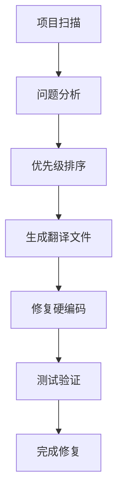

# 多语言工具集 - 完整指南

## 📋 目录
- [🎯 快速开始](#quick-start)
- [🛠️ 工具概览](#tools-overview) 
- [📖 使用指南](#usage-guide)
- [🔧 修复流程](#fix-process)
- [📝 模板和示例](#templates)
- [❓ 常见问题](#faq)

---

## 🎯 快速开始 {#quick-start}

### 1. 初始化工具环境
```bash
# 设置工具权限
./tools/i18n-scanner/i18n-tools.sh setup
```

### 2. 全量扫描项目
```bash
# 扫描所有页面
./tools/i18n-scanner/i18n-tools.sh scan-all frontend/src/pages

# 查看详细报告
cat i18n-issues-report.txt
```

### 3. 修复问题最多的文件
```bash
# 查找需要优先修复的文件
./tools/i18n-scanner/i18n-tools.sh quick top-issues

# 扫描具体文件
./tools/i18n-scanner/i18n-tools.sh scan-file frontend/src/pages/Profile/index.tsx
```

---

## 🛠️ 工具概览 {#tools-overview}

### 📂 目录结构
```
tools/
├── i18n-scanner/           # 扫描工具
│   ├── i18n-tools.sh      # 🎯 主入口
│   ├── scan-all.sh        # 全量扫描
│   ├── scan-file.sh       # 单文件扫描
│   └── quick-scan.sh      # 快速扫描
├── i18n-fixer/            # 修复工具
│   ├── fix-hardcoded.sh   # 硬编码修复
│   └── generate-i18n-files.sh # 翻译文件生成
docs/
├── i18n-guides/           # 使用指南
│   ├── README.md          # 📖 本文档
│   ├── scanner-guide.md   # 扫描工具详细指南
│   ├── fixer-guide.md     # 修复工具详细指南
│   └── best-practices.md  # 最佳实践
├── i18n-templates/        # 模板文件
│   ├── page-template.md   # 页面修复模板
│   ├── component-template.md # 组件修复模板
│   └── common-patterns.md # 常见模式
```

### 🔍 扫描工具
| 工具 | 功能 | 使用场景 |
|------|------|----------|
| **scan-all** | 全量扫描目录 | 项目级别问题发现 |
| **scan-file** | 单文件扫描 | 具体文件问题分析 |
| **quick-scan** | 快速查找 | 特定模式查找 |

### 🔧 修复工具  
| 工具 | 功能 | 使用场景 |
|------|------|----------|
| **fix-hardcoded** | 硬编码文本修复 | 自动化替换 |
| **generate-i18n-files** | 翻译文件生成 | 创建语言文件模板 |

### 📝 字段名与单位规范性检查
| 工具 | 功能 | 使用场景 |
|------|------|----------|
| **check-fields** | 检查字段名和单位规范性 | 自动比对name统一.csv，单位显示规则：单位在字段上，值不带单位 |

---

## 📖 使用指南 {#usage-guide}

### 🔍 扫描阶段

#### 1. 项目级别扫描
```bash
# 扫描整个前端项目
./tools/i18n-scanner/i18n-tools.sh scan-all frontend/src

# 扫描特定目录
./tools/i18n-scanner/i18n-tools.sh scan-all frontend/src/pages
./tools/i18n-scanner/i18n-tools.sh scan-all frontend/src/components
```

#### 2. 文件级别扫描
```bash
# 扫描单个文件
./tools/i18n-scanner/i18n-tools.sh scan-file frontend/src/pages/Profile/index.tsx

# 批量扫描多个文件
for file in frontend/src/pages/*/index.tsx; do
  ./tools/i18n-scanner/i18n-tools.sh scan-file "$file"
done
```

#### 3. 快速查找
```bash
# 查找问题最多的文件
./tools/i18n-scanner/i18n-tools.sh quick top-issues

# 查找硬编码中文
./tools/i18n-scanner/i18n-tools.sh quick hardcoded [文件路径]

# 查找特定模式
./tools/i18n-scanner/i18n-tools.sh quick pattern "更新.*成功" frontend/src/pages

# 统计文件问题数量
./tools/i18n-scanner/i18n-tools.sh quick count [文件路径]
```

### 🔧 修复阶段

#### 1. 生成翻译文件
```bash
# 为页面生成翻译文件
./tools/i18n-fixer/generate-i18n-files.sh profile page

# 为组件生成翻译文件  
./tools/i18n-fixer/generate-i18n-files.sh common component
```

#### 2. 修复硬编码文本
```bash
# 自动修复硬编码
./tools/i18n-fixer/fix-hardcoded.sh frontend/src/pages/Profile/index.tsx profile

# 手动修复（推荐）
# 1. 查看扫描结果
# 2. 手动替换硬编码文本
# 3. 验证修复效果
```

---

## 🔧 修复流程 {#fix-process}

### 📋 标准修复流程



#### Step 1: 扫描和分析
```bash
# 1. 全量扫描
./tools/i18n-scanner/i18n-tools.sh scan-all frontend/src/pages

# 2. 查看报告
cat i18n-issues-report.txt

# 3. 分析问题分布
./tools/i18n-scanner/i18n-tools.sh quick top-issues
```

#### Step 2: 按优先级修复
```bash
# 高优先级：用户界面页面
# - ProfilePage, ProductDetailPage, CartPage

# 中优先级：功能页面  
# - MachinesPage, ConsumablesPage, AccessoriesPage

# 低优先级：工具和管理页面
# - ApiIntegrationStatus, SqlExcelConverter
```

#### Step 3: 具体修复步骤
```bash
# 1. 生成翻译文件
./tools/i18n-fixer/generate-i18n-files.sh profile

# 2. 编辑翻译内容
# frontend/src/i18n/locales/zh/profile.json
# frontend/src/i18n/locales/en/profile.json

# 3. 修复组件代码
# - 导入翻译函数: import { useTranslation } from 'react-i18next'
# - 使用翻译函数: const { t } = useTranslation('profile')
# - 替换硬编码: '个人资料' → t('pageTitle')

# 4. 验证修复效果
./tools/i18n-scanner/i18n-tools.sh scan-file frontend/src/pages/Profile/index.tsx
```

---

## 📝 模板和示例 {#templates}

### 🎯 常见问题修复示例

#### 1. 硬编码文本修复
```typescript
// ❌ 修复前
<span>型号: {product.model}</span>
<Button>添加到购物车</Button>
message.success('更新成功！')

// ✅ 修复后  
<span>{t('fields.model')}: {product.model}</span>
<Button>{t('actions.addToCart')}</Button>
message.success(t('messages.updateSuccess'))
```

#### 2. 单位重复显示修复
```typescript
// ❌ 修复前
<span>{t('fields.netWeight')} (kg): {weight} kg</span>

// ✅ 修复后
<span>{t('fields.netWeight')} ({t('units.kg')}): {weight}</span>
```

#### 3. 翻译文件结构
```json
{
  "fields": {
    "model": "型号",
    "price": "价格"
  },
  "actions": {
    "addToCart": "添加到购物车"
  },
  "messages": {
    "updateSuccess": "更新成功"
  }
}
```

---

## ❓ 常见问题 {#faq}

### Q: 如何处理动态文本？
```typescript
// ❌ 错误
t(`messages.${status}Success`)

// ✅ 正确
const statusMessages = {
  add: t('messages.addSuccess'),
  update: t('messages.updateSuccess'),
  delete: t('messages.deleteSuccess')
}
statusMessages[status]
```

### Q: 如何处理带参数的翻译？
```typescript
// 翻译文件
{
  "messages": {
    "itemCount": "共 {{count}} 个项目"
  }
}

// 组件中使用
t('messages.itemCount', { count: items.length })
```

### Q: 如何处理复数形式？
```typescript
// 翻译文件
{
  "messages": {
    "itemCount_one": "{{count}} item",
    "itemCount_other": "{{count}} items"
  }
}

// 组件中使用
t('messages.itemCount', { count: items.length })
```

### Q: 工具扫描有误报怎么办？
```bash
# 1. 检查具体文件
./tools/i18n-scanner/i18n-tools.sh scan-file [文件路径]

# 2. 使用特定模式搜索
./tools/i18n-scanner/i18n-tools.sh quick pattern "具体问题模式" [目录]

# 3. 手动验证问题
grep -n "问题文本" [文件路径]
```

---

## 📚 相关文档

- [扫描工具详细指南](scanner-guide.md)
- [修复工具详细指南](fixer-guide.md)  
- [最佳实践](best-practices.md)
- [页面修复模板](../i18n-templates/page-template.md)
- [组件修复模板](../i18n-templates/component-template.md)

---

## 🤝 贡献和反馈

如有问题或建议，请：
1. 查看现有文档
2. 使用工具验证问题
3. 提供具体的错误信息和复现步骤

**让我们一起打造更好的多语言工具！** 🚀 

## 单位显示规则
- **单位应在字段标题上显示，值本身不应带单位**。
- 例如：
  - ❌ 错误：`净重: 25.5kg`
  - ✅ 正确：`净重(kg): 25.5` 