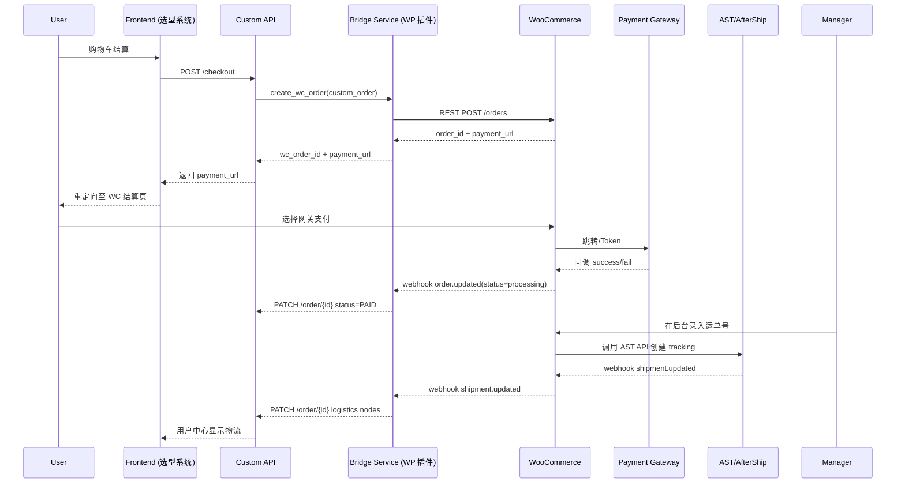

# WooCommerce Bridge 技术实现方案

> 版本：v0.1 Draft  
> 作者：[[填写]]  
> 更新日期：2025-07-07

该文档描述如何在保留现有选型 / 购物车 / 自有订单表的同时，利用 WooCommerce (WC) 生态完成**支付、发货、物流跟踪**功能。包括系统架构、数据模型映射、主要流程、接口说明、安全与监控策略等。

---

## 1. 系统架构



> 注：Bridge Service 以 **WordPress 插件**形式存在；关键逻辑在 `includes/class-bjt-wc-bridge.php`。

---

## 2. 数据模型映射

| 自有系统字段 | WooCommerce 字段 / Meta | 说明 |
|--------------|-------------------------|------|
| `order.id`   | meta:`custom_order_id`  | 双向定位 |
| `user_id`    | `customer_id`           | 使用 WP 用户 ID，若未登录则 0 |
| `currency`   | `currency`              | 与 WC 货币保持一致 |
| `items.sku`  | `line_items[].sku`      | WC 商品可为虚拟 SKU，占位库存 |
| `items.price`| `line_items[].subtotal`/`total` | 直接写实时价格 |
| `discount`   | `fee_lines` (负值) 或 `coupon_lines` | 实现折扣 |
| `weight`     | meta:`weight_total`     | 供下单条件校验 |
| `status`     | WC Status → 自家枚举   | 通过 Webhook 同步 |
| `tracking`   | meta:`_ast_tracking_items` | AST 插件存储 |

> WordPress 表：`wp_posts` 保存订单主体，`wp_postmeta` 保存自定义 meta。

---

## 3. 关键流程

### 3.1 创建 WC 订单

```php
function bjt_bridge_create_wc_order($custOrder) {
    $order = wc_create_order(['status' => 'pending']);

    // Billing & Shipping
    $order->set_address(map_billing($custOrder), 'billing');
    $order->set_address(map_shipping($custOrder), 'shipping');

    // Line items
    foreach ($custOrder['items'] as $item) {
        $product = bjt_get_or_create_virtual_product($item['sku']);
        $order->add_product($product, $item['qty'], [
            'subtotal' => $item['price'],
            'total'    => $item['price']
        ]);
    }

    // Meta
    $order->update_meta_data('custom_order_id', $custOrder['id']);
    $order->update_meta_data('weight_total', $custOrder['weight']);

    $order->calculate_totals();
    $order->save();

    return [
        'wc_order_id'  => $order->get_id(),
        'payment_url'  => $order->get_checkout_payment_url(),
    ];
}
```

### 3.2 状态同步

```php
add_action('woocommerce_order_status_changed', function($order_id,$old,$new){
    $coid = get_post_meta($order_id,'custom_order_id',true);
    if(!$coid) return;
    $payload = [
        'orderId'   => $coid,
        'wcStatus'  => $new,
        'txnId'     => bjt_get_txn_id($order_id)
    ];
    bjt_call_internal_api('/order/update-status', $payload);
}, 10, 3);
```

### 3.3 物流更新

AST Webhook 指向：`/wp-json/bjt/v1/shipment`，插件处理：

```php
register_rest_route('bjt/v1', '/shipment', [
  'methods'  => 'POST',
  'callback' => 'bjt_handle_shipment_update',
]);

function bjt_handle_shipment_update(WP_REST_Request $req){
    $order_id = $req['order_id'];
    $coid = get_post_meta($order_id,'custom_order_id',true);
    $nodes = $req['tracking_history'];
    bjt_call_internal_api('/order/update-logistics',[
        'orderId'=>$coid,
        'nodes'=>$nodes
    ]);
    return new WP_REST_Response(['success'=>true]);
}
```

---

## 4. 安全设计

1. REST 调用使用 **Application Password** + HTTPS；回源到内部 API 时走内网或签名 header。  
2. Webhook 验证：支付 / AST 均提供签名，Bridge 校验 `x-wc-webhook-signature`。  
3. 权限：自定义 WP 角色 `bjt_bridge` 仅允许 `create_orders`、`read_orders`，避免暴露后台 UI。

---

## 5. 错误处理 & 重试

| 场景 | 策略 |
|------|------|
| 创建订单调用 WC 失败 | 记录队列，重试 3 次；仍失败则标记为 `WC_SYNC_ERROR` 并通知管理员 |
| Webhook 回源失败 | WC 支持重放；Bridge 将失败事件写入 `wp_options` 队列并定时补偿 |
| AST 超时 | 缓存上次成功节点；显示"物流信息暂不可用" |

---

## 6. 监控与指标

- **订单同步成功率** >= 99.5%  
- **支付成功回调延迟** p95 < 30s  
- **Webhook 错误数** < 5/天  
- Prometheus exporter 暴露 `/metrics`：`bjt_wc_bridge_sync_total`, `bjt_wc_bridge_sync_fail_total`, `bjt_wc_bridge_latency_seconds`。

---

## 7. 部署

1. 将 `bjt-wc-bridge/` 目录打包为 zip，上传 WP → 插件激活。  
2. `.env` 追加：
   ```
   WC_API_KEY=ck_****
   WC_API_SECRET=cs_****
   BRIDGE_INTERNAL_API=https://api.bjt.local
   ```
3. NGINX 增加 `/wp-json/bjt/*` 路由放行。  
4. 配置 WooCommerce Webhook： Orders Updated, Shipments Updated → 指向 `/wp-json/bjt/v1/hooks`。

---

## 8. 待办 & 版本计划

| 里程碑 | 版本 | 内容 |
|--------|------|------|
| M1 | 0.1 | 创建订单 + 支付成功回调原型 |
| M2 | 0.2 | 物流 webhook、错误补偿、Prometheus 指标 |
| M3 | 0.3 | 发票同步、退款接口、单元测试覆盖 80% |
| GA | 1.0 | 安全审计、负载压测、文档完备 | 