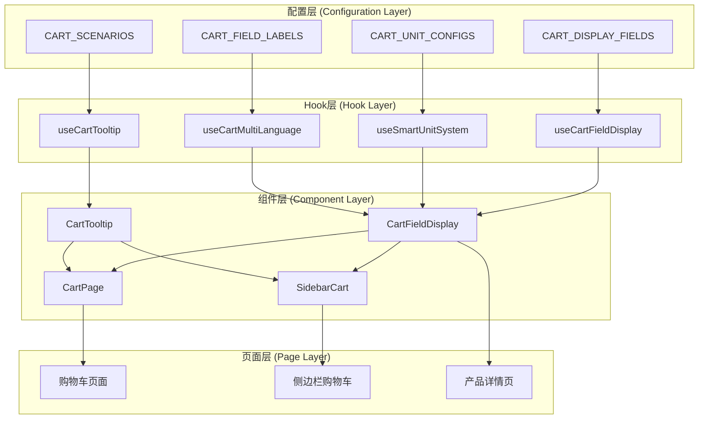
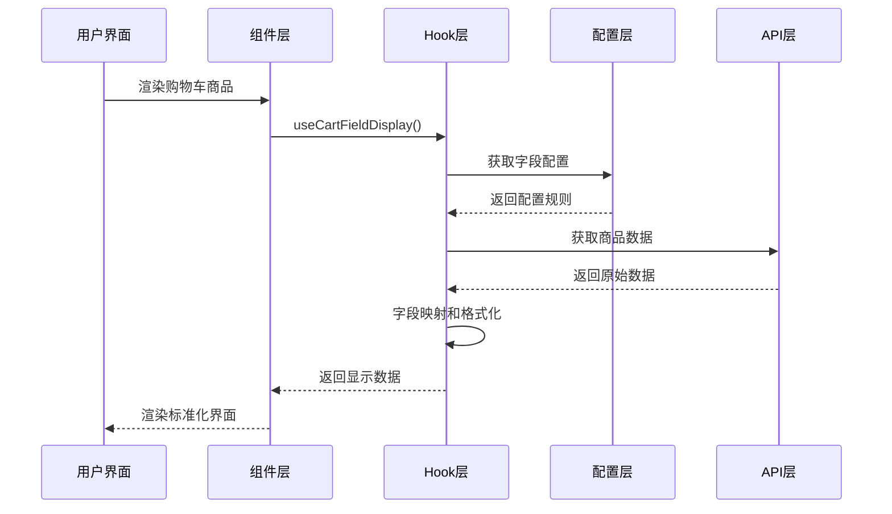
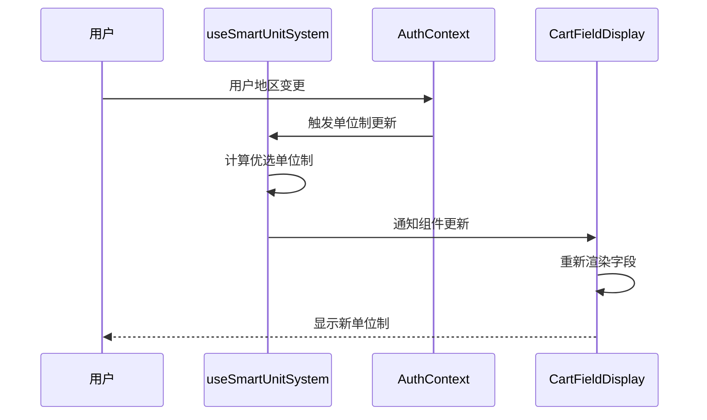

# 系统架构设计

## 🏗️ 整体架构概览

购物车系统采用**配置驱动 + Hook封装 + 组件标准化**的三层架构，确保跨产品类型的统一字段显示标准。



## 🎯 设计原则

### 1. 配置驱动原则
- **统一配置管理** - 所有字段映射、标签、单位配置集中管理
- **产品类型解耦** - 主机、配件、耗材、备件使用统一的配置结构
- **场景化配置** - 支持购物车页面、侧边栏、Tooltip不同展示场景

### 2. Hook封装原则
- **逻辑复用** - 核心显示逻辑通过Hook复用
- **状态管理** - 智能单位制、多语言状态统一管理
- **性能优化** - Hook内部实现缓存和优化策略

### 3. 组件标准化原则
- **一致性保证** - 统一的组件API和显示标准
- **可扩展性** - 支持新产品类型和字段的快速扩展
- **可维护性** - 清晰的组件职责和接口定义

## 🔧 核心技术栈

### 前端技术
```typescript
// 核心技术栈
React 18.x              // 主框架
TypeScript 4.x          // 类型安全
React Query            // 数据获取和缓存
Zustand               // 轻量级状态管理
React Hook Form       // 表单处理
Ant Design            // UI组件库
i18next               // 国际化支持
```

### 工具链
```bash
# 开发工具
Vite                  # 构建工具
ESLint + Prettier     # 代码规范
Husky + lint-staged   # Git钩子
Jest + Testing Library # 测试框架
Storybook            # 组件文档
```

## 📦 模块结构设计

### 配置模块 (config/)
```typescript
// 字段配置中心
export interface CartFieldConfig {
  key: string;                    // 字段键名
  dataType: 'string' | 'number' | 'boolean' | 'array';
  scenarios: CartScenario[];      // 适用场景
  unitConfig?: UnitConfig;        // 单位配置
  displayPriority: number;        // 显示优先级
  validation?: ValidationRule;    // 验证规则
}

// 产品类型配置
export interface ProductTypeConfig {
  type: 'machine' | 'accessory' | 'consumable' | 'spare_part';
  fields: CartFieldConfig[];      // 字段列表
  apiEndpoint: string;           // API端点
  defaultSort: string;           // 默认排序
}
```

### Hook模块 (hooks/)
```typescript
// 核心显示Hook
export const useCartFieldDisplay = (options: {
  productType: ProductType;
  scenario: CartScenario;
  enableDebug?: boolean;
}) => {
  // 字段映射逻辑
  // 单位智能切换
  // 多语言处理
  // 缓存优化
};

// 智能单位制Hook
export const useSmartUnitSystem = () => {
  // 用户地区检测
  // 公制英制切换
  // 单位换算
};
```

### 组件模块 (components/)
```typescript
// 标准字段显示组件
export const CartFieldDisplay: React.FC<{
  product: Product;
  fields: string[];
  scenario: CartScenario;
  layout?: 'horizontal' | 'vertical' | 'grid';
  showTooltip?: boolean;
}>;

// 统一Tooltip组件
export const CartTooltip: React.FC<{
  product: Product;
  placement?: TooltipPlacement;
  children: React.ReactNode;
}>;
```

## 🔄 数据流设计

### 字段显示数据流


### 单位制切换数据流


## 📋 场景支持设计

### 支持的显示场景
```typescript
export enum CartScenario {
  CART_PAGE = 'cart-page',           // 购物车页面
  SIDEBAR_CART = 'sidebar-cart',     // 侧边栏购物车
  CART_TOOLTIP = 'cart-tooltip',     // 购物车Tooltip
  CHECKOUT = 'checkout',             // 结账页面
  ORDER_SUMMARY = 'order-summary'    // 订单摘要
}

// 场景字段配置
export const CART_SCENARIO_CONFIGS = {
  [CartScenario.CART_PAGE]: {
    fields: ['model', 'image_url', 'part_number', 'name', 'voltage', /*...*/],
    layout: 'horizontal',
    showTooltip: true,
    allowEdit: true
  },
  [CartScenario.SIDEBAR_CART]: {
    fields: ['image_url', 'name', 'part_number', 'voltage'],
    layout: 'vertical',
    showTooltip: true,
    allowEdit: false
  },
  // ... 其他场景
};
```

### 产品类型字段映射
```typescript
// 基于 all-pages-display-fields.json 的标准配置
export const PRODUCT_TYPE_FIELDS = {
  // 主机/机器页面字段
  machines: {
    cartFields: [
      'model', 'voltage', 'image_url', 'part_number', 'name',
      'pcs_per_box', 'pallet_size_cm', 'pallet_size_inch', 'pcs_per_pallet'
    ],
    tooltipFields: [
      'package_size_cm', 'package_size_inch', 'net_weight_kg', 'net_weight_lbs',
      'stacking_height_cm', 'stacking_height_inch', 'pallet_gross_weight_kg', 'pallet_gross_weight_lbs'
    ]
  },
  
  // 耗材页面字段
  consumables: {
    cartFields: [
      'app_model', 'name_en', 'image_url', 'part_number', 'model_metric', 'model_imperial',
      'spec', 'spec_imperial', 'bubble_diameter_cm', 'bubble_diameter_inch', 'product_id', 'pcs_per_box'
    ],
    tooltipFields: [
      'material', 'thickness_um', 'thickness_mil', 'film_width_cm', 'film_width_inch',
      'bag_length_cm', 'bag_length_inch', 'total_length_m', 'total_length_ft',
      'package_size_cm', 'package_size_inch', 'net_weight_kg', 'net_weight_lbs'
    ]
  },
  
  // 备件页面字段
  spare_parts: {
    cartFields: [
      'app_model', 'image_url', 'part_number', 'name_en', 'spec', 'app_sn',
      'package_size_cm', 'package_size_inch', 'unit', 'net_weight_kg', 'net_weight_lbs', 'pcs_per_box'
    ],
    tooltipFields: [
      'package_size_cm', 'package_size_inch', 'net_weight_kg', 'net_weight_lbs'
    ]
  },
  
  // 配件页面字段
  accessories: {
    cartFields: [
      'image_url', 'model', 'part_number', 'product_name', 'voltage_v', 'frequency_hz', 'pcs_per_box'
    ],
    tooltipFields: [
      'package_size_cm', 'package_size_inch', 'net_weight_kg', 'net_weight_lbs',
      'stacking_height_cm', 'stacking_height_inch', 'pallet_gross_weight_kg', 'pallet_gross_weight_lbs'
    ]
  }
};
```

## 🔌 API集成设计

### 统一API适配器
```typescript
// API适配器接口
export interface CartApiAdapter<T = any> {
  fetchProducts(params: FetchParams): Promise<T[]>;
  updateQuantity(productId: string, quantity: number): Promise<void>;
  removeProduct(productId: string): Promise<void>;
  
  // 标准化数据格式
  normalizeProduct(rawProduct: any): StandardProduct;
}

// 产品类型API适配器
export class MachineCartAdapter implements CartApiAdapter<Machine> {
  async fetchProducts(params) {
    const response = await fetch('/api/machines', { params });
    return response.data.map(this.normalizeProduct);
  }
  
  normalizeProduct(raw: any): StandardProduct {
    return {
      id: raw.id,
      type: 'machine',
      name: raw.name,
      image_url: raw.image_url,
      // ... 标准化映射
    };
  }
}
```

## 🎨 UI/UX设计规范

### 视觉层次设计
```css
/* 购物车字段显示层次 */
.cart-item {
  --primary-text: #1a1a1a;
  --secondary-text: #666666;
  --tertiary-text: #999999;
  --accent-color: #1890ff;
  --border-color: #d9d9d9;
}

.cart-field-label {
  color: var(--secondary-text);
  font-weight: 500;
  font-size: 12px;
}

.cart-field-value {
  color: var(--primary-text);
  font-weight: 400;
  font-size: 14px;
}

.cart-field-unit {
  color: var(--tertiary-text);
  font-size: 12px;
}
```

### 响应式设计原则
```typescript
// 响应式布局配置
export const RESPONSIVE_LAYOUTS = {
  mobile: {
    cartFields: 4,        // 移动端显示4个核心字段
    layout: 'vertical',
    showTooltip: true
  },
  tablet: {
    cartFields: 6,        // 平板显示6个字段
    layout: 'grid',
    columns: 2
  },
  desktop: {
    cartFields: 8,        // 桌面显示所有字段
    layout: 'horizontal',
    showTooltip: true
  }
};
```

## 🔒 安全和性能设计

### 性能优化策略
```typescript
// 字段显示优化
export const useCartFieldDisplay = memo(() => {
  // 1. 字段配置缓存
  const fieldConfigs = useMemo(() => getFieldConfigs(), [productType]);
  
  // 2. 显示数据缓存
  const displayData = useMemo(() => 
    formatFields(products, fieldConfigs), 
    [products, fieldConfigs]
  );
  
  // 3. 虚拟滚动支持
  const virtualizedItems = useVirtualizer({
    count: products.length,
    getScrollElement: () => containerRef.current,
    estimateSize: () => 120
  });
  
  return { displayData, virtualizedItems };
});
```

### 错误处理策略
```typescript
// 错误边界和降级处理
export const CartFieldErrorBoundary: React.FC = ({ children }) => {
  return (
    <ErrorBoundary
      fallback={<CartFieldFallback />}
      onError={(error, errorInfo) => {
        // 错误上报
        reportError('CartFieldDisplay', error, errorInfo);
      }}
    >
      {children}
    </ErrorBoundary>
  );
};

// 字段显示降级
const getFieldValueSafely = (product: any, field: string): string => {
  try {
    return formatFieldValue(product[field], field);
  } catch (error) {
    logError(`Field display error: ${field}`, error);
    return product[field]?.toString() ?? 'N/A';
  }
};
```

## 📈 扩展性设计

### 新产品类型扩展
```typescript
// 扩展新产品类型的步骤
// 1. 添加产品类型配置
export const NEW_PRODUCT_CONFIG: ProductTypeConfig = {
  type: 'new_product',
  fields: [/* 字段配置 */],
  apiEndpoint: '/api/new-products',
  // ...
};

// 2. 注册产品类型
PRODUCT_TYPE_CONFIGS.new_product = NEW_PRODUCT_CONFIG;

// 3. 创建API适配器
export class NewProductCartAdapter implements CartApiAdapter<NewProduct> {
  // 实现接口方法
}

// 4. 组件自动支持新类型
<CartFieldDisplay 
  productType="new_product"  // 自动使用新配置
  scenario="cart-page"
/>
```

### 新字段扩展
```typescript
// 扩展新字段的步骤
// 1. 添加字段配置
const newFieldConfig: CartFieldConfig = {
  key: 'new_field',
  dataType: 'string',
  scenarios: ['cart-page', 'sidebar-cart'],
  displayPriority: 10,
  unitConfig: {
    metric: 'new_field_metric',
    imperial: 'new_field_imperial'
  }
};

// 2. 添加多语言标签
CART_FIELD_LABELS.zh.new_field = '新字段';
CART_FIELD_LABELS.en.new_field = 'New Field';

// 3. 组件自动支持新字段
// 无需修改组件代码，配置驱动自动支持
```

---

这个系统架构设计确保了购物车系统的：
- **统一性** - 跨产品类型的一致显示标准
- **扩展性** - 新产品类型和字段的快速支持
- **维护性** - 配置驱动的清晰架构
- **性能** - 优化的数据处理和渲染策略
- **用户体验** - 智能单位制和多语言支持 