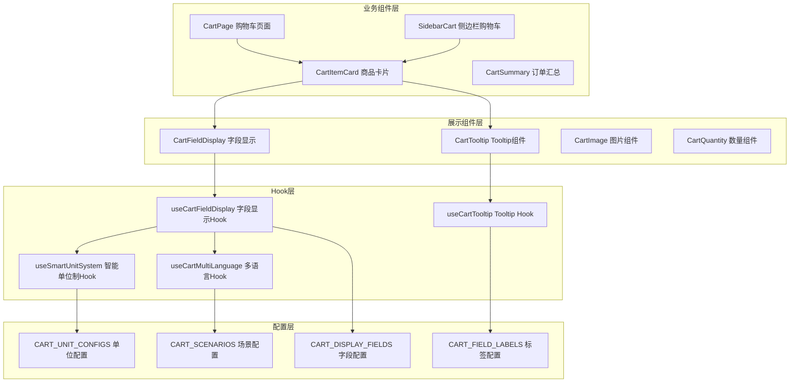

# 组件实现指南

## 🎯 组件架构概览

购物车系统采用分层组件架构，确保可复用性、可维护性和一致性。



## 🏗️ Hook层实现

### 1. useCartFieldDisplay Hook

```typescript
import { useMemo } from 'react';
import { useSmartUnitSystem } from './useSmartUnitSystem';
import { useCartMultiLanguage } from './useCartMultiLanguage';
import { 
  MACHINE_CART_FIELDS, 
  CONSUMABLE_CART_FIELDS, 
  SPARE_PART_CART_FIELDS, 
  ACCESSORY_CART_FIELDS 
} from '../configs/fieldMappings';

interface UseCartFieldDisplayProps {
  productType: 'machine' | 'consumable' | 'spare_part' | 'accessory';
  scenario: 'cart-page' | 'sidebar-cart' | 'cart-tooltip';
}

export const useCartFieldDisplay = ({ 
  productType, 
  scenario 
}: UseCartFieldDisplayProps) => {
  const { preferredUnitSystem } = useSmartUnitSystem();
  const { currentLanguage, t } = useCartMultiLanguage();
  
  // 获取产品类型对应的字段配置
  const fieldConfigs = useMemo(() => {
    const configMap = {
      'machine': MACHINE_CART_FIELDS,
      'consumable': CONSUMABLE_CART_FIELDS,
      'spare_part': SPARE_PART_CART_FIELDS,
      'accessory': ACCESSORY_CART_FIELDS
    };
    
    return configMap[productType] || {};
  }, [productType]);
  
  // 根据场景过滤字段
  const getScenarioFields = useMemo(() => {
    return (maxFields?: number) => {
      const allFields = Object.values(fieldConfigs);
      const sortedFields = allFields.sort((a, b) => a.priority - b.priority);
      
      if (maxFields && maxFields > 0) {
        return sortedFields.slice(0, maxFields);
      }
      
      return sortedFields;
    };
  }, [fieldConfigs]);
  
  // 智能单位制字段选择
  const getSmartField = useMemo(() => {
    return (fieldConfig: any) => {
      if (!fieldConfig.unitConfig) return fieldConfig.key;
      
      const unitConfig = fieldConfig.unitConfig;
      
      // 如果有智能单位制配置
      if (unitConfig.metric && unitConfig.imperial) {
        return unitConfig[preferredUnitSystem];
      }
      
      return fieldConfig.key;
    };
  }, [preferredUnitSystem]);
  
  // 获取字段标签
  const getFieldLabel = useMemo(() => {
    return (fieldKey: string) => {
      const fieldConfig = fieldConfigs[fieldKey];
      if (!fieldConfig) return fieldKey;
      
      return fieldConfig.displayName[currentLanguage] || fieldConfig.displayName.zh || fieldKey;
    };
  }, [fieldConfigs, currentLanguage]);
  
  // 格式化字段值
  const formatFieldValue = useMemo(() => {
    return (value: any, fieldKey: string) => {
      if (value === null || value === undefined) return '';
      
      const fieldConfig = fieldConfigs[fieldKey];
      if (!fieldConfig) return String(value);
      
      const formatter = fieldConfig.formatter;
      if (formatter && FIELD_FORMATTERS[formatter]) {
        return FIELD_FORMATTERS[formatter](value);
      }
      
      return String(value);
    };
  }, [fieldConfigs]);
  
  // 为Tooltip格式化字段
  const formatFieldsForTooltip = useMemo(() => {
    return (product: any, tooltipConfig: any) => {
      return tooltipConfig.fields
        .map((fieldConfig: any) => {
          const targetField = getSmartField(fieldConfig);
          const rawValue = product[targetField];
          
          if (!rawValue && rawValue !== 0) return null;
          
          return {
            key: fieldConfig.key,
            targetField,
            group: fieldConfig.group,
            priority: fieldConfig.priority,
            label: getFieldLabel(targetField),
            formattedValue: formatFieldValue(rawValue, targetField),
            rawValue
          };
        })
        .filter(Boolean)
        .sort((a: any, b: any) => a.priority - b.priority);
    };
  }, [getSmartField, getFieldLabel, formatFieldValue]);
  
  // 为购物车页面格式化字段
  const formatFieldsForCart = useMemo(() => {
    return (product: any, maxFields?: number) => {
      const scenarioFields = getScenarioFields(maxFields);
      
      return scenarioFields
        .map(fieldConfig => {
          const targetField = getSmartField(fieldConfig);
          const rawValue = product[targetField];
          
          if (!rawValue && rawValue !== 0 && !fieldConfig.required) return null;
          
          return {
            key: fieldConfig.key,
            targetField,
            priority: fieldConfig.priority,
            label: getFieldLabel(targetField),
            formattedValue: formatFieldValue(rawValue, targetField),
            rawValue,
            required: fieldConfig.required,
            dataType: fieldConfig.dataType
          };
        })
        .filter(Boolean);
    };
  }, [getScenarioFields, getSmartField, getFieldLabel, formatFieldValue]);
  
  return {
    fieldConfigs,
    getScenarioFields,
    getSmartField,
    getFieldLabel,
    formatFieldValue,
    formatFieldsForTooltip,
    formatFieldsForCart,
    preferredUnitSystem,
    currentLanguage
  };
};

// 字段格式化器（从配置文件导入）
import { FIELD_FORMATTERS } from '../configs/fieldMappings';
```

### 2. useSmartUnitSystem Hook

```typescript
import { useState, useEffect, useMemo } from 'react';
import { getUserRegion } from '../utils/locationUtils';

export const useSmartUnitSystem = () => {
  const [userRegion, setUserRegion] = useState<string>('cn');
  const [manualOverride, setManualOverride] = useState<string | null>(null);
  
  // 获取用户地区
  useEffect(() => {
    const detectUserRegion = async () => {
      try {
        const region = await getUserRegion();
        setUserRegion(region);
      } catch (error) {
        console.warn('无法检测用户地区，使用默认值:', error);
        setUserRegion('cn');
      }
    };
    
    detectUserRegion();
  }, []);
  
  // 智能单位制偏好
  const preferredUnitSystem = useMemo(() => {
    // 手动覆盖优先
    if (manualOverride) {
      return manualOverride === 'metric' ? 'metric' : 'imperial';
    }
    
    // 根据地区自动选择
    const regionUnitMapping = {
      'na': 'imperial',    // 北美
      'au': 'imperial',    // 澳洲
      'cn': 'metric',      // 中国
      'eu': 'metric',      // 欧洲
      'default': 'metric'  // 默认
    };
    
    return regionUnitMapping[userRegion] || regionUnitMapping.default;
  }, [userRegion, manualOverride]);
  
  // 单位制转换工具
  const convertValue = useMemo(() => {
    return (value: number, fromUnit: string, toUnit: string): number => {
      const conversionRules = {
        // 重量转换
        'kg_to_lbs': (kg: number) => kg * 2.20462,
        'lbs_to_kg': (lbs: number) => lbs / 2.20462,
        
        // 长度转换
        'cm_to_inch': (cm: number) => cm / 2.54,
        'inch_to_cm': (inch: number) => inch * 2.54,
        'm_to_ft': (m: number) => m * 3.28084,
        'ft_to_m': (ft: number) => ft / 3.28084,
      };
      
      const conversionKey = `${fromUnit}_to_${toUnit}`;
      const converter = conversionRules[conversionKey];
      
      if (converter) {
        return Number(converter(value).toFixed(2));
      }
      
      return value;
    };
  }, []);
  
  // 获取单位制标签
  const getUnitLabel = useMemo(() => {
    return (fieldType: string) => {
      const unitLabels = {
        weight: {
          metric: 'kg',
          imperial: 'lbs'
        },
        dimension: {
          metric: 'cm',
          imperial: 'inch'
        },
        length: {
          metric: 'm',
          imperial: 'ft'
        },
        height: {
          metric: 'cm',
          imperial: 'inch'
        }
      };
      
      return unitLabels[fieldType]?.[preferredUnitSystem] || '';
    };
  }, [preferredUnitSystem]);
  
  // 切换单位制
  const toggleUnitSystem = () => {
    const newSystem = preferredUnitSystem === 'metric' ? 'imperial' : 'metric';
    setManualOverride(newSystem);
    
    // 保存用户偏好到localStorage
    localStorage.setItem('user_unit_preference', newSystem);
  };
  
  // 重置为自动检测
  const resetToAuto = () => {
    setManualOverride(null);
    localStorage.removeItem('user_unit_preference');
  };
  
  // 初始化时读取用户偏好
  useEffect(() => {
    const savedPreference = localStorage.getItem('user_unit_preference');
    if (savedPreference && ['metric', 'imperial'].includes(savedPreference)) {
      setManualOverride(savedPreference);
    }
  }, []);
  
  return {
    userRegion,
    preferredUnitSystem,
    manualOverride,
    convertValue,
    getUnitLabel,
    toggleUnitSystem,
    resetToAuto,
    isAutoDetected: !manualOverride
  };
};
```

### 3. useCartMultiLanguage Hook

```typescript
import { useState, useEffect, useMemo } from 'react';

interface LanguageResource {
  [key: string]: {
    zh: string;
    en: string;
  };
}

export const useCartMultiLanguage = () => {
  const [currentLanguage, setCurrentLanguage] = useState<'zh' | 'en'>('zh');
  
  // 语言资源配置
  const languageResources: LanguageResource = useMemo(() => ({
    // 通用标签
    'cart_title': { zh: '购物车', en: 'Shopping Cart' },
    'sidebar_cart_title': { zh: '我的购物车', en: 'My Cart' },
    'product_details': { zh: '产品详情', en: 'Product Details' },
    'quantity': { zh: '数量', en: 'Quantity' },
    'price': { zh: '价格', en: 'Price' },
    'total': { zh: '小计', en: 'Subtotal' },
    'remove': { zh: '移除', en: 'Remove' },
    
    // 产品类型
    'machine': { zh: '主机', en: 'Machine' },
    'consumable': { zh: '耗材', en: 'Consumable' },
    'spare_part': { zh: '备件', en: 'Spare Part' },
    'accessory': { zh: '配件', en: 'Accessory' },
    
    // 单位制标签
    'metric_system': { zh: '公制', en: 'Metric' },
    'imperial_system': { zh: '英制', en: 'Imperial' },
    'unit_system_auto': { zh: '自动检测', en: 'Auto Detect' },
    
    // 错误信息
    'field_not_available': { zh: '信息不可用', en: 'Not Available' },
    'loading': { zh: '加载中...', en: 'Loading...' },
    'error_occurred': { zh: '发生错误', en: 'Error Occurred' }
  }), []);
  
  // 翻译函数
  const t = useMemo(() => {
    return (key: string, fallback?: string): string => {
      const resource = languageResources[key];
      if (resource) {
        return resource[currentLanguage] || resource.zh || key;
      }
      
      return fallback || key;
    };
  }, [languageResources, currentLanguage]);
  
  // 切换语言
  const switchLanguage = (lang: 'zh' | 'en') => {
    setCurrentLanguage(lang);
    localStorage.setItem('user_language_preference', lang);
  };
  
  // 自动检测语言
  const detectLanguage = () => {
    const browserLang = navigator.language || navigator.languages[0];
    if (browserLang.startsWith('zh')) {
      return 'zh';
    }
    return 'en';
  };
  
  // 初始化语言设置
  useEffect(() => {
    const savedLang = localStorage.getItem('user_language_preference') as 'zh' | 'en';
    if (savedLang && ['zh', 'en'].includes(savedLang)) {
      setCurrentLanguage(savedLang);
    } else {
      const detectedLang = detectLanguage();
      setCurrentLanguage(detectedLang);
    }
  }, []);
  
  return {
    currentLanguage,
    t,
    switchLanguage,
    languageResources
  };
};
```

## 🧩 展示组件层实现

### 1. CartFieldDisplay 组件

```typescript
import React from 'react';
import { Tooltip } from 'antd';
import { InfoCircleOutlined } from '@ant-design/icons';
import { useCartFieldDisplay } from '../hooks/useCartFieldDisplay';

interface CartFieldDisplayProps {
  product: any;
  productType: 'machine' | 'consumable' | 'spare_part' | 'accessory';
  scenario: 'cart-page' | 'sidebar-cart';
  maxFields?: number;
  layout?: 'horizontal' | 'vertical' | 'grid';
  showTooltip?: boolean;
  className?: string;
}

export const CartFieldDisplay: React.FC<CartFieldDisplayProps> = ({
  product,
  productType,
  scenario,
  maxFields,
  layout = 'vertical',
  showTooltip = true,
  className = ''
}) => {
  const { formatFieldsForCart } = useCartFieldDisplay({
    productType,
    scenario
  });
  
  const fields = formatFieldsForCart(product, maxFields);
  
  const renderFieldItem = (field: any) => {
    const fieldElement = (
      <div 
        key={field.key} 
        className={`cart-field-item ${field.required ? 'required' : ''}`}
        data-field={field.key}
        data-field-type={field.dataType}
      >
        <div className="field-label">
          {field.label}
        </div>
        <div className="field-value">
          {field.formattedValue || '-'}
        </div>
      </div>
    );
    
    // 如果字段有详细信息且启用了tooltip
    if (showTooltip && field.rawValue) {
      return (
        <Tooltip
          key={field.key}
          title={`${field.label}: ${field.formattedValue}`}
          placement="top"
        >
          {fieldElement}
        </Tooltip>
      );
    }
    
    return fieldElement;
  };
  
  return (
    <div className={`cart-field-display ${layout} ${className}`}>
      {fields.map(renderFieldItem)}
    </div>
  );
};
```

### 2. CartItemCard 组件

```typescript
import React from 'react';
import { Card, InputNumber, Button } from 'antd';
import { DeleteOutlined, InfoCircleOutlined } from '@ant-design/icons';
import { CartFieldDisplay } from './CartFieldDisplay';
import { 
  MachineTooltip, 
  ConsumableTooltip, 
  SparePartTooltip, 
  AccessoryTooltip 
} from './tooltips';

interface CartItem {
  id: string;
  productType: 'machine' | 'consumable' | 'spare_part' | 'accessory';
  quantity: number;
  price?: number;
  [key: string]: any;
}

interface CartItemCardProps {
  item: CartItem;
  onQuantityChange: (id: string, quantity: number) => void;
  onRemove: (id: string) => void;
  layout?: 'horizontal' | 'vertical';
}

export const CartItemCard: React.FC<CartItemCardProps> = ({
  item,
  onQuantityChange,
  onRemove,
  layout = 'horizontal'
}) => {
  // 渲染产品特定的Tooltip
  const renderProductTooltip = () => {
    const tooltipProps = {
      placement: 'topRight' as const,
      children: <InfoCircleOutlined className="info-icon" />
    };
    
    switch (item.productType) {
      case 'machine':
        return <MachineTooltip machine={item} {...tooltipProps} />;
      case 'consumable':
        return <ConsumableTooltip consumable={item} {...tooltipProps} />;
      case 'spare_part':
        return <SparePartTooltip sparePart={item} {...tooltipProps} />;
      case 'accessory':
        return <AccessoryTooltip accessory={item} {...tooltipProps} />;
      default:
        return null;
    }
  };
  
  return (
    <Card 
      className={`cart-item-card ${layout}`}
      size="small"
    >
      <div className="card-content">
        {/* 产品图片 */}
        <div className="product-image">
           {
              (e.target as HTMLImageElement).src = '/images/placeholder.png';
            }}
          />
        </div>
        
        {/* 产品信息 */}
        <div className="product-info">
          <div className="product-header">
            <h4 className="product-name">
              {item.name || item.name_en || item.part_number}
            </h4>
            <div className="product-actions">
              {renderProductTooltip()}
            </div>
          </div>
          
          {/* 字段显示 */}
          <CartFieldDisplay
            product={item}
            productType={item.productType}
            scenario="cart-page"
            maxFields={layout === 'horizontal' ? 6 : 8}
            layout={layout === 'horizontal' ? 'horizontal' : 'grid'}
            className="product-fields"
          />
        </div>
        
        {/* 数量和价格 */}
        <div className="item-controls">
          <div className="quantity-control">
            <label>数量:</label>
            <InputNumber
              min={1}
              max={999}
              value={item.quantity}
              onChange={(value) => onQuantityChange(item.id, value || 1)}
              className="quantity-input"
            />
          </div>
          
          {item.price && (
            <div className="price-info">
              <div className="unit-price">
                单价: ¥{item.price.toFixed(2)}
              </div>
              <div className="total-price">
                小计: ¥{(item.price * item.quantity).toFixed(2)}
              </div>
            </div>
          )}
          
          <Button
            type="text"
            danger
            icon={<DeleteOutlined />}
            onClick={() => onRemove(item.id)}
            className="remove-button"
          >
            移除
          </Button>
        </div>
      </div>
    </Card>
  );
};
```

### 3. SidebarCart 组件

```typescript
import React from 'react';
import { Drawer, Badge, Button, Empty } from 'antd';
import { ShoppingCartOutlined } from '@ant-design/icons';
import { CartFieldDisplay } from './CartFieldDisplay';
import { useCartMultiLanguage } from '../hooks/useCartMultiLanguage';

interface SidebarCartProps {
  visible: boolean;
  onClose: () => void;
  items: CartItem[];
  onQuantityChange: (id: string, quantity: number) => void;
  onRemove: (id: string) => void;
  onCheckout: () => void;
}

export const SidebarCart: React.FC<SidebarCartProps> = ({
  visible,
  onClose,
  items,
  onQuantityChange,
  onRemove,
  onCheckout
}) => {
  const { t } = useCartMultiLanguage();
  
  // 计算汇总信息
  const summary = React.useMemo(() => {
    const totalItems = items.reduce((sum, item) => sum + item.quantity, 0);
    const totalPrice = items.reduce((sum, item) => 
      sum + (item.price || 0) * item.quantity, 0
    );
    
    return { totalItems, totalPrice };
  }, [items]);
  
  const renderCartItem = (item: CartItem) => {
    const tooltipComponents = {
      'machine': MachineTooltip,
      'consumable': ConsumableTooltip,
      'spare_part': SparePartTooltip,
      'accessory': AccessoryTooltip
    };
    
    const TooltipComponent = tooltipComponents[item.productType];
    
    return (
      <div key={item.id} className="sidebar-cart-item">
        <TooltipComponent 
          {...{ [item.productType]: item }}
          placement="left"
        >
          <div className="item-content">
            <div className="item-image">
              
            </div>
            
            <div className="item-details">
              <div className="item-name">
                {item.name || item.name_en}
              </div>
              
              <CartFieldDisplay
                product={item}
                productType={item.productType}
                scenario="sidebar-cart"
                maxFields={3}
                layout="vertical"
                showTooltip={false}
                className="compact-fields"
              />
              
              <div className="item-controls">
                <InputNumber
                  min={1}
                  size="small"
                  value={item.quantity}
                  onChange={(value) => onQuantityChange(item.id, value || 1)}
                />
                <Button
                  type="text"
                  size="small"
                  danger
                  onClick={() => onRemove(item.id)}
                >
                  移除
                </Button>
              </div>
            </div>
          </div>
        </TooltipComponent>
      </div>
    );
  };
  
  return (
    <Drawer
      title={
        <div className="sidebar-cart-header">
          <ShoppingCartOutlined />
          <span>{t('sidebar_cart_title')}</span>
          <Badge count={summary.totalItems} />
        </div>
      }
      placement="right"
      onClose={onClose}
      open={visible}
      width={400}
      className="sidebar-cart-drawer"
    >
      <div className="sidebar-cart-content">
        {items.length === 0 ? (
          <Empty
            description={t('cart_empty', '购物车为空')}
            image={Empty.PRESENTED_IMAGE_SIMPLE}
          />
        ) : (
          <>
            <div className="cart-items">
              {items.map(renderCartItem)}
            </div>
            
            <div className="cart-summary">
              <div className="summary-row">
                <span>商品数量:</span>
                <span>{summary.totalItems}件</span>
              </div>
              {summary.totalPrice > 0 && (
                <div className="summary-row total">
                  <span>总计:</span>
                  <span>¥{summary.totalPrice.toFixed(2)}</span>
                </div>
              )}
              
              <Button
                type="primary"
                size="large"
                block
                onClick={onCheckout}
                disabled={items.length === 0}
                className="checkout-button"
              >
                去结算
              </Button>
            </div>
          </>
        )}
      </div>
    </Drawer>
  );
};
```

## 🎨 样式规范

### CSS变量定义
```css
:root {
  /* 购物车主色调 */
  --cart-primary-color: #1890ff;
  --cart-success-color: #52c41a;
  --cart-warning-color: #faad14;
  --cart-error-color: #ff4d4f;
  
  /* 背景色 */
  --cart-bg-primary: #ffffff;
  --cart-bg-secondary: #fafafa;
  --cart-bg-tertiary: #f5f5f5;
  
  /* 文字色 */
  --cart-text-primary: rgba(0, 0, 0, 0.85);
  --cart-text-secondary: rgba(0, 0, 0, 0.65);
  --cart-text-tertiary: rgba(0, 0, 0, 0.45);
  
  /* 边框色 */
  --cart-border-color: #d9d9d9;
  --cart-border-color-light: #f0f0f0;
  
  /* 间距 */
  --cart-spacing-xs: 4px;
  --cart-spacing-sm: 8px;
  --cart-spacing-md: 16px;
  --cart-spacing-lg: 24px;
  --cart-spacing-xl: 32px;
  
  /* 字段显示组件 */
  --field-item-padding: 8px 12px;
  --field-label-width: 100px;
  --field-value-color: var(--cart-text-primary);
  
  /* 响应式断点 */
  --mobile-breakpoint: 768px;
  --tablet-breakpoint: 1024px;
}
```

### 字段显示组件样式
```css
.cart-field-display {
  display: flex;
  flex-wrap: wrap;
  gap: var(--cart-spacing-sm);
}

.cart-field-display.vertical {
  flex-direction: column;
}

.cart-field-display.horizontal {
  flex-direction: row;
  align-items: center;
}

.cart-field-display.grid {
  display: grid;
  grid-template-columns: repeat(auto-fit, minmax(150px, 1fr));
  gap: var(--cart-spacing-sm);
}

.cart-field-item {
  display: flex;
  align-items: center;
  padding: var(--field-item-padding);
  border-radius: 4px;
  background: var(--cart-bg-secondary);
  transition: background-color 0.3s;
}

.cart-field-item:hover {
  background: var(--cart-bg-tertiary);
}

.cart-field-item.required {
  border-left: 3px solid var(--cart-primary-color);
}

.field-label {
  font-size: 12px;
  color: var(--cart-text-secondary);
  margin-right: var(--cart-spacing-sm);
  min-width: var(--field-label-width);
  flex-shrink: 0;
}

.field-value {
  font-size: 13px;
  color: var(--field-value-color);
  font-weight: 500;
  flex-grow: 1;
  text-align: right;
}

/* 购物车项卡片样式 */
.cart-item-card {
  margin-bottom: var(--cart-spacing-md);
  border-radius: 8px;
  box-shadow: 0 2px 8px rgba(0, 0, 0, 0.06);
  transition: box-shadow 0.3s;
}

.cart-item-card:hover {
  box-shadow: 0 4px 16px rgba(0, 0, 0, 0.1);
}

.card-content {
  display: flex;
  gap: var(--cart-spacing-md);
  padding: var(--cart-spacing-md);
}

.product-image {
  flex-shrink: 0;
  width: 80px;
  height: 80px;
  border-radius: 6px;
  overflow: hidden;
  background: var(--cart-bg-tertiary);
}

.product-image img {
  width: 100%;
  height: 100%;
  object-fit: cover;
}

.product-info {
  flex-grow: 1;
  min-width: 0;
}

.product-header {
  display: flex;
  justify-content: space-between;
  align-items: flex-start;
  margin-bottom: var(--cart-spacing-sm);
}

.product-name {
  font-size: 14px;
  font-weight: 600;
  color: var(--cart-text-primary);
  margin: 0;
  line-height: 1.4;
}

.product-actions {
  display: flex;
  gap: var(--cart-spacing-xs);
}

.info-icon {
  color: var(--cart-text-tertiary);
  cursor: pointer;
  transition: color 0.3s;
}

.info-icon:hover {
  color: var(--cart-primary-color);
}

.item-controls {
  flex-shrink: 0;
  display: flex;
  flex-direction: column;
  gap: var(--cart-spacing-sm);
  align-items: flex-end;
  min-width: 120px;
}

.quantity-control {
  display: flex;
  align-items: center;
  gap: var(--cart-spacing-xs);
}

.quantity-control label {
  font-size: 12px;
  color: var(--cart-text-secondary);
}

.price-info {
  text-align: right;
}

.unit-price {
  font-size: 12px;
  color: var(--cart-text-secondary);
}

.total-price {
  font-size: 14px;
  font-weight: 600;
  color: var(--cart-primary-color);
}

/* 侧边栏购物车样式 */
.sidebar-cart-drawer .ant-drawer-body {
  padding: 0;
  display: flex;
  flex-direction: column;
}

.sidebar-cart-header {
  display: flex;
  align-items: center;
  gap: var(--cart-spacing-sm);
}

.sidebar-cart-content {
  display: flex;
  flex-direction: column;
  height: 100%;
}

.cart-items {
  flex-grow: 1;
  overflow-y: auto;
  padding: var(--cart-spacing-md);
}

.sidebar-cart-item {
  margin-bottom: var(--cart-spacing-md);
  padding: var(--cart-spacing-sm);
  border: 1px solid var(--cart-border-color-light);
  border-radius: 6px;
  transition: border-color 0.3s;
}

.sidebar-cart-item:hover {
  border-color: var(--cart-border-color);
}

.item-content {
  display: flex;
  gap: var(--cart-spacing-sm);
}

.item-image {
  width: 50px;
  height: 50px;
  border-radius: 4px;
  overflow: hidden;
  background: var(--cart-bg-tertiary);
  flex-shrink: 0;
}

.item-image img {
  width: 100%;
  height: 100%;
  object-fit: cover;
}

.item-details {
  flex-grow: 1;
  min-width: 0;
}

.item-name {
  font-size: 13px;
  font-weight: 500;
  color: var(--cart-text-primary);
  margin-bottom: var(--cart-spacing-xs);
  line-height: 1.3;
}

.compact-fields .field-label {
  min-width: 60px;
  font-size: 11px;
}

.compact-fields .field-value {
  font-size: 12px;
}

.item-controls {
  display: flex;
  justify-content: space-between;
  align-items: center;
  margin-top: var(--cart-spacing-xs);
}

.cart-summary {
  padding: var(--cart-spacing-md);
  border-top: 1px solid var(--cart-border-color-light);
  background: var(--cart-bg-secondary);
}

.summary-row {
  display: flex;
  justify-content: space-between;
  margin-bottom: var(--cart-spacing-xs);
  font-size: 13px;
}

.summary-row.total {
  font-size: 16px;
  font-weight: 600;
  color: var(--cart-primary-color);
  border-top: 1px solid var(--cart-border-color-light);
  padding-top: var(--cart-spacing-sm);
  margin-top: var(--cart-spacing-sm);
}

.checkout-button {
  margin-top: var(--cart-spacing-md);
  height: 40px;
  border-radius: 6px;
}

/* 响应式适配 */
@media (max-width: 768px) {
  .cart-field-display.horizontal {
    flex-direction: column;
  }
  
  .cart-field-display.grid {
    grid-template-columns: 1fr;
  }
  
  .card-content {
    flex-direction: column;
  }
  
  .product-header {
    flex-direction: column;
    align-items: flex-start;
    gap: var(--cart-spacing-xs);
  }
  
  .item-controls {
    flex-direction: row;
    justify-content: space-between;
    align-items: center;
    min-width: auto;
  }
  
  .field-label {
    min-width: 80px;
  }
  
  .sidebar-cart-drawer {
    width: 100vw !important;
  }
}
```

## 📋 组件实施检查清单

### Hook层检查
- [ ] `useCartFieldDisplay` Hook正确处理所有产品类型
- [ ] `useSmartUnitSystem` Hook智能单位制切换正常
- [ ] `useCartMultiLanguage` Hook多语言切换正确
- [ ] 所有Hook的依赖和缓存优化正确

### 组件层检查
- [ ] `CartFieldDisplay` 组件支持所有布局模式
- [ ] `CartItemCard` 组件响应式布局正确
- [ ] `SidebarCart` 组件交互功能完整
- [ ] 所有组件的TypeScript类型定义正确

### 样式检查
- [ ] CSS变量定义完整
- [ ] 响应式断点适配正确
- [ ] 组件样式在不同浏览器中一致
- [ ] 深色模式支持（如需要）

### 性能检查
- [ ] 组件渲染性能良好
- [ ] 大量数据时滚动流畅
- [ ] 内存使用合理
- [ ] 无不必要的重新渲染

---

这个组件实现指南确保了：
- **架构清晰** - 分层设计，职责明确
- **高度复用** - Hook和组件可以在不同场景中复用
- **类型安全** - 完整的TypeScript类型定义
- **性能优化** - 合理的缓存和优化策略
- **用户体验** - 响应式设计和流畅的交互

## 🛒 购物车功能集成方案 - 最小化修改版

### 核心原则：零破坏性集成
基于现有的添加购物车和侧边栏购物车功能，通过**Hook包装**的方式集成智能单位制，**完全保持现有的多语言、交互行为不受影响**。

### 1. 透明Hook适配器

```typescript
// hooks/useCartDisplayEnhancer.ts - 零侵入的显示增强Hook
import { useMemo } from 'react';
import { useAuth } from '../contexts/AuthContext';
import { useI18n } from 'react-i18next';

export const useCartDisplayEnhancer = (originalData: any) => {
  const { getPreferredUnit } = useAuth();
  const { i18n } = useI18n();
  
  // 获取用户偏好（不影响现有逻辑）
  const preferredUnit = getPreferredUnit?.() || 'metric';
  const currentLanguage = i18n.language || 'zh';
  
  // 智能字段映射（只用于显示增强，不修改原始数据）
  const enhancedDisplayData = useMemo(() => {
    if (!originalData) return originalData;
    
    return {
      ...originalData, // 完全保持所有原始数据
      
      // 只添加显示增强字段（与现有数据隔离）
      _display: {
        // 智能重量显示
        weight: {
          value: preferredUnit === 'metric' ? originalData.net_weight_kg : originalData.net_weight_lbs,
          unit: preferredUnit === 'metric' ? 'kg' : 'lbs',
          label: currentLanguage === 'zh' 
            ? (preferredUnit === 'metric' ? '净重(kg)' : '净重(lbs)')
            : (preferredUnit === 'metric' ? 'Net Weight(kg)' : 'Net Weight(lbs)')
        },
        
        // 智能尺寸显示
        packageSize: {
          value: preferredUnit === 'metric' ? originalData.package_size_cm : originalData.package_size_inch,
          unit: preferredUnit === 'metric' ? 'cm' : 'inch',
          label: currentLanguage === 'zh'
            ? (preferredUnit === 'metric' ? '包装尺寸(cm)' : '包装尺寸(inch)')
            : (preferredUnit === 'metric' ? 'Package Size(cm)' : 'Package Size(inch)')
        },
        
        // 智能数量显示
        quantity: {
          value: originalData.pcs_per_box,
          unit: currentLanguage === 'zh' ? '件' : 'pcs',
          label: currentLanguage === 'zh' ? '单箱数量(件)' : 'Qty per Carton(pcs)'
        },
        
        // 智能名称显示（遵循现有多语言逻辑）
        name: {
          value: currentLanguage === 'zh' ? originalData.name_zh : originalData.name_en,
          label: currentLanguage === 'zh' ? '名称' : 'Item Name'
        }
      }
    };
  }, [originalData, preferredUnit, currentLanguage]);
  
  return {
    // 原始数据（现有逻辑使用，完全不变）
    originalData,
    
    // 增强显示数据（只用于UI显示增强）
    displayData: enhancedDisplayData,
    
    // 便捷的显示方法
    getDisplayValue: (field: string) => {
      return enhancedDisplayData._display?.[field] || originalData[field];
    },
    
    // 用户偏好信息
    preferences: {
      unit: preferredUnit,
      language: currentLanguage
    }
  };
};
```

### 2. 非侵入式显示组件

```typescript
// components/SmartFieldDisplay.tsx - 纯显示组件，不影响现有组件
import React from 'react';
import { useCartDisplayEnhancer } from '../hooks/useCartDisplayEnhancer';

interface SmartFieldDisplayProps {
  data: any;
  field: 'weight' | 'packageSize' | 'quantity' | 'name';
  className?: string;
  showLabel?: boolean;
  children?: (displayInfo: any) => React.ReactNode;
}

export const SmartFieldDisplay: React.FC<SmartFieldDisplayProps> = ({
  data,
  field,
  className = '',
  showLabel = true,
  children
}) => {
  const { getDisplayValue } = useCartDisplayEnhancer(data);
  const displayInfo = getDisplayValue(field);
  
  if (!displayInfo) return null;
  
  // 如果提供了自定义渲染函数，使用它
  if (children) {
    return <>{children(displayInfo)}</>;
  }
  
  // 标准化格式：标题包含单位，内容纯数值
  return (
    <div className={`smart-field-display ${className}`}>
      {showLabel && (
        <span className="field-label">{displayInfo.label}:</span>
      )}
      <span className="field-value">
        {displayInfo.value} {displayInfo.unit && displayInfo.unit}
      </span>
    </div>
  );
};

// 便捷的专用组件（可选使用）
export const SmartWeight = ({ data, ...props }) => (
  <SmartFieldDisplay data={data} field="weight" {...props} />
);

export const SmartPackageSize = ({ data, ...props }) => (
  <SmartFieldDisplay data={data} field="packageSize" {...props} />
);

export const SmartQuantity = ({ data, ...props }) => (
  <SmartFieldDisplay data={data} field="quantity" {...props} />
);

export const SmartName = ({ data, ...props }) => (
  <SmartFieldDisplay data={data} field="name" {...props} />
);
```

### 3. 现有购物车组件的平滑升级

#### 方案A：组件包装模式（推荐 - 零风险）

```typescript
// 现有的购物车按钮组件 - 完全不需要修改
const ExistingAddToCartButton = ({ product, onAddToCart, children, ...props }) => {
  // 所有现有逻辑保持不变
  // 多语言逻辑保持不变
  // 交互行为保持不变
  return (
    <button onClick={() => onAddToCart(product)} {...props}>
      {children}
    </button>
  );
};

// 新的智能包装组件 - 可选择性使用
const SmartAddToCartButton = ({ 
  product, 
  onAddToCart, 
  showSmartDisplay = false, 
  children = '添加到购物车' 
}) => {
  const { displayData, originalData } = useCartDisplayEnhancer(product);
  
  // 购物车逻辑使用原始数据（保持现有行为100%不变）
  const handleAddToCart = () => {
    onAddToCart(originalData); // 传递原始数据给现有逻辑
  };
  
  return (
    <div className="smart-cart-button-wrapper">
      {/* 可选的智能显示信息（不影响现有布局） */}
      {showSmartDisplay && (
        <div className="product-smart-info">
          <SmartName data={product} showLabel={false} />
          <SmartWeight data={product} />
          <SmartQuantity data={product} />
        </div>
      )}
      
      {/* 完全复用现有的购物车按钮，行为、样式、多语言完全不变 */}
      <ExistingAddToCartButton 
        product={originalData} 
        onAddToCart={onAddToCart}
      >
        {children}
      </ExistingAddToCartButton>
    </div>
  );
};
```

#### 方案B：内联增强模式（渐进式升级）

```typescript
// 现有页面组件的升级示例 - 最小化修改
const ProductListPage = () => {
  // ... 所有现有的state和逻辑保持不变
  const [products, setProducts] = useState([]);
  const [cartItems, setCartItems] = useState([]);
  
  // 现有的添加购物车逻辑 - 完全不修改
  const handleAddToCart = (product) => {
    setCartItems(prev => [...prev, product]);
    // ... 其他现有逻辑不变
  };
  
  // 现有的多语言逻辑 - 完全不修改
  const { t, i18n } = useTranslation();
  
  return (
    <div className="product-list">
      {products.map(product => (
        <div key={product.id} className="product-item">
          {/* 现有的产品显示 - 布局、样式完全保持 */}
          <h3>{i18n.language === 'zh' ? product.name_zh : product.name_en}</h3>
          <p>{product.part_number}</p>
          
          {/* 可选：添加智能显示增强（不影响现有布局） */}
          <div className="enhanced-info" style={{ marginTop: '8px' }}>
            <SmartWeight data={product} />
            <SmartPackageSize data={product} />
          </div>
          
          {/* 现有的购物车按钮 - 逻辑完全不变 */}
          <button 
            className="btn btn-primary"
            onClick={() => handleAddToCart(product)}
          >
            {t('addToCart')}
          </button>
        </div>
      ))}
    </div>
  );
};
```

### 4. 侧边栏购物车的智能增强

```typescript
// 现有侧边栏购物车组件的增强
const CartSidebar = ({ cartItems, onUpdateQuantity, onRemoveItem, ...existingProps }) => {
  const { t } = useTranslation(); // 保持现有多语言逻辑
  
  return (
    <div className="cart-sidebar" {...existingProps}>
      <h3>{t('cart.title')}</h3>
      
      {cartItems.map(item => {
        // 使用Hook增强显示，但保持所有现有逻辑
        const { displayData, originalData } = useCartDisplayEnhancer(item);
        
        return (
          <div key={item.id} className="cart-item">
            {/* 现有的基础信息显示 - 保持原样 */}
            <div className="basic-info">
              <h4>
                <SmartName data={item} showLabel={false} />
              </h4>
              <p>{item.part_number}</p>
            </div>
            
            {/* 智能增强的详细信息 - 新增，不影响现有布局 */}
            <div className="smart-details" style={{ fontSize: '12px', color: '#666' }}>
              <SmartWeight data={item} />
              <SmartPackageSize data={item} />
            </div>
            
            {/* 现有的数量控制 - 逻辑完全不变 */}
            <div className="quantity-control">
              <button onClick={() => onUpdateQuantity(originalData.id, item.quantity - 1)}>
                -
              </button>
              <span>{item.quantity}</span>
              <button onClick={() => onUpdateQuantity(originalData.id, item.quantity + 1)}>
                +
              </button>
            </div>
            
            {/* 现有的删除按钮 - 逻辑完全不变 */}
            <button onClick={() => onRemoveItem(originalData.id)}>
              {t('cart.remove')}
            </button>
          </div>
        );
      })}
    </div>
  );
};
```

## 🎛️ 渐进式启用策略

### 环境变量控制（支持快速开关）

```env
# .env.development
REACT_APP_ENABLE_SMART_CART_DISPLAY=true
REACT_APP_SMART_DISPLAY_FEATURES=weight,packageSize,quantity

# .env.production  
REACT_APP_ENABLE_SMART_CART_DISPLAY=false  # 生产环境可选择性启用
```

### 功能开关组件

```typescript
// src/components/FeatureToggle.tsx
export const SmartCartFeature = ({ children, fallback = null }) => {
  const isEnabled = process.env.REACT_APP_ENABLE_SMART_CART_DISPLAY === 'true';
  
  return isEnabled ? children : fallback;
};

// 使用示例 - 可以随时关闭新功能
<SmartCartFeature 
  fallback={<OriginalProductDisplay product={product} />}
>
  <SmartProductDisplay product={product} />
</SmartCartFeature>
```

## 🔒 向后兼容保障

### 数据结构保持（重要）

```typescript
// 购物车数据结构完全不变
interface CartItem {
  id: number;
  part_number: string;
  name_zh: string;
  name_en: string;
  net_weight_kg: number;
  net_weight_lbs: number;
  package_size_cm: string;
  package_size_inch: string;
  pcs_per_box: number;
  quantity: number;
  price: number;
  // ... 所有现有字段保持完全不变
}

// Hook只在内部添加 _display 字段用于增强显示
// 所有现有的购物车逻辑、API调用、结算流程完全不变
```

### API调用保持

```typescript
// 现有的API调用完全不变
const addToCartAPI = (cartItem: CartItem) => {
  return fetch('/api/cart/add', {
    method: 'POST',
    body: JSON.stringify({
      // 传递原始数据，保持API兼容性
      id: cartItem.id,
      part_number: cartItem.part_number,
      quantity: cartItem.quantity,
      // ... 其他原始字段
    })
  });
};

// 现有的多语言API调用也完全不变
const updateCartLanguage = (language: string) => {
  // 现有的语言切换逻辑保持不变
  i18n.changeLanguage(language);
};
```

## 🚨 快速回滚机制

### 代码级快速回滚

```typitten
// 1. 环境变量快速关闭
// 将 REACT_APP_ENABLE_SMART_CART_DISPLAY 设为 false

// 2. 代码级快速回滚
const SMART_FEATURES_ENABLED = false; // 一键关闭所有智能功能

// 3. 组件级快速回滚
const ProductDisplay = ({ product }) => {
  if (!SMART_FEATURES_ENABLED) {
    // 回滚到现有组件，功能完全不变
    return <OriginalProductDisplay product={product} />;
  }
  return <SmartProductDisplay product={product} />;
};
```

### 监控现有功能

```typescript
// 监控现有功能是否受影响
const monitorCartFunctionality = () => {
  console.assert(typeof addToCart === 'function', '添加购物车功能正常');
  console.assert(typeof updateQuantity === 'function', '数量更新功能正常');
  console.assert(typeof removeFromCart === 'function', '删除商品功能正常');
  console.assert(i18n.language, '多语言功能正常');
  console.assert(typeof onLanguageChange === 'function', '语言切换功能正常');
};
```

## 📋 集成检查清单（最小化修改版）

### Phase 1: Hook创建（15分钟）
- [ ] 创建 `useCartDisplayEnhancer` Hook（不影响现有代码）
- [ ] 创建 `SmartFieldDisplay` 组件（纯新增）
- [ ] 添加环境变量控制（可随时关闭）
- [ ] 本地测试Hook功能（隔离测试）

### Phase 2: 选择试点页面（5-10分钟/页面）
- [ ] 选择一个低风险页面作为试点
- [ ] 添加智能显示组件（可选显示，不影响布局）
- [ ] 验证现有功能完全不受影响
- [ ] 验证多语言切换正常（重要）
- [ ] 验证添加购物车交互正常（重要）

### Phase 3: 购物车侧边栏升级（15分钟）
- [ ] 在购物车项目中添加智能显示（不影响现有功能）
- [ ] 确保数量控制逻辑不变（重要）
- [ ] 确保删除商品逻辑不变（重要）
- [ ] 确保结算流程不变（重要）

### Phase 4: 全面验证（20分钟）
- [ ] 测试所有现有的购物车功能
- [ ] 测试多语言切换（切换语言时界面正常）
- [ ] 测试添加/删除商品（交互行为不变）
- [ ] 测试数量修改（操作方式不变）
- [ ] 测试结算流程（流程不变）
- [ ] 性能测试（确保无性能影响）

## 🎯 成功标准（最小化修改版）

### 功能完整性（零破坏性）
- [ ] 所有现有的购物车功能正常工作
- [ ] 多语言切换完全不受影响
- [ ] 添加/删除/修改商品交互完全正常
- [ ] 用户界面响应速度无变化
- [ ] 现有的键盘快捷键、鼠标交互保持不变

### 智能增强效果（渐进性）
- [ ] 智能单位制显示正常（公制/英制自动切换）
- [ ] 多语言字段映射正确
- [ ] 用户偏好设置生效
- [ ] 显示信息更加清晰友好
- [ ] 可以随时关闭智能功能回到原始状态

### 技术质量（高标准）
- [ ] 代码修改量最小化（只添加，不修改现有）
- [ ] 向后兼容性100%
- [ ] 无TypeScript错误
- [ ] 无控制台警告或错误
- [ ] 代码结构清晰，易于维护

## 💡 实施建议（最小化修改）

### 分步实施策略
1. **最小试点**：选择一个简单的产品展示页面，只添加智能显示
2. **验证核心功能**：确认多语言、购物车交互完全正常
3. **保守扩展**：确认无问题后再扩展到其他页面
4. **持续监控**：每个步骤都要验证现有功能

### 沟通和协作
1. **团队同步**：与其他开发者确认哪些功能是核心，不能影响
2. **用户测试**：邀请用户测试，确保体验保持一致
3. **文档记录**：记录每个修改点，便于快速回滚
4. **代码审查**：重点审查是否影响现有功能

### 风险控制
1. **功能开关**：所有新功能都有开关，可以随时关闭
2. **数据隔离**：智能显示数据与现有数据完全隔离
3. **测试覆盖**：重点测试现有功能是否受影响
4. **回滚准备**：随时可以回滚到修改前的状态

这个方案确保了在提供智能单位制显示增强的同时，**完全保持现有系统的稳定性**，所有的多语言功能、用户交互行为都不会受到任何影响。
</rewritten_file> 