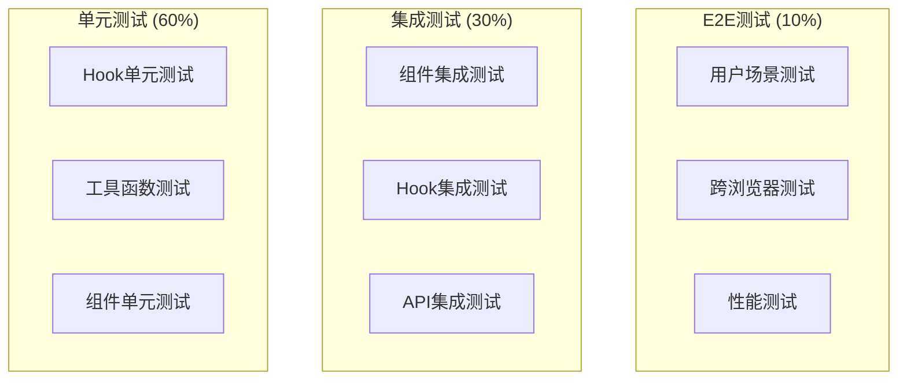

# 测试验证方案

## 🎯 测试验证目标

确保购物车系统的字段显示标准化、单位制智能切换、多语言支持、Tooltip一致性等功能的完整性、准确性和性能表现。

## 🧪 测试分层架构

### 测试金字塔


## 🔬 单元测试实现

### Hook单元测试
```typescript
// tests/hooks/useCartFieldDisplay.test.tsx
import { renderHook } from '@testing-library/react';
import { useCartFieldDisplay } from '../../src/hooks/useCartFieldDisplay';
import { MACHINE_CART_FIELDS } from '../../src/configs/fieldMappings';

describe('useCartFieldDisplay', () => {
  const mockProduct = {
    id: '1',
    name: 'Test Machine',
    part_number: 'TM001',
    net_weight_kg: 25.5,
    net_weight_lbs: 56.2,
    package_size_cm: '75*35*45',
    package_size_inch: '29.5*13.8*17.7'
  };
  
  test('应该正确格式化机器字段', () => {
    const { result } = renderHook(() => 
      useCartFieldDisplay({
        productType: 'machine',
        scenario: 'cart-page'
      })
    );
    
    const fields = result.current.formatFieldsForCart(mockProduct, 6);
    
    expect(fields).toHaveLength(6);
    expect(fields[0]).toMatchObject({
      key: expect.any(String),
      label: expect.any(String),
      formattedValue: expect.any(String),
      required: expect.any(Boolean)
    });
  });
  
  test('应该根据单位制选择正确字段', () => {
    // Mock 公制环境
    jest.mock('../../src/hooks/useSmartUnitSystem', () => ({
      useSmartUnitSystem: () => ({
        preferredUnitSystem: 'metric'
      })
    }));
    
    const { result } = renderHook(() => 
      useCartFieldDisplay({
        productType: 'machine',
        scenario: 'cart-page'
      })
    );
    
    const smartField = result.current.getSmartField({
      key: 'net_weight',
      unitConfig: {
        metric: 'net_weight_kg',
        imperial: 'net_weight_lbs'
      }
    });
    
    expect(smartField).toBe('net_weight_kg');
  });
  
  test('应该正确处理空值和缺失字段', () => {
    const emptyProduct = {
      id: '2',
      name: null,
      part_number: '',
      net_weight_kg: undefined
    };
    
    const { result } = renderHook(() => 
      useCartFieldDisplay({
        productType: 'machine',
        scenario: 'cart-page'
      })
    );
    
    const fields = result.current.formatFieldsForCart(emptyProduct);
    const validFields = fields.filter(field => field.formattedValue);
    
    expect(validFields.length).toBeLessThanOrEqual(fields.length);
  });
});
```

### 工具函数测试
```typescript
// tests/utils/unitConversions.test.ts
import {
  WEIGHT_CONVERSIONS,
  DIMENSION_CONVERSIONS,
  convertFieldValue
} from '../../src/utils/unitConversions';

describe('单位转换工具', () => {
  describe('重量转换', () => {
    test('kg到lbs转换精度', () => {
      const kg = 25.5;
      const lbs = WEIGHT_CONVERSIONS.kg_to_lbs(kg);
      
      expect(lbs).toBeCloseTo(56.218, 2);
    });
    
    test('lbs到kg转换精度', () => {
      const lbs = 56.2;
      const kg = WEIGHT_CONVERSIONS.lbs_to_kg(lbs);
      
      expect(kg).toBeCloseTo(25.491, 2);
    });
    
    test('转换往返精度', () => {
      const original = 25.5;
      const converted = WEIGHT_CONVERSIONS.lbs_to_kg(
        WEIGHT_CONVERSIONS.kg_to_lbs(original)
      );
      
      expect(converted).toBeCloseTo(original, 1);
    });
  });
  
  describe('尺寸转换', () => {
    test('复合尺寸转换', () => {
      const cmDimension = '75*35*45';
      const { value: inchValue } = DIMENSION_CONVERSIONS.convertCompositeDimension(
        cmDimension, 'cm'
      );
      
      expect(inchValue).toMatch(/^\d+\.\d+\*\d+\.\d+\*\d+\.\d+$/);
      
      const dimensions = inchValue.split('*').map(Number);
      expect(dimensions[0]).toBeCloseTo(29.5, 1);
      expect(dimensions[1]).toBeCloseTo(13.8, 1);
      expect(dimensions[2]).toBeCloseTo(17.7, 1);
    });
    
    test('无效尺寸处理', () => {
      const invalidDimensions = ['', 'abc*def', '75*', '*35*45'];
      
      invalidDimensions.forEach(dim => {
        const result = DIMENSION_CONVERSIONS.convertCompositeDimension(dim, 'cm');
        expect(result.value).toBe(dim);
        expect(result.unit).toBe('cm');
      });
    });
  });
});
```

## 🔗 集成测试实现

### 组件集成测试
```typescript
// tests/integration/CartItemCard.test.tsx
import React from 'react';
import { render, screen, fireEvent, waitFor } from '@testing-library/react';
import { CartItemCard } from '../../src/components/CartItemCard';
import { TestProviders } from '../utils/TestProviders';

const mockCartItem = {
  id: '1',
  productType: 'machine' as const,
  name: 'Test Machine',
  part_number: 'TM001',
  image_url: 'test.jpg',
  quantity: 2,
  price: 1000,
  net_weight_kg: 25.5,
  package_size_cm: '75*35*45'
};

describe('CartItemCard 集成测试', () => {
  const mockOnQuantityChange = jest.fn();
  const mockOnRemove = jest.fn();
  
  beforeEach(() => {
    jest.clearAllMocks();
  });
  
  test('应该正确渲染所有字段信息', async () => {
    render(
      <TestProviders>
        <CartItemCard
          item={mockCartItem}
          onQuantityChange={mockOnQuantityChange}
          onRemove={mockOnRemove}
        />
      </TestProviders>
    );
    
    // 检查基础信息
    expect(screen.getByText('Test Machine')).toBeInTheDocument();
    expect(screen.getByText('TM001')).toBeInTheDocument();
    
    // 检查字段显示
    await waitFor(() => {
      expect(screen.getByText(/单件净重/)).toBeInTheDocument();
      expect(screen.getByText('25.5')).toBeInTheDocument();
    });
  });
  
  test('应该正确响应数量变更', async () => {
    render(
      <TestProviders>
        <CartItemCard
          item={mockCartItem}
          onQuantityChange={mockOnQuantityChange}
          onRemove={mockOnRemove}
        />
      </TestProviders>
    );
    
    const quantityInput = screen.getByDisplayValue('2');
    fireEvent.change(quantityInput, { target: { value: '3' } });
    
    await waitFor(() => {
      expect(mockOnQuantityChange).toHaveBeenCalledWith('1', 3);
    });
  });
  
  test('应该正确显示Tooltip', async () => {
    render(
      <TestProviders>
        <CartItemCard
          item={mockCartItem}
          onQuantityChange={mockOnQuantityChange}
          onRemove={mockOnRemove}
        />
      </TestProviders>
    );
    
    const infoIcon = screen.getByRole('button', { name: /info/i });
    fireEvent.mouseEnter(infoIcon);
    
    await waitFor(() => {
      expect(screen.getByText(/产品详细信息/)).toBeInTheDocument();
    });
  });
});
```

### Hook集成测试
```typescript
// tests/integration/smartUnitSystem.test.tsx
import { renderHook, act } from '@testing-library/react';
import { useSmartUnitSystem } from '../../src/hooks/useSmartUnitSystem';
import { useCartFieldDisplay } from '../../src/hooks/useCartFieldDisplay';

describe('智能单位制集成测试', () => {
  test('单位制切换应该影响字段显示', async () => {
    const { result: unitResult } = renderHook(() => useSmartUnitSystem());
    const { result: displayResult } = renderHook(() => 
      useCartFieldDisplay({
        productType: 'machine',
        scenario: 'cart-page'
      })
    );
    
    const testProduct = {
      net_weight_kg: 25.5,
      net_weight_lbs: 56.2
    };
    
    // 初始状态（假设是公制）
    expect(unitResult.current.preferredUnitSystem).toBe('metric');
    
    let smartField = displayResult.current.getSmartField({
      key: 'net_weight',
      unitConfig: {
        metric: 'net_weight_kg',
        imperial: 'net_weight_lbs'
      }
    });
    expect(smartField).toBe('net_weight_kg');
    
    // 切换到英制
    act(() => {
      unitResult.current.toggleUnitSystem();
    });
    
    expect(unitResult.current.preferredUnitSystem).toBe('imperial');
    
    smartField = displayResult.current.getSmartField({
      key: 'net_weight',
      unitConfig: {
        metric: 'net_weight_kg',
        imperial: 'net_weight_lbs'
      }
    });
    expect(smartField).toBe('net_weight_lbs');
  });
});
```

## 🌐 端到端测试

### Cypress E2E测试
```typescript
// cypress/e2e/cart-system.cy.ts
describe('购物车系统完整流程', () => {
  beforeEach(() => {
    cy.visit('/machines');
    cy.viewport(1200, 800);
  });
  
  it('应该支持完整的购物车操作流程', () => {
    // 1. 添加商品到购物车
    cy.get('[data-testid="product-card"]').first().within(() => {
      cy.get('[data-testid="add-to-cart"]').click();
    });
    
    // 2. 验证侧边栏购物车
    cy.get('[data-testid="cart-sidebar-trigger"]').click();
    cy.get('[data-testid="sidebar-cart"]').should('be.visible');
    cy.get('[data-testid="cart-item"]').should('have.length', 1);
    
    // 3. 验证字段显示
    cy.get('[data-testid="cart-item"]').within(() => {
      cy.get('[data-testid="field-label"]').should('be.visible');
      cy.get('[data-testid="field-value"]').should('be.visible');
      
      // 验证单位制显示
      cy.get('[data-testid="field-label"]').contains(/(kg|lbs)/);
    });
    
    // 4. 测试Tooltip
    cy.get('[data-testid="info-icon"]').trigger('mouseenter');
    cy.get('[data-testid="tooltip-content"]').should('be.visible');
    cy.get('[data-testid="tooltip-content"]').should('contain', '产品详细信息');
    
    // 5. 测试单位制切换
    cy.get('[data-testid="unit-system-toggle"]').click();
    cy.wait(500); // 等待切换完成
    
    // 验证单位制已切换
    cy.get('[data-testid="field-label"]').then($labels => {
      const hasImperial = Array.from($labels).some(label => 
        label.textContent?.includes('lbs') || label.textContent?.includes('inch')
      );
      const hasMetric = Array.from($labels).some(label => 
        label.textContent?.includes('kg') || label.textContent?.includes('cm')
      );
      
      expect(hasImperial || hasMetric).to.be.true;
    });
    
    // 6. 进入购物车页面
    cy.get('[data-testid="view-cart"]').click();
    cy.url().should('include', '/cart');
    
    // 7. 验证购物车页面功能
    cy.get('[data-testid="cart-item-card"]').should('be.visible');
    cy.get('[data-testid="quantity-input"]').should('have.value', '1');
    
    // 8. 修改数量
    cy.get('[data-testid="quantity-input"]').clear().type('2');
    cy.get('[data-testid="total-price"]').should('contain', '2');
    
    // 9. 移除商品
    cy.get('[data-testid="remove-item"]').click();
    cy.get('[data-testid="empty-cart"]').should('be.visible');
  });
  
  it('应该支持多语言切换', () => {
    // 切换到英文
    cy.get('[data-testid="language-switcher"]').click();
    cy.get('[data-testid="language-option-en"]').click();
    
    // 验证界面语言
    cy.get('[data-testid="cart-title"]').should('contain', 'Shopping Cart');
    
    // 验证字段标签语言
    cy.get('[data-testid="add-to-cart"]').click();
    cy.get('[data-testid="cart-sidebar-trigger"]').click();
    
    cy.get('[data-testid="field-label"]').then($labels => {
      const hasEnglish = Array.from($labels).some(label => 
        /Weight|Size|Quantity/.test(label.textContent || '')
      );
      expect(hasEnglish).to.be.true;
    });
  });
});
```

### 跨浏览器测试配置
```javascript
// cypress.config.js
module.exports = {
  e2e: {
    baseUrl: 'http://localhost:3000',
    viewportWidth: 1200,
    viewportHeight: 800,
    video: true,
    screenshotOnRunFailure: true,
    
    // 多浏览器测试
    browsers: [
      {
        name: 'chrome',
        channel: 'stable'
      },
      {
        name: 'firefox',
        channel: 'stable'
      },
      {
        name: 'edge',
        channel: 'stable'
      }
    ],
    
    // 移动端测试
    mobileViewports: [
      { width: 375, height: 667 }, // iPhone SE
      { width: 414, height: 896 }, // iPhone 11
      { width: 360, height: 640 }  // Android
    ]
  }
};
```

## 📊 性能测试

### 性能基准测试
```typescript
// tests/performance/cartPerformance.test.ts
import { performance } from 'perf_hooks';

describe('购物车性能测试', () => {
  test('大量商品渲染性能', async () => {
    const startTime = performance.now();
    
    // 创建1000个商品
    const largeCartItems = Array.from({ length: 1000 }, (_, i) => ({
      id: `item-${i}`,
      productType: 'machine' as const,
      name: `Product ${i}`,
      part_number: `PN${i}`,
      quantity: 1,
      net_weight_kg: Math.random() * 100,
      package_size_cm: `${Math.random() * 100}*${Math.random() * 100}*${Math.random() * 100}`
    }));
    
    // 渲染组件
    const { container } = render(
      <TestProviders>
        <CartPage items={largeCartItems} />
      </TestProviders>
    );
    
    await waitFor(() => {
      expect(container.querySelectorAll('[data-testid="cart-item-card"]')).toHaveLength(1000);
    });
    
    const endTime = performance.now();
    const renderTime = endTime - startTime;
    
    // 渲染时间应该少于3秒
    expect(renderTime).toBeLessThan(3000);
  });
  
  test('单位制切换性能', async () => {
    const { result } = renderHook(() => useSmartUnitSystem());
    
    const startTime = performance.now();
    
    // 执行100次切换
    for (let i = 0; i < 100; i++) {
      act(() => {
        result.current.toggleUnitSystem();
      });
    }
    
    const endTime = performance.now();
    const switchTime = endTime - startTime;
    
    // 平均每次切换应该少于10ms
    expect(switchTime / 100).toBeLessThan(10);
  });
});
```

### 内存泄漏测试
```typescript
// tests/performance/memoryLeak.test.ts
describe('内存泄漏测试', () => {
  test('组件卸载后应该清理内存', () => {
    const { unmount } = render(
      <TestProviders>
        <CartPage />
      </TestProviders>
    );
    
    // 记录初始内存
    const initialMemory = (performance as any).memory?.usedJSHeapSize;
    
    // 卸载组件
    unmount();
    
    // 强制垃圾回收（如果可用）
    if (global.gc) {
      global.gc();
    }
    
    // 检查内存是否释放
    setTimeout(() => {
      const finalMemory = (performance as any).memory?.usedJSHeapSize;
      if (initialMemory && finalMemory) {
        const memoryIncrease = finalMemory - initialMemory;
        // 内存增长应该少于10MB
        expect(memoryIncrease).toBeLessThan(10 * 1024 * 1024);
      }
    }, 1000);
  });
});
```

## 🔍 自动化验证脚本

### 浏览器控制台验证
```javascript
// 购物车系统完整验证脚本
window.validateCartSystem = () => {
  console.log('🛒 开始购物车系统完整验证...');
  
  const results = {
    passed: 0,
    failed: 0,
    details: []
  };
  
  const tests = [
    {
      name: '字段显示标准化',
      test: () => {
        const fieldLabels = document.querySelectorAll('[data-testid="field-label"]');
        const fieldValues = document.querySelectorAll('[data-testid="field-value"]');
        
        let hasUnitsInLabels = false;
        let hasUnitsInValues = false;
        
        fieldLabels.forEach(label => {
          if (/(kg|lbs|cm|inch|件|pcs)/.test(label.textContent || '')) {
            hasUnitsInLabels = true;
          }
        });
        
        fieldValues.forEach(value => {
          const text = value.textContent?.trim() || '';
          if (text && text !== 'N/A' && /(kg|lbs|cm|inch|件|pcs)$/.test(text)) {
            hasUnitsInValues = true;
          }
        });
        
        const result = hasUnitsInLabels && !hasUnitsInValues;
        console.log(`标题包含单位: ${hasUnitsInLabels}, 内容包含单位: ${hasUnitsInValues}`);
        return result;
      }
    },
    
    {
      name: '智能单位制切换',
      test: () => {
        const toggleButton = document.querySelector('[data-testid="unit-system-toggle"]');
        if (!toggleButton) return false;
        
        const beforeLabels = Array.from(document.querySelectorAll('[data-testid="field-label"]'))
          .map(el => el.textContent);
        
        toggleButton.click();
        
        // 等待100ms后检查
        return new Promise(resolve => {
          setTimeout(() => {
            const afterLabels = Array.from(document.querySelectorAll('[data-testid="field-label"]'))
              .map(el => el.textContent);
            
            const hasChanged = beforeLabels.some((label, index) => 
              label !== afterLabels[index]
            );
            
            console.log(`单位制切换响应: ${hasChanged ? '正常' : '异常'}`);
            resolve(hasChanged);
          }, 100);
        });
      }
    },
    
    {
      name: 'Tooltip一致性',
      test: () => {
        const infoIcons = document.querySelectorAll('[data-testid="info-icon"]');
        if (infoIcons.length === 0) return false;
        
        infoIcons[0].dispatchEvent(new MouseEvent('mouseenter'));
        
        return new Promise(resolve => {
          setTimeout(() => {
            const tooltipContent = document.querySelector('[data-testid="tooltip-content"]');
            const hasTooltip = tooltipContent && tooltipContent.textContent;
            
            console.log(`Tooltip显示: ${hasTooltip ? '正常' : '异常'}`);
            resolve(!!hasTooltip);
          }, 200);
        });
      }
    },
    
    {
      name: '多语言支持',
      test: () => {
        const langSwitcher = document.querySelector('[data-testid="language-switcher"]');
        if (!langSwitcher) return true; // 如果没有语言切换器，跳过测试
        
        const beforeTexts = Array.from(document.querySelectorAll('[data-testid="field-label"]'))
          .map(el => el.textContent);
        
        // 查找并点击英文选项
        const enOption = document.querySelector('[data-testid="language-option-en"]');
        if (enOption) {
          enOption.click();
          
          return new Promise(resolve => {
            setTimeout(() => {
              const afterTexts = Array.from(document.querySelectorAll('[data-testid="field-label"]'))
                .map(el => el.textContent);
              
              const hasEnglish = afterTexts.some(text => 
                /Weight|Size|Quantity|Model/.test(text || '')
              );
              
              console.log(`多语言切换: ${hasEnglish ? '正常' : '异常'}`);
              resolve(hasEnglish);
            }, 300);
          });
        }
        
        return true;
      }
    },
    
    {
      name: '购物车操作功能',
      test: () => {
        const quantityInputs = document.querySelectorAll('[data-testid="quantity-input"]');
        const removeButtons = document.querySelectorAll('[data-testid="remove-item"]');
        
        const hasQuantityControl = quantityInputs.length > 0;
        const hasRemoveFunction = removeButtons.length > 0;
        
        console.log(`数量控制: ${hasQuantityControl}, 移除功能: ${hasRemoveFunction}`);
        return hasQuantityControl && hasRemoveFunction;
      }
    }
  ];
  
  // 执行所有测试
  const runTests = async () => {
    for (const test of tests) {
      try {
        const result = await test.test();
        if (result) {
          results.passed++;
          console.log(`✅ ${test.name} - 通过`);
        } else {
          results.failed++;
          console.log(`❌ ${test.name} - 失败`);
        }
        results.details.push({ name: test.name, passed: result });
      } catch (error) {
        results.failed++;
        console.error(`❌ ${test.name} - 错误:`, error);
        results.details.push({ name: test.name, passed: false, error: error.message });
      }
    }
    
    const total = results.passed + results.failed;
    const successRate = (results.passed / total) * 100;
    
    console.log(`\n📊 购物车系统验证结果:`);
    console.log(`通过: ${results.passed}/${total} (${successRate.toFixed(1)}%)`);
    
    if (successRate >= 90) {
      console.log('🎉 购物车系统验证通过！');
    } else if (successRate >= 70) {
      console.log('⚠️  购物车系统基本正常，建议优化');
    } else {
      console.log('❌ 购物车系统需要修复');
    }
    
    return {
      success: successRate >= 90,
      successRate,
      results: results.details
    };
  };
  
  return runTests();
};

// 自动执行验证
if (typeof window !== 'undefined') {
  window.validateCartSystem();
}
```

## 📋 测试实施检查清单

### 单元测试检查
- [ ] Hook单元测试覆盖率 ≥ 80%
- [ ] 工具函数测试覆盖率 ≥ 90%
- [ ] 组件单元测试覆盖率 ≥ 70%
- [ ] 边界情况测试完整

### 集成测试检查
- [ ] 组件集成测试覆盖主要场景
- [ ] Hook集成测试验证交互
- [ ] API集成测试数据一致性
- [ ] 错误边界测试完整

### E2E测试检查
- [ ] 用户完整流程测试
- [ ] 跨浏览器兼容性测试
- [ ] 移动端响应式测试
- [ ] 性能基准测试

### 验证脚本检查
- [ ] 自动化验证脚本可执行
- [ ] 验证结果准确可靠
- [ ] 错误信息清晰明确
- [ ] 性能指标符合要求

---

这个测试验证方案确保了：
- **完整覆盖** - 从单元到端到端的全面测试覆盖
- **质量保证** - 多层次的质量检查和验证机制
- **自动化** - 可持续集成的自动化测试流程
- **性能监控** - 性能基准和内存泄漏检测
- **用户体验** - 真实用户场景的端到端验证 