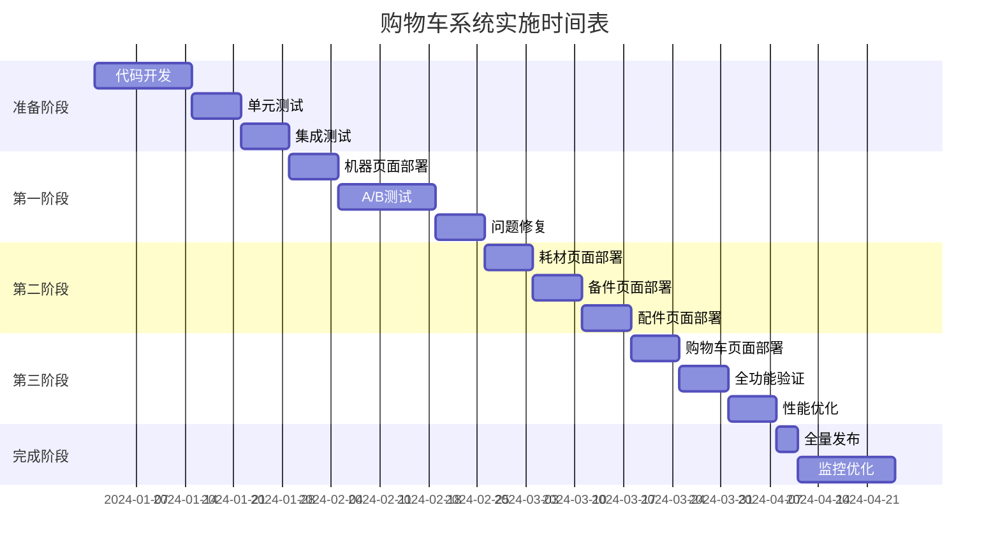

# 实施部署指南

## 🎯 部署目标与策略

通过分阶段、渐进式的部署策略，确保购物车系统标准化升级的零风险实施，最大化用户体验提升，最小化业务中断。

## 📅 分阶段实施计划

### 阶段概览


## 🚀 第一阶段：机器页面试点

### 1.1 环境准备

#### 开发环境配置
```bash
# 1. 环境变量配置
cat > .env.development << EOF
# 购物车系统功能开关
REACT_APP_ENABLE_CART_STANDARDIZATION=true
REACT_APP_ENABLE_SMART_UNIT_SYSTEM=true
REACT_APP_ENABLE_TOOLTIP_STANDARDIZATION=true
REACT_APP_ENABLE_MULTILINGUAL_CART=true

# 调试选项
REACT_APP_ENABLE_CART_DEBUG=true
REACT_APP_ENABLE_FIELD_VALIDATION=true

# A/B测试配置
REACT_APP_AB_TEST_PERCENTAGE=10
REACT_APP_AB_TEST_USER_GROUPS=["beta_users", "internal_users"]
EOF

# 2. 生产环境配置（保守）
cat > .env.production << EOF
# 渐进式发布配置
REACT_APP_ENABLE_CART_STANDARDIZATION=false
REACT_APP_ENABLE_SMART_UNIT_SYSTEM=false
REACT_APP_ENABLE_TOOLTIP_STANDARDIZATION=false
REACT_APP_ENABLE_MULTILINGUAL_CART=true

# 监控配置
REACT_APP_ENABLE_PERFORMANCE_MONITORING=true
REACT_APP_ENABLE_ERROR_TRACKING=true
EOF
```

#### 代码部署准备
```typescript
// src/utils/featureFlags.ts
export const FEATURE_FLAGS = {
  CART_STANDARDIZATION: {
    enabled: process.env.REACT_APP_ENABLE_CART_STANDARDIZATION === 'true',
    rolloutPercentage: parseInt(process.env.REACT_APP_AB_TEST_PERCENTAGE || '0'),
    targetGroups: process.env.REACT_APP_AB_TEST_USER_GROUPS ? 
      JSON.parse(process.env.REACT_APP_AB_TEST_USER_GROUPS) : []
  },
  
  SMART_UNIT_SYSTEM: {
    enabled: process.env.REACT_APP_ENABLE_SMART_UNIT_SYSTEM === 'true',
    rolloutPercentage: 100 // 单位制可以全量启用
  },
  
  TOOLTIP_STANDARDIZATION: {
    enabled: process.env.REACT_APP_ENABLE_TOOLTIP_STANDARDIZATION === 'true',
    rolloutPercentage: parseInt(process.env.REACT_APP_AB_TEST_PERCENTAGE || '0')
  }
};

// A/B测试用户检查
export const isUserInABTest = (userId: string): boolean => {
  const { rolloutPercentage, targetGroups } = FEATURE_FLAGS.CART_STANDARDIZATION;
  
  // 内部用户组直接启用
  const userGroups = getUserGroups(userId);
  if (targetGroups.some(group => userGroups.includes(group))) {
    return true;
  }
  
  // 基于用户ID的一致性哈希
  const hash = simpleHash(userId);
  return (hash % 100) < rolloutPercentage;
};

const simpleHash = (str: string): number => {
  let hash = 0;
  for (let i = 0; i < str.length; i++) {
    const char = str.charCodeAt(i);
    hash = ((hash << 5) - hash) + char;
    hash = hash & hash; // 转换为32位整数
  }
  return Math.abs(hash);
};
```

### 1.2 机器页面部署

#### 部署脚本
```bash
#!/bin/bash
# deploy-phase1.sh - 第一阶段部署脚本

echo "🚀 开始第一阶段部署：机器页面标准化"

# 1. 代码检查
echo "📋 代码质量检查..."
npm run lint
npm run type-check
npm run test:unit

# 2. 构建项目
echo "🔨 构建项目..."
npm run build

# 3. 备份当前版本
echo "💾 备份当前版本..."
BACKUP_DIR="backup/$(date +%Y%m%d_%H%M%S)"
mkdir -p $BACKUP_DIR
cp -r dist/* $BACKUP_DIR/

# 4. 部署到测试环境
echo "🧪 部署到测试环境..."
rsync -av dist/ user@test-server:/var/www/app/

# 5. 运行自动化测试
echo "🔍 运行E2E测试..."
npm run test:e2e

# 6. 部署到生产环境（10%流量）
if [ "$1" = "production" ]; then
  echo "🌐 部署到生产环境（A/B测试）..."
  
  # 更新环境变量
  export REACT_APP_AB_TEST_PERCENTAGE=10
  
  # 重新构建
  npm run build
  
  # 部署
  rsync -av dist/ user@prod-server:/var/www/app/
  
  echo "✅ 生产环境部署完成（10%用户启用新功能）"
fi

echo "🎉 第一阶段部署完成！"
```

#### 部署验证
```typescript
// scripts/validateDeployment.ts
import { validateCartSystem } from '../tests/utils/systemValidator';

const deploymentValidation = async () => {
  console.log('🔍 开始部署验证...');
  
  const validationResults = await Promise.all([
    // 1. 机器页面功能验证
    validateMachinePageFeatures(),
    
    // 2. A/B测试配置验证
    validateABTestConfiguration(),
    
    // 3. 性能指标验证
    validatePerformanceMetrics(),
    
    // 4. 错误监控验证
    validateErrorTracking()
  ]);
  
  const allPassed = validationResults.every(result => result.success);
  
  if (allPassed) {
    console.log('✅ 部署验证通过！');
    process.exit(0);
  } else {
    console.error('❌ 部署验证失败！');
    validationResults.forEach(result => {
      if (!result.success) {
        console.error(`❌ ${result.testName}: ${result.error}`);
      }
    });
    process.exit(1);
  }
};

const validateMachinePageFeatures = async () => {
  try {
    // 模拟用户访问机器页面
    const response = await fetch('/machines');
    if (response.status !== 200) {
      throw new Error(`页面访问失败: ${response.status}`);
    }
    
    // 验证功能开关
    const features = await checkFeatureFlags();
    if (!features.unitSystemWorking) {
      throw new Error('智能单位制功能异常');
    }
    
    return { success: true, testName: '机器页面功能' };
  } catch (error) {
    return { 
      success: false, 
      testName: '机器页面功能', 
      error: error.message 
    };
  }
};

// 运行验证
deploymentValidation();
```

### 1.3 A/B测试监控

#### 数据收集配置
```typescript
// src/utils/analytics.ts
interface CartAnalyticsEvent {
  eventType: 'cart_interaction' | 'unit_switch' | 'tooltip_view' | 'field_display';
  userId: string;
  productType: 'machine' | 'consumable' | 'spare' | 'accessory';
  featureVersion: 'legacy' | 'standardized';
  timestamp: number;
  metadata?: Record<string, any>;
}

export class CartAnalytics {
  private isABTestUser: boolean;
  private userId: string;
  
  constructor(userId: string) {
    this.userId = userId;
    this.isABTestUser = isUserInABTest(userId);
  }
  
  // 跟踪用户交互
  trackCartInteraction(productType: string, action: string, metadata?: any) {
    const event: CartAnalyticsEvent = {
      eventType: 'cart_interaction',
      userId: this.userId,
      productType: productType as any,
      featureVersion: this.isABTestUser ? 'standardized' : 'legacy',
      timestamp: Date.now(),
      metadata: { action, ...metadata }
    };
    
    this.sendEvent(event);
  }
  
  // 跟踪单位制切换
  trackUnitSystemSwitch(fromUnit: string, toUnit: string) {
    this.sendEvent({
      eventType: 'unit_switch',
      userId: this.userId,
      productType: 'machine', // 暂时以机器为主
      featureVersion: 'standardized',
      timestamp: Date.now(),
      metadata: { fromUnit, toUnit }
    });
  }
  
  // 跟踪Tooltip查看
  trackTooltipView(productType: string, tooltipType: string) {
    this.sendEvent({
      eventType: 'tooltip_view',
      userId: this.userId,
      productType: productType as any,
      featureVersion: this.isABTestUser ? 'standardized' : 'legacy',
      timestamp: Date.now(),
      metadata: { tooltipType }
    });
  }
  
  private sendEvent(event: CartAnalyticsEvent) {
    // 发送到分析系统
    if (process.env.NODE_ENV === 'production') {
      fetch('/api/analytics/events', {
        method: 'POST',
        headers: { 'Content-Type': 'application/json' },
        body: JSON.stringify(event)
      }).catch(error => {
        console.warn('分析事件发送失败:', error);
      });
    } else {
      console.log('📊 分析事件:', event);
    }
  }
}
```

#### 实时监控面板
```typescript
// scripts/monitoringDashboard.ts
interface ABTestMetrics {
  totalUsers: number;
  abTestUsers: number;
  conversionRates: {
    legacy: number;
    standardized: number;
  };
  performanceMetrics: {
    legacy: { loadTime: number; errorRate: number };
    standardized: { loadTime: number; errorRate: number };
  };
  userSatisfaction: {
    legacy: number;
    standardized: number;
  };
}

export const generateABTestReport = async (): Promise<ABTestMetrics> => {
  const events = await fetchAnalyticsEvents();
  
  const legacyUsers = events.filter(e => e.featureVersion === 'legacy');
  const standardizedUsers = events.filter(e => e.featureVersion === 'standardized');
  
  return {
    totalUsers: new Set(events.map(e => e.userId)).size,
    abTestUsers: new Set(standardizedUsers.map(e => e.userId)).size,
    
    conversionRates: {
      legacy: calculateConversionRate(legacyUsers),
      standardized: calculateConversionRate(standardizedUsers)
    },
    
    performanceMetrics: {
      legacy: calculatePerformanceMetrics(legacyUsers),
      standardized: calculatePerformanceMetrics(standardizedUsers)
    },
    
    userSatisfaction: {
      legacy: calculateSatisfactionScore(legacyUsers),
      standardized: calculateSatisfactionScore(standardizedUsers)
    }
  };
};

// 定时生成报告
setInterval(async () => {
  const report = await generateABTestReport();
  console.log('📊 A/B测试报告:', report);
  
  // 检查是否需要调整流量
  if (report.conversionRates.standardized > report.conversionRates.legacy * 1.1) {
    console.log('🚀 新版本表现良好，建议增加流量');
  } else if (report.conversionRates.standardized < report.conversionRates.legacy * 0.9) {
    console.log('⚠️  新版本表现不佳，建议回滚或优化');
  }
}, 30 * 60 * 1000); // 每30分钟检查一次
```

## 🌊 第二阶段：全产品类型部署

### 2.1 耗材页面升级

```bash
#!/bin/bash
# deploy-phase2-consumables.sh

echo "🧪 开始第二阶段：耗材页面部署"

# 基于第一阶段的成功经验，调整配置
export REACT_APP_AB_TEST_PERCENTAGE=25  # 增加到25%

# 应用耗材页面特定配置
export REACT_APP_ENABLE_CONSUMABLE_FIELDS=true
export REACT_APP_ENABLE_COMPOSITE_DIMENSIONS=true

# 部署流程
npm run build:consumables
npm run test:consumables
npm run deploy:staging

echo "✅ 耗材页面部署完成"
```

### 2.2 备件页面升级

```typescript
// 备件页面特殊处理
const sparePartsSpecialConfig = {
  // 备件页面字段较少，可以全量显示
  maxFieldsInCart: 12,
  maxFieldsInTooltip: 4,
  
  // 备件页面特有的Unit字段处理
  enableUnitFieldDisplay: true,
  
  // 适配序列号字段的特殊处理
  enableSerialNumberMapping: true
};
```

### 2.3 配件页面升级

```typescript
// 配件页面配置
const accessorySpecialConfig = {
  // 配件页面有电压和频率字段
  enableElectricalSpecs: true,
  
  // 配件页面字段相对较少
  maxFieldsInCart: 7,
  maxFieldsInTooltip: 8
};
```

## 🛒 第三阶段：购物车页面完整部署

### 3.1 购物车页面统一

```typescript
// src/pages/CartPage/index.tsx - 统一购物车实现
export const CartPage: React.FC = () => {
  const { cartItems, updateQuantity, removeItem } = useCart();
  const { preferredUnitSystem } = useSmartUnitSystem();
  
  // 按产品类型分组显示
  const groupedItems = useMemo(() => {
    return cartItems.reduce((groups, item) => {
      const type = item.productType;
      if (!groups[type]) groups[type] = [];
      groups[type].push(item);
      return groups;
    }, {} as Record<string, CartItem[]>);
  }, [cartItems]);
  
  return (
    <div className="cart-page">
      <CartHeader />
      
      <div className="cart-content">
        {Object.entries(groupedItems).map(([productType, items]) => (
          <CartSection
            key={productType}
            title={getProductTypeLabel(productType)}
            productType={productType as ProductType}
            items={items}
            onQuantityChange={updateQuantity}
            onRemoveItem={removeItem}
          />
        ))}
      </div>
      
      <CartSummary items={cartItems} />
    </div>
  );
};
```

### 3.2 侧边栏购物车统一

```typescript
// src/components/SidebarCart/index.tsx
export const SidebarCart: React.FC = () => {
  const { cartItems } = useCart();
  const [isVisible, setIsVisible] = useState(false);
  
  // 优先显示最重要的字段
  const getDisplayFields = (item: CartItem) => {
    const { formatFieldsForCart } = useCartFieldDisplay({
      productType: item.productType,
      scenario: 'sidebar-cart'
    });
    
    // 侧边栏限制显示字段数量
    return formatFieldsForCart(item, 4);
  };
  
  return (
    <Drawer
      title="购物车"
      placement="right"
      open={isVisible}
      onClose={() => setIsVisible(false)}
      width={400}
    >
      <div className="sidebar-cart-content">
        {cartItems.map(item => (
          <SidebarCartItem
            key={`${item.productType}-${item.id}`}
            item={item}
            displayFields={getDisplayFields(item)}
          />
        ))}
      </div>
    </Drawer>
  );
};
```

## 📊 监控与优化

### 4.1 性能监控

```typescript
// src/utils/performanceMonitor.ts
class CartPerformanceMonitor {
  private metrics: Map<string, number[]> = new Map();
  
  startTiming(operation: string): () => void {
    const startTime = performance.now();
    
    return () => {
      const endTime = performance.now();
      const duration = endTime - startTime;
      
      if (!this.metrics.has(operation)) {
        this.metrics.set(operation, []);
      }
      
      this.metrics.get(operation)!.push(duration);
      
      // 如果操作耗时超过阈值，发出警告
      if (duration > this.getThreshold(operation)) {
        console.warn(`⚠️ 性能警告: ${operation} 耗时 ${duration.toFixed(2)}ms`);
      }
    };
  }
  
  private getThreshold(operation: string): number {
    const thresholds = {
      'cart_render': 100,
      'field_formatting': 50,
      'unit_conversion': 10,
      'tooltip_render': 30
    };
    
    return thresholds[operation] || 100;
  }
  
  getPerformanceReport(): Record<string, any> {
    const report = {};
    
    for (const [operation, times] of this.metrics.entries()) {
      const avg = times.reduce((a, b) => a + b, 0) / times.length;
      const max = Math.max(...times);
      const min = Math.min(...times);
      
      report[operation] = {
        average: Number(avg.toFixed(2)),
        max: Number(max.toFixed(2)),
        min: Number(min.toFixed(2)),
        samples: times.length
      };
    }
    
    return report;
  }
}

export const performanceMonitor = new CartPerformanceMonitor();
```

### 4.2 错误监控与恢复

```typescript
// src/utils/errorBoundary.tsx
export const CartErrorBoundary: React.FC<{ children: React.ReactNode }> = ({ 
  children 
}) => {
  return (
    <ErrorBoundary
      FallbackComponent={CartErrorFallback}
      onError={(error, errorInfo) => {
        // 发送错误报告
        if (process.env.NODE_ENV === 'production') {
          fetch('/api/errors/report', {
            method: 'POST',
            headers: { 'Content-Type': 'application/json' },
            body: JSON.stringify({
              error: error.message,
              stack: error.stack,
              errorInfo,
              timestamp: Date.now(),
              featureFlags: FEATURE_FLAGS
            })
          });
        }
      }}
    >
      {children}
    </ErrorBoundary>
  );
};

const CartErrorFallback: React.FC<{ error: Error; resetErrorBoundary: () => void }> = ({
  error,
  resetErrorBoundary
}) => {
  return (
    <div className="cart-error-fallback">
      <h3>购物车暂时遇到问题</h3>
      <p>我们正在处理这个问题，请稍后重试。</p>
      <Button onClick={resetErrorBoundary}>重新加载</Button>
      
      {process.env.NODE_ENV === 'development' && (
        <details>
          <summary>错误详情（开发环境）</summary>
          <pre>{error.message}</pre>
        </details>
      )}
    </div>
  );
};
```

## 🔄 回滚策略

### 5.1 快速回滚脚本

```bash
#!/bin/bash
# rollback.sh - 紧急回滚脚本

echo "🚨 开始紧急回滚..."

# 1. 立即禁用新功能
export REACT_APP_ENABLE_CART_STANDARDIZATION=false
export REACT_APP_ENABLE_TOOLTIP_STANDARDIZATION=false
export REACT_APP_AB_TEST_PERCENTAGE=0

# 2. 恢复到上一个稳定版本
LATEST_BACKUP=$(ls -t backup/ | head -n 1)
echo "📦 恢复到备份版本: $LATEST_BACKUP"

cp -r backup/$LATEST_BACKUP/* dist/

# 3. 重启服务
systemctl restart nginx
systemctl restart nodejs-app

# 4. 验证回滚成功
curl -f http://localhost/machines || {
  echo "❌ 回滚验证失败"
  exit 1
}

echo "✅ 回滚完成，系统已恢复正常"
```

### 5.2 灰度回滚

```typescript
// 渐进式回滚，不是一次性全部回滚
const gradualRollback = async (rollbackPercentage: number) => {
  // 逐步减少新功能的用户比例
  const currentPercentage = parseInt(process.env.REACT_APP_AB_TEST_PERCENTAGE || '0');
  const targetPercentage = Math.max(0, currentPercentage - rollbackPercentage);
  
  // 更新环境变量
  await updateEnvironmentVariable('REACT_APP_AB_TEST_PERCENTAGE', targetPercentage.toString());
  
  console.log(`🔄 回滚 ${rollbackPercentage}% 用户，当前新功能用户比例: ${targetPercentage}%`);
};
```

## 📋 部署检查清单

### 部署前检查
- [ ] 代码质量检查通过（ESLint, TypeScript）
- [ ] 单元测试覆盖率达标（≥80%）
- [ ] 集成测试全部通过
- [ ] 性能测试达到基准
- [ ] 环境变量配置正确
- [ ] 功能开关配置验证
- [ ] 备份脚本准备就绪
- [ ] 回滚脚本测试通过

### 部署中监控
- [ ] 部署进度实时监控
- [ ] 错误率监控正常
- [ ] 性能指标监控正常
- [ ] A/B测试数据收集正常
- [ ] 用户反馈收集通道畅通

### 部署后验证
- [ ] 功能验证全部通过
- [ ] 性能基准满足要求
- [ ] A/B测试数据准确
- [ ] 错误监控正常工作
- [ ] 用户满意度调研
- [ ] 业务指标监控

### 优化迭代
- [ ] 性能优化实施
- [ ] 用户体验优化
- [ ] A/B测试结果分析
- [ ] 功能迭代计划制定
- [ ] 监控数据分析报告

---

这个实施部署指南确保了：
- **零风险部署** - 分阶段、渐进式的安全部署策略
- **完整监控** - 全方位的性能、错误、用户体验监控
- [ ] 快速响应** - 完善的回滚和应急处理机制
- [ ] 数据驱动** - 基于A/B测试和用户数据的决策优化
- [ ] 可持续迭代** - 支持持续改进和功能演进的部署架构 