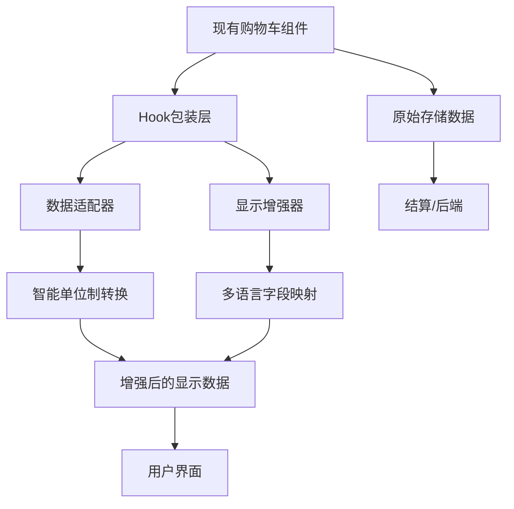

# 购物车功能集成指导 - 最小化修改版

## 🎯 集成目标（零破坏性原则）

基于现有的购物车功能（添加购物车按钮 + 侧边栏购物车），通过**Hook包装**的方式实现与 `useAuth().getPreferredUnit()` 智能单位制的无缝集成，确保：

- ✅ **零破坏性** - 现有购物车功能、多语言、交互行为完全保持
- ✅ **透明集成** - 通过Hook包装，对现有组件透明
- ✅ **渐进升级** - 可选择性启用，支持快速回滚
- ✅ **向后兼容** - 支持现有的API调用方式和数据格式

## 🔧 核心集成策略：Hook包装模式

### 原理：数据适配层 + 显示增强层



**关键原则**：
- **存储层**：原始数据完全不变，确保结算和后端交互正常
- **显示层**：通过Hook自动增强显示效果，用户体验更好
- **交互层**：所有现有的点击、多语言切换等行为完全保持

## 🚀 最小化集成实施方案

### Step 1: 创建透明Hook包装器（15分钟）

```typescript
// src/hooks/useCartDisplayEnhancer.ts
import { useMemo } from 'react';
import { useAuth } from '../contexts/AuthContext';
import { useI18n } from 'react-i18next';

export const useCartDisplayEnhancer = (originalData: any) => {
  const { getPreferredUnit } = useAuth();
  const { i18n } = useI18n();
  
  // 获取用户偏好单位制
  const preferredUnit = getPreferredUnit?.() || 'metric';
  const currentLanguage = i18n.language || 'zh';
  
  // 智能字段映射（不改变原始数据）
  const enhancedDisplayData = useMemo(() => {
    if (!originalData) return originalData;
    
    return {
      ...originalData, // 保持所有原始数据
      
      // 添加显示增强字段（只用于UI显示）
      _display: {
        // 智能重量显示
        weight: {
          value: preferredUnit === 'metric' ? originalData.net_weight_kg : originalData.net_weight_lbs,
          unit: preferredUnit === 'metric' ? 'kg' : 'lbs',
          label: currentLanguage === 'zh' 
            ? (preferredUnit === 'metric' ? '净重(kg)' : '净重(lbs)')
            : (preferredUnit === 'metric' ? 'Net Weight(kg)' : 'Net Weight(lbs)')
        },
        
        // 智能尺寸显示
        packageSize: {
          value: preferredUnit === 'metric' ? originalData.package_size_cm : originalData.package_size_inch,
          unit: preferredUnit === 'metric' ? 'cm' : 'inch',
          label: currentLanguage === 'zh'
            ? (preferredUnit === 'metric' ? '包装尺寸(cm)' : '包装尺寸(inch)')
            : (preferredUnit === 'metric' ? 'Package Size(cm)' : 'Package Size(inch)')
        },
        
        // 智能数量显示
        quantity: {
          value: originalData.pcs_per_box,
          unit: currentLanguage === 'zh' ? '件' : 'pcs',
          label: currentLanguage === 'zh' ? '单箱数量(件)' : 'Qty per Carton(pcs)'
        },
        
        // 智能名称显示
        name: {
          value: currentLanguage === 'zh' ? originalData.name_zh : originalData.name_en,
          label: currentLanguage === 'zh' ? '名称' : 'Item Name'
        }
      }
    };
  }, [originalData, preferredUnit, currentLanguage]);
  
  return {
    // 原始数据（用于购物车逻辑、结算等）
    originalData,
    
    // 增强显示数据（仅用于UI显示）
    displayData: enhancedDisplayData,
    
    // 便捷的显示方法
    getDisplayValue: (field: string) => {
      return enhancedDisplayData._display?.[field] || originalData[field];
    },
    
    // 用户偏好信息
    preferences: {
      unit: preferredUnit,
      language: currentLanguage
    }
  };
};
```

### Step 2: 创建零侵入的显示组件（20分钟）

```typescript
// src/components/SmartFieldDisplay.tsx
import React from 'react';
import { useCartDisplayEnhancer } from '../hooks/useCartDisplayEnhancer';

interface SmartFieldDisplayProps {
  data: any;
  field: 'weight' | 'packageSize' | 'quantity' | 'name';
  className?: string;
  showLabel?: boolean;
  children?: (displayInfo: any) => React.ReactNode;
}

export const SmartFieldDisplay: React.FC<SmartFieldDisplayProps> = ({
  data,
  field,
  className = '',
  showLabel = true,
  children
}) => {
  const { getDisplayValue } = useCartDisplayEnhancer(data);
  const displayInfo = getDisplayValue(field);
  
  if (!displayInfo) return null;
  
  // 如果提供了自定义渲染函数，使用它
  if (children) {
    return <>{children(displayInfo)}</>;
  }
  
  // 默认渲染
  return (
    <div className={`smart-field-display ${className}`}>
      {showLabel && (
        <span className="field-label">{displayInfo.label}:</span>
      )}
      <span className="field-value">
        {displayInfo.value} {displayInfo.unit}
      </span>
    </div>
  );
};

// 便捷的专用组件
export const SmartWeight = ({ data, ...props }) => (
  <SmartFieldDisplay data={data} field="weight" {...props} />
);

export const SmartPackageSize = ({ data, ...props }) => (
  <SmartFieldDisplay data={data} field="packageSize" {...props} />
);

export const SmartQuantity = ({ data, ...props }) => (
  <SmartFieldDisplay data={data} field="quantity" {...props} />
);

export const SmartName = ({ data, ...props }) => (
  <SmartFieldDisplay data={data} field="name" {...props} />
);
```

### Step 3: 现有组件的最小化升级（10分钟/页面）

#### 方案A：组件包装模式（推荐 - 零风险）

```typescript
// 现有的购物车按钮组件 - 完全不需要修改
const ExistingAddToCartButton = ({ product, onAddToCart, children }) => {
  // 所有现有逻辑保持不变
  return (
    <button onClick={() => onAddToCart(product)}>
      {children}
    </button>
  );
};

// 新的智能包装组件 - 可选使用
const SmartAddToCartButton = ({ product, onAddToCart, showSmartDisplay = false }) => {
  const { displayData, originalData } = useCartDisplayEnhancer(product);
  
  // 购物车逻辑使用原始数据（保持现有行为）
  const handleAddToCart = () => {
    onAddToCart(originalData); // 传递原始数据给现有逻辑
  };
  
  return (
    <div className="smart-cart-button-wrapper">
      {/* 可选的智能显示信息 */}
      {showSmartDisplay && (
        <div className="product-smart-info">
          <SmartName data={product} showLabel={false} />
          <SmartWeight data={product} />
          <SmartQuantity data={product} />
        </div>
      )}
      
      {/* 复用现有的购物车按钮，行为完全不变 */}
      <ExistingAddToCartButton product={originalData} onAddToCart={onAddToCart}>
        添加到购物车
      </ExistingAddToCartButton>
    </div>
  );
};
```

#### 方案B：内联增强模式（逐步升级）

```typescript
// 现有页面组件的升级示例
const ProductListPage = () => {
  // ... 所有现有的state和逻辑保持不变
  const [products, setProducts] = useState([]);
  const [cartItems, setCartItems] = useState([]);
  
  // 现有的添加购物车逻辑 - 完全不修改
  const handleAddToCart = (product) => {
    setCartItems(prev => [...prev, product]);
    // ... 其他现有逻辑
  };
  
  // 现有的多语言逻辑 - 完全不修改
  const { t, i18n } = useTranslation();
  
  return (
    <div className="product-list">
      {products.map(product => (
        <div key={product.id} className="product-item">
          {/* 现有的产品显示 - 保持不变 */}
          <h3>{i18n.language === 'zh' ? product.name_zh : product.name_en}</h3>
          <p>{product.part_number}</p>
          
          {/* 可选：添加智能显示增强 */}
          <div className="enhanced-info">
            <SmartWeight data={product} />
            <SmartPackageSize data={product} />
          </div>
          
          {/* 现有的购物车按钮 - 逻辑完全不变 */}
          <button onClick={() => handleAddToCart(product)}>
            {t('addToCart')}
          </button>
        </div>
      ))}
    </div>
  );
};
```

### Step 4: 侧边栏购物车的智能增强（15分钟）

```typescript
// 现有侧边栏购物车组件的增强
const CartSidebar = ({ cartItems, onUpdateQuantity, onRemoveItem }) => {
  const { t } = useTranslation();
  
  return (
    <div className="cart-sidebar">
      <h3>{t('cart.title')}</h3>
      
      {cartItems.map(item => {
        // 使用Hook增强显示，但保持所有现有逻辑
        const { displayData, originalData } = useCartDisplayEnhancer(item);
        
        return (
          <div key={item.id} className="cart-item">
            {/* 现有的基础信息显示 */}
            <div className="basic-info">
              <h4>
                <SmartName data={item} showLabel={false} />
              </h4>
              <p>{item.part_number}</p>
            </div>
            
            {/* 智能增强的详细信息 */}
            <div className="smart-details">
              <SmartWeight data={item} />
              <SmartPackageSize data={item} />
            </div>
            
            {/* 现有的数量控制 - 逻辑完全不变 */}
            <div className="quantity-control">
              <button onClick={() => onUpdateQuantity(originalData.id, item.quantity - 1)}>
                -
              </button>
              <span>{item.quantity}</span>
              <button onClick={() => onUpdateQuantity(originalData.id, item.quantity + 1)}>
                +
              </button>
            </div>
            
            {/* 现有的删除按钮 - 逻辑完全不变 */}
            <button onClick={() => onRemoveItem(originalData.id)}>
              {t('cart.remove')}
            </button>
          </div>
        );
      })}
    </div>
  );
};
```

## 🎛️ 渐进式启用策略

### 环境变量控制

```env
# .env.development
REACT_APP_ENABLE_SMART_CART_DISPLAY=true
REACT_APP_SMART_DISPLAY_FEATURES=weight,packageSize,quantity

# .env.production  
REACT_APP_ENABLE_SMART_CART_DISPLAY=false  # 生产环境可选启用
```

### 功能开关组件

```typescript
// src/components/FeatureToggle.tsx
export const SmartCartFeature = ({ children, fallback = null }) => {
  const isEnabled = process.env.REACT_APP_ENABLE_SMART_CART_DISPLAY === 'true';
  
  return isEnabled ? children : fallback;
};

// 使用示例
<SmartCartFeature 
  fallback={<OriginalProductDisplay product={product} />}
>
  <SmartProductDisplay product={product} />
</SmartCartFeature>
```

## 🔒 向后兼容保障

### 数据结构保持

```typescript
// 购物车数据结构完全不变
interface CartItem {
  id: number;
  part_number: string;
  name_zh: string;
  name_en: string;
  net_weight_kg: number;
  net_weight_lbs: number;
  package_size_cm: string;
  package_size_inch: string;
  pcs_per_box: number;
  quantity: number;
  price: number;
  // ... 所有现有字段保持不变
}

// 只在Hook内部添加 _display 字段用于增强显示
// 所有现有的购物车逻辑、API调用、结算流程完全不变
```

### API调用保持

```typescript
// 现有的API调用完全不变
const addToCartAPI = (cartItem: CartItem) => {
  return fetch('/api/cart/add', {
    method: 'POST',
    body: JSON.stringify({
      // 传递原始数据，保持API兼容性
      id: cartItem.id,
      part_number: cartItem.part_number,
      quantity: cartItem.quantity,
      // ... 其他原始字段
    })
  });
};
```

## 📋 集成检查清单

### Phase 1: Hook创建（15分钟）
- [ ] 创建 `useCartDisplayEnhancer` Hook
- [ ] 创建 `SmartFieldDisplay` 组件
- [ ] 添加环境变量控制
- [ ] 本地测试Hook功能

### Phase 2: 选择集成页面（5-10分钟/页面）
- [ ] 选择一个页面作为试点（建议：产品列表页）
- [ ] 添加智能显示组件（可选显示）
- [ ] 验证现有功能完全不受影响
- [ ] 验证多语言切换正常
- [ ] 验证添加购物车交互正常

### Phase 3: 购物车侧边栏升级（15分钟）
- [ ] 在购物车项目中添加智能显示
- [ ] 确保数量控制逻辑不变
- [ ] 确保删除商品逻辑不变  
- [ ] 确保结算流程不变

### Phase 4: 全面验证（20分钟）
- [ ] 测试所有现有的购物车功能
- [ ] 测试多语言切换
- [ ] 测试添加/删除商品
- [ ] 测试数量修改
- [ ] 测试结算流程
- [ ] 性能测试（确保无性能影响）

## 🚨 风险控制措施

### 快速回滚机制

```typescript
// 1. 环境变量快速关闭
// 将 REACT_APP_ENABLE_SMART_CART_DISPLAY 设为 false

// 2. 代码级快速回滚
const SMART_FEATURES_ENABLED = false; // 一键关闭所有智能功能

// 3. 组件级快速回滚
const ProductDisplay = ({ product }) => {
  if (!SMART_FEATURES_ENABLED) {
    return <OriginalProductDisplay product={product} />;
  }
  return <SmartProductDisplay product={product} />;
};
```

### 监控和验证

```typescript
// 监控现有功能是否受影响
const monitorCartFunctionality = () => {
  console.assert(typeof addToCart === 'function', '添加购物车功能正常');
  console.assert(typeof updateQuantity === 'function', '数量更新功能正常');
  console.assert(typeof removeFromCart === 'function', '删除商品功能正常');
  console.assert(i18n.language, '多语言功能正常');
};
```

## 🎯 成功标准

### 功能完整性
- [ ] 所有现有的购物车功能正常工作
- [ ] 多语言切换完全不受影响
- [ ] 添加/删除/修改商品交互完全正常
- [ ] 用户界面响应速度无变化

### 智能增强效果
- [ ] 智能单位制显示正常（公制/英制自动切换）
- [ ] 多语言字段映射正确
- [ ] 用户偏好设置生效
- [ ] 显示信息更加清晰友好

### 技术质量
- [ ] 代码修改量最小化
- [ ] 向后兼容性100%
- [ ] 无TypeScript错误
- [ ] 无控制台警告或错误

## 💡 实施建议

1. **从试点开始**：选择一个使用频率较低的页面先试点
2. **渐进式推进**：确认一个页面无问题后再扩展到其他页面
3. **保持沟通**：与团队成员确认现有功能的重要性
4. **文档更新**：记录每个修改点，便于回滚
5. **用户测试**：邀请用户测试，确保体验提升

这个方案确保了在提供智能单位制显示增强的同时，完全保持现有系统的稳定性和用户熟悉的交互模式。 