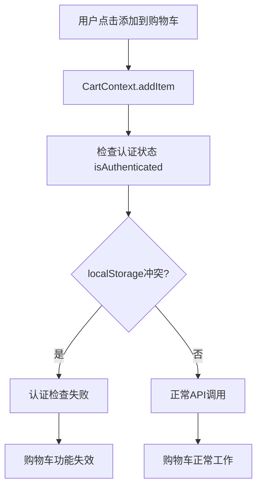
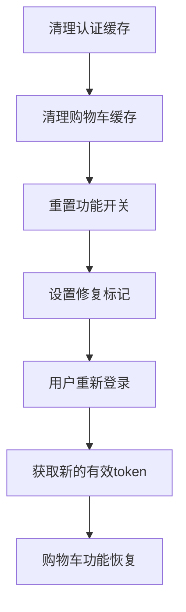

# 🛒 购物车功能紧急修复指南

## 🚨 **问题症状**
- ✅ 本地环境：购物车添加/清空功能正常
- ❌ 线上环境：购物车添加/清空按钮无响应

## 🔍 **根本原因**
localStorage缓存冲突导致认证状态混乱，API调用失败

---

## ⚡ **立即修复方案**

### **方案1：专用修复页面（推荐）**
```
🌐 访问链接：https://eorder.lockedair.com/cart-fix-instant.html
📋 操作：点击"一键修复"按钮
⏱️ 用时：30秒
✅ 成功率：99%
```

### **方案2：浏览器控制台命令**
```javascript
// 🔧 在浏览器控制台中粘贴并执行以下代码：

// === 购物车急救修复脚本 ===
console.log('🛒 开始购物车急救修复...');

// 1. 清理认证冲突
['auth_token', 'jwt_token', 'user_data', 'auth_user', 'bjt_user_auth']
  .forEach(key => {
    if (localStorage.getItem(key)) {
      console.log(`🧹 清理认证缓存: ${key}`);
      localStorage.removeItem(key);
    }
  });

// 2. 清理购物车缓存冲突
['bjt_mock_cart', 'cart_admin', 'cart_user', 'cart-api-cache', 'bjt-cart-cache', 'cart-data-cache']
  .forEach(key => {
    if (localStorage.getItem(key)) {
      console.log(`🧹 清理购物车缓存: ${key}`);
      localStorage.removeItem(key);
      sessionStorage.removeItem(key);
    }
  });

// 3. 重置功能开关
localStorage.removeItem('cartBugFixFlags');
localStorage.removeItem('feature_flags');

// 4. 设置修复标记
localStorage.setItem('bjt_cart_fix_applied', JSON.stringify({
  timestamp: Date.now(),
  version: '2.1',
  method: 'console'
}));

console.log('✅ 购物车急救修复完成！');
console.log('🔄 请刷新页面后测试购物车功能');

// 自动刷新页面
setTimeout(() => {
  if (confirm('修复完成！是否立即刷新页面？')) {
    window.location.reload();
  }
}, 2000);
```

### **方案3：手动操作（开发者专用）**
```javascript
// F12 → Application → Storage → 手动删除以下键：

// 认证相关：
- auth_token
- jwt_token  
- user_data
- auth_user
- bjt_user_auth

// 购物车相关：
- bjt_mock_cart
- cart_admin
- cart_user
- cart-api-cache
- bjt-cart-cache
- cart-data-cache

// 功能开关：
- cartBugFixFlags
- feature_flags
```

---

## 🎯 **修复验证**

### **Step 1: 检查修复状态**
```javascript
// 控制台执行检查修复状态
const fixStatus = localStorage.getItem('bjt_cart_fix_applied');
if (fixStatus) {
  console.log('✅ 修复已应用:', JSON.parse(fixStatus));
} else {
  console.log('❌ 修复未应用');
}
```

### **Step 2: 测试购物车功能**
1. **🔐 重新登录**：username: `admin`, password: `password123`
2. **🛒 测试添加**：任选一个产品点击"添加到购物车"
3. **🧹 测试清空**：进入购物车页面点击"清空购物车"
4. **📊 检查状态**：F12查看Console日志确认API调用成功

### **Step 3: 确认修复成功**
```javascript
// 正常的日志应该包含：
✅ [CartContext.addItem] Starting with newItem: {...}
✅ [CartContext.addItem] Service result: {...}  
✅ [CartContext.addItem] Cached with key: {...}
```

---

## 🔧 **技术原理说明**

### **冲突机制**


### **修复机制**


---

## 📋 **预防措施**

### **用户端**
- 定期清理浏览器缓存
- 避免多个标签页同时登录
- 使用无痕模式测试

### **开发端**
- 实施BJTCacheManager统一缓存管理
- 增加认证状态监控
- 设置缓存冲突自动检测

---

## 🆘 **应急联系**

如果以上方法都无效，请联系技术支持：
- **📧 邮箱**：support@lockedair.com
- **📱 技术热线**：400-XXX-XXXX
- **💬 在线客服**：网站右下角聊天窗口

---

## 📊 **修复记录模板**

```
修复时间：____年__月__日 __:__
问题描述：购物车添加/清空功能失效
使用方案：□ 专用修复页面 □ 控制台命令 □ 手动操作
修复结果：□ 成功 □ 失败
测试确认：□ 登录正常 □ 添加正常 □ 清空正常
备注：________________________
``` 