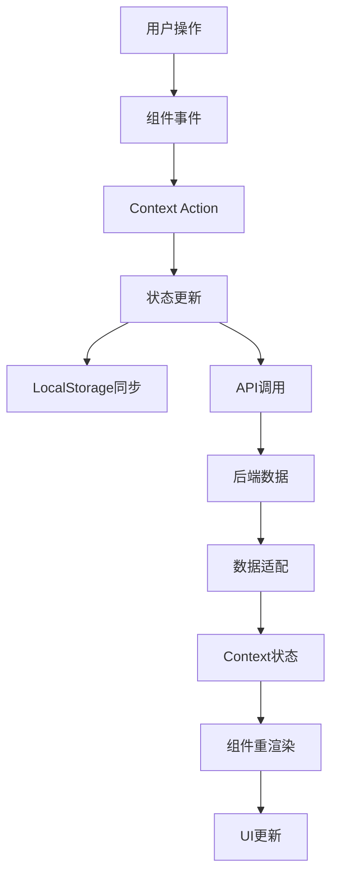

# BJT产品管理系统 - 前端组件

## 项目概述

BJT产品管理系统是一个面向B2B工业设备和配件销售的电子商务平台。系统支持多语言、多区域、多角色的用户体验，包括产品展示、备件管理、购物车和订单处理等功能。

## 最近改进

### 1. 配置模块化

创建了全局配置模块，集中管理API URL、区域设置和用户角色等全局参数：

- `src/config/appConfig.ts` - 集中管理应用配置
- 统一了区域、货币和角色的定义
- 提供了工具函数如`getUserRegionFromEmail`和`getCurrencySymbol`

### 2. 统一Mock数据管理

将原先分散在API实现中的Mock数据移至独立模块：

- `src/services/mockData/sparePartsMockData.ts` - 备件模拟数据
- 分类存储不同类型的备件数据
- 与API层实现解耦

### 3. API服务抽象7k

创建了统一的API服务层，支持根据环境切换真实API和Mock API：

- `src/services/apiService.ts` - API服务工厂
- 统一的请求和响应拦截处理
- 根据环境配置自动选择数据源

### 4. 工具函数库

添加了通用工具函数库，提供常用辅助函数：

- `src/utils/helpers.ts` - 工具函数集合
- 包含格式化、延迟、防抖等常用功能
- 可在整个应用中重用

## SpareParts页面优化

### 优化项目：

1. **消除硬编码配置**
   - 区域判断逻辑移至配置模块
   - 货币符号从配置中获取
   - API基础URL集中管理

2. **统一Mock数据管理**
   - 将备件Mock数据移至专门的数据文件
   - 支持通过配置切换真实/模拟API
   - 更好的代码组织和维护性

3. **API调用优化**
   - 使用统一的API调用接口
   - 添加类型定义和参数验证
   - 更好的错误处理

4. **响应式设计**
   - 完善的移动端卡片视图
   - 适配不同屏幕尺寸
   - 优化移动端用户体验

## 配置说明

### API配置

```typescript
// 在环境变量中设置
VITE_API_URL=https://api.example.com
VITE_USE_MOCK=true // 控制是否使用模拟数据
```

### 区域配置

系统支持以下区域：
- 中国 (CN) - 默认货币 ¥
- 欧洲 (EU) - 默认货币 €
- 北美 (NA) - 默认货币 $
- 澳洲 (AU) - 默认货币 A$

### 用户角色

系统支持以下角色：
- 管理员 (admin)
- 销售 (sales)
- 客户 (customer)
- 合作伙伴 (partner)
- 访客 (guest)

## 开发指南

### 使用配置模块

```typescript
import { API_CONFIG, getCurrencySymbol } from '../config/appConfig';

// 检查是否使用Mock数据
if (API_CONFIG.USE_MOCK_DATA) {
  // 处理模拟数据逻辑
}

// 获取货币符号
const currencySymbol = getCurrencySymbol('eu'); // 返回 €
```

### 使用API服务

```typescript
import apiService from '../services/apiService';

// GET请求
const data = await apiService.get('/endpoint', { param: value });

// POST请求
const result = await apiService.post('/endpoint', { data: value });
```

### 使用工具函数

```typescript
import { delay, formatCurrency } from '../utils/helpers';

// 延迟执行
await delay(500);

// 格式化货币
const price = formatCurrency(100, '$', 2); // 返回 $100.00
```

## 下一步改进

1. 增加服务端分页支持
2. 改进国际化实现
3. 添加单元测试覆盖
4. 性能优化和代码拆分

## 🔄 状态管理架构

### 多Context架构设计
系统采用多个React Context进行状态管理，每个Context负责特定领域的状态：

#### 1. 认证上下文 (AuthContext)
```typescript
// 📄 src/contexts/AuthContext.tsx (347行核心代码)
interface AuthContextType {
  user: UserInfo | null;              // 当前用户信息
  loading: boolean;                   // 认证加载状态
  error: string | null;               // 认证错误信息
  login: (username, password) => Promise<UserInfo>;
  logout: () => Promise<void>;
  updateProfile: (data) => Promise<void>;
  getTranslatedUserName: (name) => string;
}

// 用户角色枚举
export enum UserRole {
  CUSTOMER = 'customer',    // 客户
  PARTNER = 'partner',      // 合作伙伴
  SALES = 'sales',          // 销售
  ADMIN = 'admin',          // 管理员
  UNKNOWN = 'unknown'       // 未知
}

// 用户信息接口
export interface UserInfo {
  id: string;
  name: string;
  email: string;
  role: UserRole;
  region?: string;          // 用户区域
  vipLevel?: number;        // VIP等级
  token?: string;           // 认证令牌
}
```

#### 2. 购物车上下文 (CartContext)
```typescript
// 购物车状态管理
interface CartContextType {
  items: CartItem[];                  // 购物车商品列表
  totalQuantity: number;              // 商品总数量
  totalAmount: number;                // 总金额
  addItem: (item: CartItem) => void;         // 添加商品
  removeItem: (id: string) => void;          // 移除商品
  updateQuantity: (id: string, quantity: number) => void; // 更新数量
  clearCart: () => void;              // 清空购物车
}

// 购物车商品接口
interface CartItem {
  id: string;
  name: string;
  code: string;
  price: number;
  quantity: number;
  image?: string;
  properties?: Record<string, any>;   // 商品属性
  specs?: Record<string, any>;        // 规格参数
}
```

#### 3. 语言上下文 (LanguageContext)
```typescript
// 国际化状态管理
interface LanguageContextType {
  language: string;                   // 当前语言
  changeLanguage: (lang: string) => void;    // 切换语言
  t: (key: string) => string;         // 翻译函数
  currentRegion: string;              // 当前区域
}
```

### 状态数据流


## 🌐 API服务层

### 服务层架构
基于继承的服务层设计，提供统一的API调用接口：

#### 1. 基础服务类
```typescript
// 📄 src/api/services/base.service.ts (336行)
abstract class BaseService {
  protected baseURL: string;
  protected timeout: number = 30000;
  
  constructor() {
    this.baseURL = getBaseUrl();
  }
  
  // 统一请求方法
  protected async request<T>(config: RequestConfig): Promise<T> {
    // 🔒 认证头处理
    const headers = getAuthHeaders();
    
    // 🔍 请求拦截
    const requestConfig = {
      ...config,
      headers: { ...headers, ...config.headers },
      timeout: this.timeout
    };
    
    try {
      const response = await fetch(url, requestConfig);
      
      // 📡 响应拦截
      if (!response.ok) {
        throw new Error(getErrorMessage(response.status));
      }
      
      return await response.json();
    } catch (error) {
      // 🚨 错误处理
      logDebug('API Request Failed', { url, error });
      throw error;
    }
  }
  
  // HTTP方法封装
  protected get<T>(url: string, params?: any): Promise<T>
  protected post<T>(url: string, data?: any): Promise<T>
  protected put<T>(url: string, data?: any): Promise<T>
  protected delete<T>(url: string): Promise<T>
}
```

#### 2. 具体服务实现
```typescript
// 📄 src/api/services/machine.service.ts (413行)
export class MachineService extends BaseService {
  // 获取设备列表
  async getMachines(params?: MachineListParams): Promise<MachineListData> {
    const queryParams = new URLSearchParams();
    if (params?.product_line_id) {
      queryParams.append('product_line_id', params.product_line_id.toString());
    }
    
    return this.get<MachineListData>(`/machines?${queryParams}`);
  }
  
  // 获取设备详情
  async getMachineById(id: string): Promise<MachineProduct> {
    return this.get<MachineProduct>(`/machines/${id}`);
  }
  
  // 获取设备配件
  async getMachineParts(hostId: string): Promise<MachinePartListData> {
    return this.get<MachinePartListData>(`/machines/${hostId}/parts`);
  }
}
```

### API配置管理
```typescript
// 📄 src/api/config.ts (92行)
export const API_BASE_URL = import.meta.env.VITE_API_URL || '/wp-json/bjt/v1';

// 获取认证头
export const getAuthHeaders = () => {
  const token = localStorage.getItem('auth_token');
  return token ? {
    'Authorization': `Bearer ${token}`,
    'Content-Type': 'application/json',
    'Accept': 'application/json'
  } : getDefaultHeaders();
};

// 错误消息映射
export const ERROR_MESSAGES = {
  NETWORK_ERROR: '网络连接错误，请检查您的网络连接。',
  SERVER_ERROR: '服务器错误，请稍后重试。',
  UNAUTHORIZED: '您的登录已过期，请重新登录。',
  FORBIDDEN: '您没有权限执行此操作。',
  NOT_FOUND: '请求的资源不存在。'
};
```

### 服务实例管理
```typescript
// 📄 src/api/services/index.ts (64行)
// 创建服务实例
export const productLineServiceInstance = new ProductLineService();
export const machineServiceInstance = new MachineService();
export const sparePartServiceInstance = new SparePartService();
export const accessoryServiceInstance = new AccessoryService();
export const consumableServiceInstance = new ConsumableService();
export const cartServiceInstance = new CartService();
export const orderServiceInstance = new OrderService();
export const authServiceInstance = new AuthService();

// 统一导出
export {
  productLineService,
  machineService,
  accessoryService,
  consumableService,
  cartService,
  orderService,
  authService
} from './services';
```

## 🧩 组件架构

### 页面组件分析

#### 1. Machines页面 (核心业务页面)
```typescript
// 📄 src/pages/Machines/index.tsx (1385行超大型组件)
const MachinesPage: React.FC = () => {
  // 🔄 状态管理 (22个状态变量)
  const [machines, setMachines] = useState<MachinePart[]>([]);
  const [loading, setLoading] = useState<boolean>(true);
  const [selectedMachine, setSelectedMachine] = useState<string>('');
  const [accessories, setAccessories] = useState<MachineAccessory[]>([]);
  const [level2Accessories, setLevel2Accessories] = useState<MachineAccessory[]>([]);
  // ... 更多状态

  // 🎯 核心业务逻辑
  const handleMachineSelection = useCallback(async (machineId: string) => {
    setSelectedMachine(machineId);
    // 自动加载配件逻辑
  }, []);

  const handleAddToCart = useCallback(async (product: MachinePart) => {
    // 添加到购物车逻辑
    const cartResponse = await cartService.addToCart({
      product_id: product.id,
      quantity: quantities[product.id] || 1,
      properties: { /* 产品属性 */ }
    });
  }, [quantities]);

  // 📊 数据获取与处理
  useEffect(() => {
    const fetchMachines = async () => {
      const response = await machineService.getMachines({
        product_line_id: 1
      });
      setMachines(response.items);
    };
    fetchMachines();
  }, [userRegion, t]);

  // 🔄 配件自动加载
  useEffect(() => {
    if (selectedMachine && previousMachineRef.current !== selectedMachine) {
      const fetchAccessories = async () => {
        const accessoriesData = await accessoryService.getMachineAccessories(
          selectedMachine, 
          { level: 1 }
        );
        setAccessories(accessoriesData.items);
      };
      fetchAccessories();
    }
  }, [selectedMachine]);

  return (
    <div className="machines-page">
      {/* 筛选器组件 */}
      <MachineFilters onFilterChange={handleFilterChange} />
      
      {/* 主机列表 */}
      <MachineList 
        machines={filteredMachines}
        onSelect={handleMachineSelection}
        onAddToCart={handleAddToCart}
      />
      
      {/* 多级配件选择器 */}
      <AccessorySelector 
        machine={selectedMachine}
        onAccessorySelect={handleAccessorySelection}
      />
      
      {/* 购物车摘要 */}
      <CartSummary />
    </div>
  );
};
```

#### 2. 组件复用模式
```typescript
// 🃏 卡片/表格切换模式
const MachineList: React.FC = ({ machines, onSelect, onAddToCart }) => {
  const [viewMode, setViewMode] = useState<'card' | 'table'>('table');
  
  return (
    <div className="machine-list">
      {/* 视图切换 */}
      <ViewModeToggle mode={viewMode} onChange={setViewMode} />
      
      {/* 条件渲染 */}
      {viewMode === 'table' ? (
        <MachineTable machines={machines} onSelect={onSelect} />
      ) : (
        <MachineCards machines={machines} onSelect={onSelect} />
      )}
    </div>
  );
};
```

### 通用组件设计

#### 1. 错误边界组件
```typescript
// 📄 src/main.tsx - 对象渲染错误保护
class ObjectRenderGuard extends React.Component {
  componentDidCatch(error: Error, errorInfo: React.ErrorInfo) {
    // 专门捕获React对象渲染错误
    if (error.message.includes('Objects are not valid as a React child')) {
      console.error('捕获到对象渲染错误:', error);
      this.setState({ hasError: true });
      return; // 不让错误继续传播
    }
    throw error; // 其他错误重新抛出
  }
  
  render() {
    if (this.state.hasError) {
      return (
        <div className="error-recovery">
          <h4>渲染错误已被自动修复</h4>
          <button onClick={this.retry}>重试</button>
        </div>
      );
    }
    return this.props.children;
  }
}
```

#### 2. 安全渲染组件
```typescript
// 📄 src/utils/renderUtils.ts
export const safeRender = (content: any) => {
  if (typeof content === 'object' && content !== null) {
    // 安全处理对象类型
    if (React.isValidElement(content)) {
      return content;
    }
    return JSON.stringify(content);
  }
  return content;
};

// 安全文本内容处理
export const safeTextContent = (text: string): string => {
  if (!text || typeof text !== 'string') return '';
  
  try {
    // 处理中文编码问题
    return text.replace(/[\u0000-\u001F\u007F-\u009F]/g, '');
  } catch (error) {
    return '';
  }
};
```

## 🌍 国际化系统

### 多语言架构
```typescript
// 📄 src/i18n/index.ts - i18n配置
import i18n from 'i18next';
import { initReactI18next } from 'react-i18next';

i18n
  .use(initReactI18next)
  .init({
    resources: {
      zh: { translation: zhTranslations },
      en: { translation: enTranslations }
    },
    lng: localStorage.getItem('language') || 'zh',
    fallbackLng: 'en',
    interpolation: {
      escapeValue: false
    }
  });
```

### 语言包结构
```json
// 📄 src/i18n/locales/zh.json - 中文语言包
{
  "common": {
    "loading": "加载中...",
    "error": "错误",
    "success": "成功"
  },
  "machines": {
    "title": "设备选择",
    "filters": {
      "voltage": "电压",
      "type": "类型",
      "small": "小型",
      "medium": "中型", 
      "large": "大型"
    },
    "accessory": {
      "selectFor": "为以下设备选择配件："
    }
  },
  "cart": {
    "title": "购物车",
    "addToCart": "添加到购物车",
    "checkout": "去结账"
  }
}
```

### 动态语言切换
```typescript
// 组件中的多语言使用
const MachineComponent: React.FC = () => {
  const { t, i18n } = useTranslation();
  const currentLanguage = i18n.language.startsWith('zh') ? 'zh' : 'en';
  
  // 根据语言获取产品名称
  const getMachineName = (machine: MachinePart): string => {
    const name = currentLanguage === 'zh' ? machine.name_zh : machine.name_en;
    if (!name) {
      const fallbackName = currentLanguage === 'zh' ? machine.name_en : machine.name_zh;
      return safeTextContent(fallbackName || machine.model || 'N/A');
    }
    return safeTextContent(name);
  };
  
  return (
    <div>
      <h1>{t('machines.title')}</h1>
      <p>{getMachineName(selectedMachine)}</p>
    </div>
  );
};
```

## 🔒 错误处理机制

### 多层错误边界
系统实现了多层错误处理机制，确保单个组件错误不会导致整个应用崩溃：

#### 1. 全局错误处理器
```typescript
// 📄 src/main.tsx - 全局错误拦截
const installGlobalErrorHandler = () => {
  const handleError = (event: ErrorEvent) => {
    const error = event.error || event.message;
    
    // 检查是否是对象渲染错误
    if (typeof error === 'string' && 
        error.includes('Objects are not valid as a React child')) {
      console.error('全局错误拦截器捕获到对象渲染错误:', error);
      event.preventDefault(); // 防止错误冒泡
    }
  };
  
  window.addEventListener('error', handleError);
};
```

#### 2. 数据安全处理
```typescript
// 📄 src/utils/priceUtils.ts - 价格安全格式化
export const safeToLocaleString = (
  value: number, 
  locale: string = 'zh-CN'
): string => {
  if (typeof value !== 'number' || isNaN(value)) return '0';
  
  try {
    return value.toLocaleString(locale, {
      minimumFractionDigits: 2,
      maximumFractionDigits: 2
    });
  } catch (error) {
    console.warn('价格格式化失败:', error);
    return value.toString();
  }
};
```

#### 3. API错误处理
```typescript
// 📄 src/api/config.ts - 统一错误处理
export const getErrorMessage = (status: number): string => {
  switch (status) {
    case 401: return '您的登录已过期，请重新登录。';
    case 403: return '您没有权限执行此操作。';
    case 404: return '请求的资源不存在。';
    case 422: return '提交的数据有误，请检查并重试。';
    case 500:
    case 502:
    case 503:
    case 504: return '服务器错误，请稍后重试。';
    default: return '发生错误，请稍后重试。';
  }
};
```

## ⚡ 性能优化策略

### 1. 代码分割与懒加载
```typescript
// 路由级别代码分割
const UnicodeTest = React.lazy(() => import('./pages/DevTests/UnicodeTest'));
const AdminRoutes = React.lazy(() => import('./admin/routes'));

// 组件级别懒加载
const HeavyComponent = React.lazy(() => 
  import('./components/HeavyComponent').then(module => ({
    default: module.HeavyComponent
  }))
);

// Suspense包装
<Suspense fallback={<Loading />}>
  <HeavyComponent />
</Suspense>
```

### 2. 状态优化
```typescript
// useCallback防止不必要重渲染
const handleMachineSelection = useCallback(async (machineId: string) => {
  setSelectedMachine(machineId);
  // 业务逻辑
}, [selectedMachine, machines]);

// useMemo计算缓存
const filteredMachines = useMemo(() => {
  if (filterType === 'all') return machines;
  return machines.filter(machine => {
    const name = getMachineName(machine).toLowerCase();
    return name.includes(filterType.toLowerCase());
  });
}, [machines, filterType, currentLanguage]);

// useRef避免重复API调用
const previousMachineRef = useRef<string>('');
useEffect(() => {
  if (previousMachineRef.current === selectedMachine) return;
  previousMachineRef.current = selectedMachine;
  // 执行API调用
}, [selectedMachine]);
```

### 3. 虚拟化长列表
```typescript
// 使用react-window进行列表虚拟化
import { FixedSizeList as List } from 'react-window';

const VirtualizedMachineList: React.FC = ({ machines }) => (
  <List
    height={600}
    itemCount={machines.length}
    itemSize={120}
    itemData={machines}
  >
    {MachineRow}
  </List>
);
```

## ⚙️ 开发配置

### 环境变量配置
```typescript
// 📄 src/config/env.ts (15行)
export const isDev = import.meta.env.DEV;
export const useMockData = import.meta.env.VITE_USE_MOCK_DATA === 'true';
export const API_BASE_URL = import.meta.env.VITE_API_BASE_URL || '/wp-json/bjt/v1';
export const BASE_URL = import.meta.env.VITE_BASE_URL || '/';
export const DEFAULT_REGION = 'CN';
export const SUPPORTED_REGIONS = ['CN', 'EU', 'NA', 'AU'];
```

### Vite构建配置
```typescript
// 📄 vite.config.ts (53行)
export default defineConfig({
  base: '/', // 确保根路径
  plugins: [react()],
  resolve: {
    alias: {
      '@': path.resolve(__dirname, './src'),
      '@components': path.resolve(__dirname, './src/components'),
      '@pages': path.resolve(__dirname, './src/pages'),
      '@services': path.resolve(__dirname, './src/services'),
      '@utils': path.resolve(__dirname, './src/utils'),
      '@contexts': path.resolve(__dirname, './src/contexts'),
      '@i18n': path.resolve(__dirname, './src/i18n'),
      '@assets': path.resolve(__dirname, './src/assets'),
      '@styles': path.resolve(__dirname, './src/styles'),
      '@config': path.resolve(__dirname, './src/config'),
      '@types': path.resolve(__dirname, './src/types')
    }
  },
  css: {
    postcss: './postcss.config.js'
  },
  server: {
    port: 5173,
    host: '0.0.0.0'
  }
});
```

### Mock数据配置
```typescript
// Mock数据管理
const MockDataManager: React.FC = ({ isOpen, onClose }) => {
  const [mockEnabled, setMockEnabled] = useState(useMockData);
  
  const toggleMockData = () => {
    localStorage.setItem('USE_MOCK_DATA', (!mockEnabled).toString());
    setMockEnabled(!mockEnabled);
    window.location.reload();
  };
  
  return (
    <div className={`mock-manager ${isOpen ? 'open' : ''}`}>
      <h3>Mock数据管理</h3>
      <button onClick={toggleMockData}>
        {mockEnabled ? '禁用' : '启用'} Mock数据
      </button>
    </div>
  );
};
```

## 🚀 构建与部署

### Docker容器化
```dockerfile
# 📄 Dockerfile.prod - 生产环境构建
FROM node:16-alpine AS builder

WORKDIR /app
COPY package*.json ./
RUN npm ci --only=production

COPY . .
RUN npm run build

FROM nginx:alpine
COPY --from=builder /app/dist /usr/share/nginx/html
COPY nginx.conf /etc/nginx/nginx.conf

EXPOSE 80
CMD ["nginx", "-g", "daemon off;"]
```

### 构建脚本
```bash
#!/bin/bash
# 📄 build.sh - 构建脚本

echo "🚀 开始构建 BJT 前端应用..."

# 检查 Node.js 版本
node_version=$(node -v)
echo "📦 Node.js 版本: $node_version"

# 安装依赖
echo "📦 安装依赖包..."
npm ci

# 构建应用
echo "🔨 构建应用..."
npm run build

# 检查构建结果
if [ -d "dist" ]; then
  echo "✅ 构建成功! 输出目录: dist/"
  ls -la dist/
else
  echo "❌ 构建失败!"
  exit 1
fi
```

## 📖 开发指南

### 使用配置模块
```typescript
import { API_CONFIG, getCurrencySymbol } from '@/config/appConfig';

// 检查是否使用Mock数据
if (API_CONFIG.USE_MOCK_DATA) {
  // 处理模拟数据逻辑
}

// 获取货币符号
const currencySymbol = getCurrencySymbol('eu'); // 返回 €
```

### 使用API服务
```typescript
import { machineService, cartService } from '@/api/services';

// 获取设备列表
const machines = await machineService.getMachines({
  product_line_id: 1,
  region: 'CN'
});

// 添加到购物车
await cartService.addToCart({
  product_id: machineId,
  quantity: 1,
  properties: { voltage: '220V' }
});
```

### 使用状态管理
```typescript
import { useAuth, useCart, useLanguage } from '@/contexts';

const MyComponent: React.FC = () => {
  const { user, login, logout } = useAuth();
  const { items, addItem, totalAmount } = useCart();
  const { t, changeLanguage } = useLanguage();
  
  return (
    <div>
      <h1>{t('common.welcome')}, {user?.name}</h1>
      <p>{t('cart.total')}: ¥{totalAmount}</p>
    </div>
  );
};
```

### 使用工具函数
```typescript
import { safeTextContent, safeToLocaleString } from '@/utils';

// 安全文本处理
const safeName = safeTextContent(machine.name_zh);

// 安全价格格式化
const formattedPrice = safeToLocaleString(price, 'zh-CN');
```

## 🔧 故障排除

### 常见问题与解决方案

#### 1. 路径配置问题
**问题**：从不同目录运行出现不同的URL路径
```bash
# 从 frontend/ 目录运行
➜ Local: http://localhost:5173/

# 从项目根目录运行  
➜ Local: http://localhost:5173/bjt/
```

**解决方案**：
- 确保 `vite.config.ts` 中 `base: '/'`
- 从 `frontend/` 目录运行开发服务器
- 使用绝对路径配置

#### 2. 对象渲染错误
**问题**：`Objects are not valid as a React child`

**解决方案**：
- 使用 `safeRender` 包装可能是对象的内容
- 检查翻译函数返回值，确保返回字符串
- 使用 `ObjectRenderGuard` 错误边界

#### 3. 国际化问题
**问题**：翻译不生效或显示key

**解决方案**：
- 检查语言包文件是否正确加载
- 确保翻译key存在于语言包中
- 使用 `t('common.loading')` 而不是 `t('loading')`

#### 4. API调用失败
**问题**：API请求返回404或CORS错误

**解决方案**：
- 检查 `VITE_API_BASE_URL` 环境变量
- 确保后端服务正常运行
- 检查认证token是否有效

### 调试技巧
```typescript
// 开启调试模式
export const ENABLE_DEBUG_LOGS = isDev;

// 使用调试函数
import { logDebug } from '@/api/config';

logDebug('API请求', { url, params });
```

## 📈 代码质量指标

### 架构优势
1. ✅ **类型安全**：全面的TypeScript类型定义
2. ✅ **模块化**：清晰的分层架构和职责分离  
3. ✅ **国际化**：完整的多语言支持
4. ✅ **错误处理**：多层错误边界和安全机制
5. ✅ **可扩展性**：基于Context的状态管理
6. ✅ **开发体验**：完善的开发工具和调试支持

### 改进空间
1. ⚠️ **代码复杂度**：Machines页面1385行代码过于复杂
2. ⚠️ **状态管理**：考虑使用Redux Toolkit管理复杂状态
3. ⚠️ **性能优化**：大量数据渲染需要虚拟化
4. ⚠️ **测试覆盖**：需要增加单元测试和集成测试
5. ⚠️ **文档完善**：需要更详细的API文档

## 🔮 未来优化建议

### 1. 架构重构
```typescript
// 将复杂页面拆分为多个子组件
const MachinesPage = () => {
  return (
    <MachinePageProvider>
      <MachineFilters />
      <MachineList />
      <AccessorySelector />
      <CartSummary />
    </MachinePageProvider>
  );
};
```

### 2. 状态管理升级
```typescript
// 考虑使用Redux Toolkit
import { configureStore } from '@reduxjs/toolkit';

const store = configureStore({
  reducer: {
    auth: authSlice.reducer,
    cart: cartSlice.reducer,
    machines: machinesSlice.reducer
  }
});
```

### 3. 性能优化
- 实现虚拟滚动
- 添加数据缓存机制
- 优化包体积
- 使用Service Worker

### 4. 开发体验改进
- 添加Storybook组件文档
- 完善TypeScript类型定义
- 增加E2E测试
- 集成代码质量检查工具

---

*本文档记录了BJT产品管理系统前端的完整架构设计，为开发团队提供技术参考和开发指南。*
