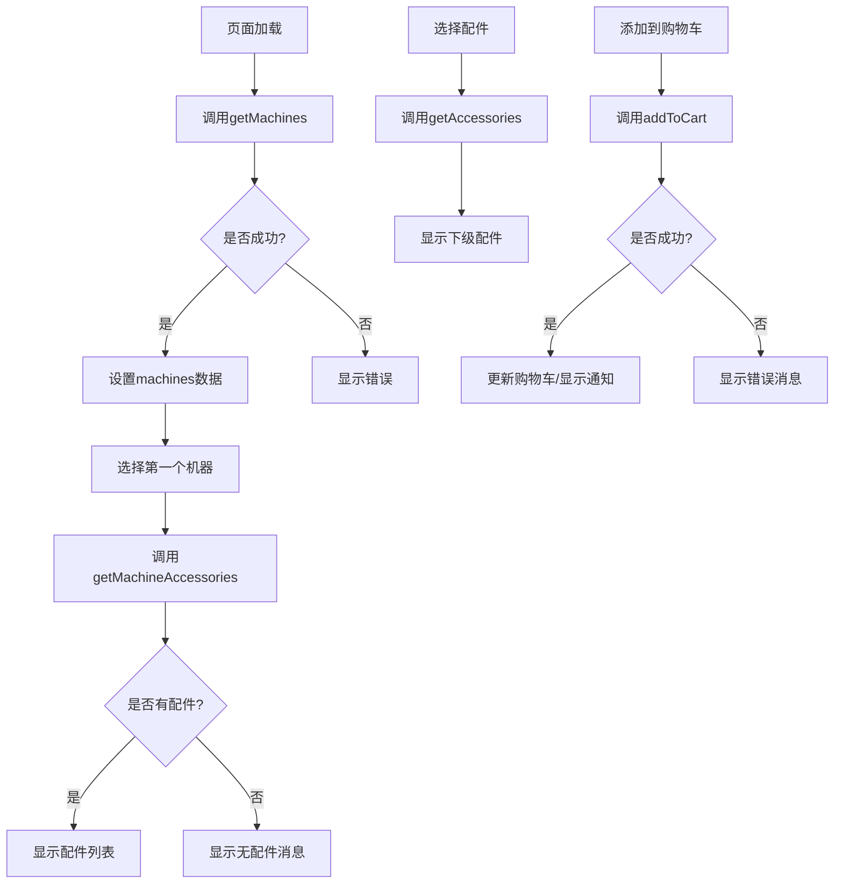

# Machines 页面 API 调用分析

## 1. API调用流程图



## 2. 主要API调用时机

### 2.1 页面初始化
```typescript
useEffect(() => {
  const fetchMachines = async () => {
    try {
      const response = await machinesService.getMachines({
        region: userRegion,
        lang: 'zh'
      });
      // 处理响应...
    } catch (err) {
      // 错误处理...
    }
  };
  fetchMachines();
}, [userRegion, t]);
```

### 2.2 机器选择
```typescript
const handleMachineSelection = async (machineId: string) => {
  setSelectedMachine(machineId);
  try {
    const response = await machinesService.getMachineAccessories(machineId, {
      level: 1
    });
    // 处理响应...
  } catch (err) {
    // 错误处理...
  }
};
```

### 2.3 配件选择
```typescript
const handleAccessorySelection = async (level: number, accessoryId: string, accessoryName: string) => {
  try {
    const response = await machinesService.getAccessories({
      parent_id: accessoryId,
      machine_id: selectedMachine,
      level: level + 1
    });
    // 处理响应...
  } catch (err) {
    // 错误处理...
  }
};
```

### 2.4 添加到购物车
```typescript
const handleAddToCart = async (product: MachineProduct) => {
  try {
    const response = await machinesService.addToCart({
      product_id: product.id,
      product_type: 'machine',
      quantity: quantity,
      voltage: selectedVoltage,
      properties: { ... }
    });
    // 处理响应...
  } catch (err) {
    // 错误处理...
  }
};
```

## 3. 数据流转

### 3.1 设备数据流
1. 调用 `getMachines` 获取设备列表
2. 数据存储在 `machines` state
3. 通过 `filteredMachines` 进行过滤
4. 渲染到表格或卡片视图

### 3.2 配件数据流
1. 选择设备触发 `getMachineAccessories`
2. 一级配件存储在 `accessories` state
3. 选择配件触发 `getAccessories`
4. 不同级别配件存储在对应的 state:
   - level2Accessories
   - level3Accessories
   - level4Accessories
   - level5Accessories

### 3.3 购物车数据流
1. 添加商品触发 `addToCart`
2. 成功后更新前端购物车上下文
3. 显示成功通知
4. 更新购物车计数

## 4. 状态管理

### 4.1 产品相关状态
```typescript
const [machines, setMachines] = useState<MachineProduct[]>([]);
const [loading, setLoading] = useState<boolean>(true);
const [error, setError] = useState<string | null>(null);
const [filterType, setFilterType] = useState<string>('all');
const [filterRegion, setFilterRegion] = useState<string>(user?.region || DEFAULT_REGION);
```

### 4.2 配件相关状态
```typescript
const [accessories, setAccessories] = useState<any[]>([]);
const [selectedAccessories, setSelectedAccessories] = useState<Record<string, string>>({});
const [level2Accessories, setLevel2Accessories] = useState<any[]>([]);
// ... 其他级别配件状态
```

### 4.3 用户交互状态
```typescript
const [selectedMachine, setSelectedMachine] = useState<string>('');
const [selectedVoltage, setSelectedVoltage] = useState<string>();
const [quantities, setQuantities] = useState<Record<string, number>>({});
```

## 5. 存在的问题

### 5.1 类型定义问题
1. 配件相关状态使用 `any[]`
2. 缺少统一的接口定义
3. 响应类型定义不完整

### 5.2 错误处理问题
1. 错误处理较为简单
2. 缺少错误重试机制
3. 错误提示不够具体

### 5.3 性能问题
1. 缺少数据缓存
2. 未实现分页加载
3. 配件选择可能触发频繁API调用

### 5.4 用户体验问题
1. 加载状态反馈不够清晰
2. 错误恢复机制不完善
3. 批量操作支持不足

## 6. 改进建议

### 6.1 类型完善
```typescript
interface MachineAccessory {
  id: string;
  name: string;
  code: string;
  image_url: string;
  specs: Record<string, string>;
  inventory: Array<{
    region: string;
    amount: number;
  }>;
  prices: {
    base: number;
    tier1: number;
    tier2: number;
    vip: number;
  };
  parent_id?: string;
  level: number;
  compatible_machines?: string[];
}
```

### 6.2 错误处理增强
```typescript
const handleApiError = (error: any, context: string) => {
  console.error(`Error in ${context}:`, error);
  
  if (error.response?.data?.code) {
    const errorMessage = getErrorMessage(error.response.data.code);
    message.error(t(errorMessage));
  } else if (error.request) {
    message.error(t('errors.networkError'));
  } else {
    message.error(t('errors.systemError'));
  }
  
  // 记录错误
  logError(error, context);
  
  // 特定错误的重试逻辑
  if (isRetryableError(error)) {
    retryOperation(context);
  }
};
```

### 6.3 性能优化
```typescript
// 数据缓存
const useMachinesData = () => {
  const [machines, setMachines] = useState<MachineProduct[]>([]);
  
  useEffect(() => {
    const cachedData = sessionStorage.getItem('machines');
    if (cachedData) {
      setMachines(JSON.parse(cachedData));
    } else {
      fetchMachines();
    }
  }, []);
  
  return machines;
};

// 分页加载
const fetchMachinesPage = async (page: number) => {
  const response = await machinesService.getMachines({
    page,
    page_size: 10,
    region: userRegion,
    lang: 'zh'
  });
  return response;
};
```

### 6.4 用户体验优化
```typescript
// 批量操作支持
const handleBatchAddToCart = async (products: MachineProduct[]) => {
  const results = await Promise.allSettled(
    products.map(product => handleAddToCart(product))
  );
  
  const succeeded = results.filter(r => r.status === 'fulfilled').length;
  const failed = results.filter(r => r.status === 'rejected').length;
  
  if (succeeded > 0) {
    message.success(`成功添加 ${succeeded} 个商品到购物车`);
  }
  if (failed > 0) {
    message.warning(`${failed} 个商品添加失败`);
  }
};
```

## 7. 总结

Machines页面的API调用逻辑较为复杂，涉及多个嵌套的数据获取和状态管理流程。主要问题集中在类型定义、错误处理、性能优化和用户体验等方面。建议按照上述建议进行改进，提高代码质量和用户体验。

---

> 注：本文档应与具体开发进度同步更新，确保分析始终反映最新的实现状况。 